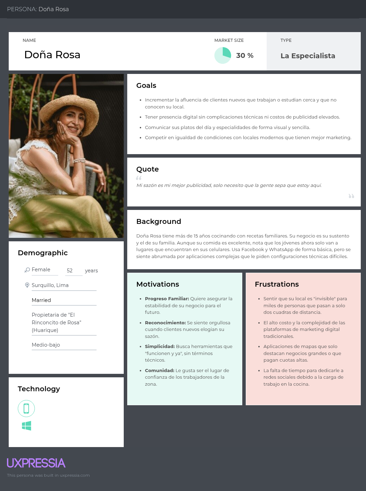
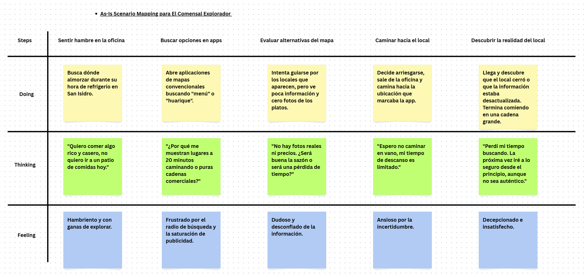
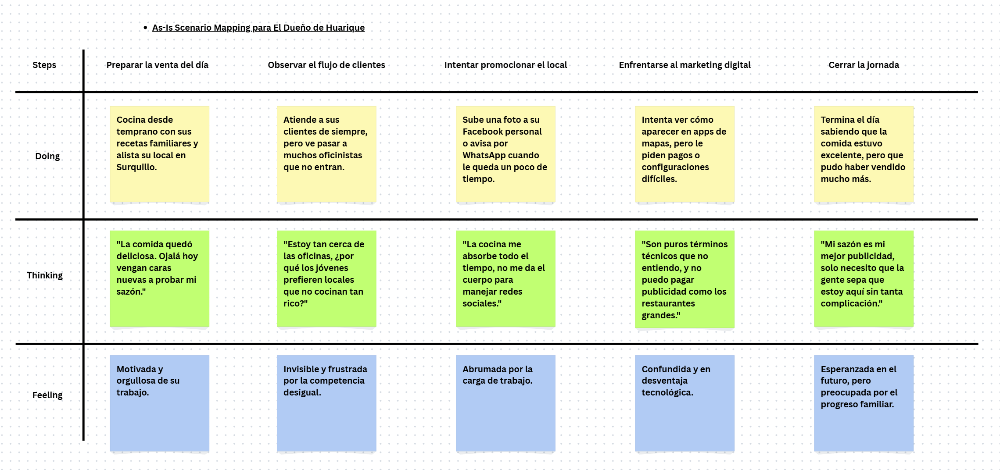
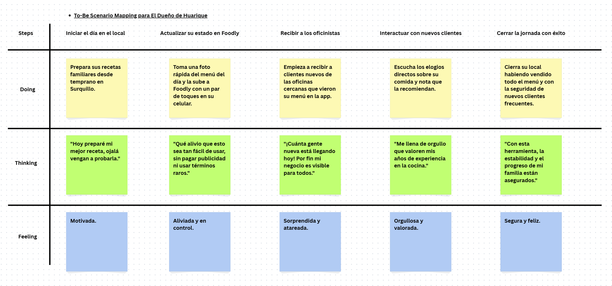

  

    <h2 style="text-align: center;">Universidad Peruana de Ciencias Aplicadas</h2>
    <h4 style="text-align: center;">Ingeniería de Software</h2> 
    <h4 style="text-align: center"> Periodo: 202610 </h4>
    <h4 style="text-align: center"> 1ASI0572 - Fundamentos de Arquitectura de Software </h4>
    <h4 style="text-align: center"> NRC: 17949  </h4>
    <h4 style="text-align: center"> Docente: Jorge Luis Delgado Vite </h4>

 

    <h3 style="text-align: center">Informe del Trabajo Final </h3>
    <h4 style="text-align: center;"> Startup: FoodNode </h3>
    <h4 style="text-align: center"> Producto: Foodly </h4>

 

    
U202223990 — Cacho Seminario, Diego Alonso

    
U202318274 — Julca Minaya, Sergio Gino 

    
U202310008 — Urrutia Pena, Jasmin Adriana

    
U202317000 — Vega Coronado Fabricio Samir

    
U20231c168 — Villanueva Andrade Ysaac Ligorio

    <h4 style="text-align: center">Lima – abril 2026</h4>

### Registro de Versiones del Informe
<section>
    <h3>Registro de Versiones del Informe</h3>
    <table border="1" style="width:100%; border-collapse: collapse; font-family: Arial, sans-serif; font-size: 14px;">
        <thead>
            <tr style="background-color: #f2f2f2; text-align: center;">
                <th style="padding: 10px; width: 10%;">Versión</th>
                <th style="padding: 10px; width: 15%;">Fecha</th>
                <th style="padding: 10px; width: 25%;">Autor</th>
                <th style="padding: 10px; width: 50%;">Descripción de modificación</th>
            </tr>
        </thead>
        <tbody>
            <tr>
                <td style="padding: 8px; text-align: center;">1.1</td>
                <td style="padding: 8px; text-align: center;">10/04/26</td>
                <td style="padding: 8px;">Vega Coronado, Fabricio Samir</td>
                <td style="padding: 8px;">Redacción de Startup Profile (Descripción y perfiles), Lean UX Problem Statement, Lean UX Assumptions, Segmentos objetivo y Product Backlog.</td>
            </tr>
            <tr>
                <td style="padding: 8px; text-align: center;">1.2</td>
                <td style="padding: 8px; text-align: center;">10/04/26</td>
                <td style="padding: 8px;">Julca Minaya, Sergio Gino</td>
                <td style="padding: 8px;">Elaboración de Solution Profile (Nombre del producto, Antecedentes y problemática), Lean UX Hypothesis y Lean UX Canvas.</td>
            </tr>
            <tr>
                <td style="padding: 8px; text-align: center;">1.3</td>
                <td style="padding: 8px; text-align: center;">11/04/26</td>
                <td style="padding: 8px;">Urrutia Pena, Jasmin Adriana</td>
                <td style="padding: 8px;">Investigación de Competidores, Diseño y registro de Entrevistas y definición de User Stories.</td>
            </tr>
            <tr>
                <td style="padding: 8px; text-align: center;">1.4</td>
                <td style="padding: 8px; text-align: center;">12/04/26</td>
                <td style="padding: 8px;">Villanueva Andrade, Ysaac Ligorio</td>
                <td style="padding: 8px;">Análisis de Needfinding: User Personas, User Task Matrix e Impact Map.</td>
            </tr>
            <tr>
                <td style="padding: 8px; text-align: center;">1.5</td>
                <td style="padding: 8px; text-align: center;">13/04/26</td>
                <td style="padding: 8px;">Cacho Seminario, Diego Alonso</td>
                <td style="padding: 8px;">Elaboración de Empathy Maps, As-is Scenario Mapping y To-Be Scenario Mapping.</td>
            </tr>
            <tr style="background-color: #fafafa;">
                <td style="padding: 8px; text-align: center;">1.6</td>
                <td style="padding: 8px; text-align: center;">11/04/26</td>
                <td style="padding: 8px;">Julca Minaya, Sergio Gino</td>
                <td style="padding: 8px;">Actualización de Lean UX Canvas tras validación, diseño de arquitectura inicial y descripción de problemática y objetivos de solución.</td>
            </tr>
            <tr style="background-color: #fafafa;">
                <td style="padding: 8px; text-align: center;">1.7</td>
                <td style="padding: 8px; text-align: center;">10/04/26</td>
                <td style="padding: 8px;">Urrutia Pena, Jasmin Adriana</td>
                <td style="padding: 8px;">Refinamiento de User Stories, análisis competitivo avanzado y actualización de registros de entrevistas.</td>
            </tr>
            <tr style="background-color: #fafafa;">
                <td style="padding: 8px; text-align: center;">1.8</td>
                <td style="padding: 8px; text-align: center;">10/04/26</td>
                <td style="padding: 8px;">Villanueva Andrade, Ysaac Ligorio</td>
                <td style="padding: 8px;">Desarrollo de User Task Matrix según feedback de usuarios.</td>
            </tr>
        </tbody>
    </table>
</section>

### Contenido

- [Contenido](#contenido)
- [Tabla de contenidos](#tabla-de-contenidos)
- [Student Outcome](#student-outcome)

- [Capítulo I: Introducción](#capítulo-i-introducción)
  - [1.1 Startup Profile](#11-startup-profile)
    - [1.1.1 Descripción de la Startup](#111-descripción-de-la-startup)
    - [1.1.2 Perfiles de integrantes del equipo](#112-perfiles-de-integrantes-del-equipo)
  - [1.2 Solution Profile](#12-solution-profile)
    - [1.2.1 Nombre del producto](#121-nombre-del-producto)
    - [1.2.2 Antecedentes y problemática](#122-antecedentes-y-problemática)
    - [1.2.3 Lean UX Process](#123-lean-ux-process)
      - [1.2.3.1 Lean UX Problem Statement](#1231-lean-ux-problem-statement)
      - [1.2.3.2 Lean UX Assumptions](#1232-lean-ux-assumptions)
      - [1.2.3.3 Lean UX Hypothesis](#1233-lean-ux-hypothesis)
      - [1.2.3.4 Lean UX Canvas](#1234-lean-ux-canvas)
  - [1.3 Segmentos objetivo](#13-segmentos-objetivo)

- [Capítulo II: Requirements & Analysis](#capítulo-ii-requirements--analysis)
  - [2.1 Competidores](#21-competidores)
  - [2.2 Entrevistas](#22-entrevistas)
  - [2.3 Needfinding](#23-needfinding)
    - [2.3.1 User Personas](#231-user-personas)
    - [2.3.2 User Task Matrix](#232-user-task-matrix)
    - [2.3.3 Empathy Maps](#233-empathy-maps)
    - [2.3.4 As-is Scenario Mapping](#234-as-is-scenario-mapping)

- [Capítulo III: Requirements Specification](#capítulo-iii-requirements-specification)
  - [3.1 To-Be Scenario Mapping](#31-to-be-scenario-mapping)
  - [3.2 User Stories](#32-user-stories)
  - [3.3 Impact Map](#33-impact-map)
  - [3.4 Product Backlog ](#34-product-backlog-avance-1)

- [Capítulo IV: Product Architecture Design](#capítulo-iv-product-architecture-design)
  - [4.1 Design Concepts, ViewPoints & ER Diagrams](#41-design-concepts-viewpoints--er-diagrams)
    - [4.1.1 Principles Statements](#411-principles-statements)
    - [4.1.2 Approaches Statements, Architectural Styles & Patterns](#412-approaches-statements-architectural-styles--patterns)
    - [4.1.3 Context Diagram](#413-context-diagram)
    - [4.1.4 Approach Driven ViewPoints Diagrams](#414-approach-driven-viewpoints-diagrams)
    - [4.1.5 Relational/Non Relational Database Diagram](#415-relationalnon-relational-database-diagram)
    - [4.1.6 Design Patterns](#416-design-patterns)
    - [4.1.7 Tactics](#417-tactics)
  - [4.2 Architectural Drivers](#42-architectural-drivers)
    - [4.2.1 Design Purpose](#421-design-purpose)
    - [4.2.2 Primary Functionality](#422-primary-functionality)
    - [4.2.3 Quality Attribute Scenarios](#423-quality-attribute-scenarios)
    - [4.2.4 Constraints](#424-constraints)
    - [4.2.5 Architectural Concerns](#425-architectural-concerns)
  - [4.3 ADD Iterations](#43-add-iterations)

- [Capítulo V: Product Implementation, Validation & Deployment](#capítulo-v-product-implementation-validation--deployment)
  - [5.1 Testing Suites & General Patterns](#51-testing-suites--general-patterns)
  - [5.2 Software Configuration Management](#52-software-configuration-management)
  - [5.3 Microservices Implementation](#53-microservices-implementation)
  - [5.4 Microservices Deployment](#54-microservices-deployment)

- [Conclusiones](#conclusiones)
- [Conclusiones y recomendaciones](#conclusiones-y-recomendaciones)
- [Video About-The-Team](#video-about-the-team)
- [Referencias Bibliográficas](#referencias-bibliográficas)
- [Anexos](#anexos)
- [Links](#links)

### Student Outcome

| Criterio específico | Acciones realizadas | Conclusiones |
| :--- | :--- | :--- |
| Actualiza conceptos y conocimientos necesarios para su desarrollo profesional y en especial para su proyecto en soluciones de software. | **Cacho Seminario, Diego Alonso** TB1: Me enfoqué en realizar los puntos de Empathy Maps, As-Is Scenario Mapping y el To-Be Scenario Mapping, además de organizar parte del reporte y la presentación grupal.  **Julca Minaya, Sergio Gino** TB1: Investigué y desarrollé la definición del producto, los antecedentes del problema y el proceso de Lean UX (Hypothesis y Canvas), aplicando metodologías ágiles para validar la propuesta de valor.  **Urrutia Peña, Jasmin Adriana** TB1: Realicé el análisis de competidores y la ejecución/transcripción de entrevistas, actualizando conocimientos sobre el mercado actual de aplicaciones FoodTech y la problemática de los huariques en Lima.  **Vega Coronado, Fabricio Samir** TB1: Desarrollé la descripción de la startup, el Lean UX Problem Statement, Assumptions y la definición de los segmentos objetivo, integrando conceptos de modelos de negocio tecnológicos.  **Villanueva Andrade, Ysaac Ligorio** TB1: Elaboré el desarrollo de User Personas, la User Task Matrix y el Impact Map, aplicando técnicas de diseño centrado en el usuario para definir la funcionalidad del software. | Durante la TB1, el equipo logró integrar conocimientos de ingeniería de software con metodologías de diseño UX (Lean UX). La actualización constante sobre el uso de celdas hexagonales H3 y la investigación de mercado permitió fundamentar una solución robusta y escalable para el sector gastronómico local. |
| Reconoce la necesidad del aprendizaje permanente para el desempeño profesional y el desarrollo de proyectos en soluciones de software. | **Cacho Seminario, Diego Alonso** TB1: Utilicé herramientas como GitHub, UXPressia y Canva para colaborar eficientemente con el equipo, reconociendo que el dominio de nuevas plataformas es clave para el flujo de trabajo.  **Julca Minaya, Sergio Gino** TB1: Empleé LucidChart para diagramar el Lean UX Canvas, comprendiendo que la iteración constante y el aprendizaje de herramientas de modelado de negocio son vitales en proyectos de software.  **Urrutia Peña, Jasmin Adriana** TB1: Apliqué técnicas de investigación cualitativa y herramientas de documentación compartida para sistematizar las entrevistas, entendiendo que el perfil del usuario cambia y requiere estudio constante.  **Vega Coronado, Fabricio Samir** TB1: Utilicé herramientas de gestión de contenidos y plantillas de Lean UX para estructurar la startup, reconociendo la importancia de mantenerse al día con los estándares de la industria tecnológica.  **Villanueva Andrade, Ysaac Ligorio** TB1: Trabajé con herramientas de mapeo de impacto y matrices de tareas, asumiendo el reto de aprender metodologías de análisis de requerimientos que no había manejado anteriormente. | El equipo reconoce que el desarrollo de soluciones como Foodly no solo requiere código, sino el aprendizaje de nuevas herramientas de colaboración y diseño. Esta entrega demuestra que el aprendizaje autónomo de herramientas (UXPressia, GitHub, Google Workspace) es fundamental para el éxito profesional. |

### Capítulo I: Introducción

#### 1.1 Startup Profile
##### 1.1.1 Descripción de la Startup
Somos una startup de tecnología enfocada en soluciones FoodTech, dedicada a potenciar la visibilidad y el acceso al sector gastronómico local mediante software de alta disponibilidad. Nuestro objetivo con Foodly es cerrar la brecha entre los pequeños negocios gastronómicos ("huariques") y los comensales, utilizando una arquitectura escalable que permita el crecimiento exponencial de los emprendimientos locales en Lima.

A diferencia de los buscadores convencionales, Foodly optimiza la experiencia de descubrimiento mediante computación geoespacial. Utilizamos la indexación de mapas para conectar a los usuarios con las mejores propuestas culinarias en su entorno inmediato con una precisión superior, garantizando un sistema robusto, eficiente y centrado en la cercanía real.

* **Misión:** Optimizar la conexión entre la gastronomía local y los usuarios finales mediante soluciones de software de alta disponibilidad y precisión geoespacial que faciliten el descubrimiento de experiencias culinarias auténticas.
* **Visión:** Convertirnos en la plataforma líder de búsqueda y localización para negocios emergentes (huariques) en Lima, democratizando el acceso a tecnologías de vanguardia, como la indexación hexagonal (H3), para revolucionar la forma en que los usuarios interactúan con su entorno gastronómico local.

##### 1.1.2 Perfiles de integrantes del equipo

<table border="1" style="width:100%; border-collapse: collapse; font-family: Arial, sans-serif;">
  <tbody>
    <tr>
      <td style="padding: 10px; width: 70%;">
        <strong>Nombre:</strong> Cacho Seminario, Diego Alonso
      </td>
      <td style="padding: 10px; width: 30%; text-align: center;" rowspan="4">
        
      </td>
    </tr>
    <tr>
      <td style="padding: 10px;">
        <strong>Código:</strong> U202223990
      </td>
    </tr>
    <tr>
      <td style="padding: 10px;">
        <strong>Carrera:</strong> Ingeniería de Software
      </td>
    </tr>
    <tr>
      <td style="padding: 10px; text-align: justify;">
        <strong>Habilidades:</strong> Soy estudiante de Ingeniería de Software cursando el 7mo ciclo de mi carrera en la UPC y tengo 21 años. Me considero una persona tranquila y diligente, intentó realizar mis tareas y trabajos lo antes posible para evitar contratiempos en un futuro, especialmente si son actividades que consumen mucho tiempo. Como miembro de equipo buscaré ayudar a mis compañeros cuando lo necesiten, realizando además mis entregas lo más temprano posible. Habilidades en C++, C#, Python, Flutter, Unity 2D/3D, html/css/js.
      </td>
    </tr>
    <tr>
      <td style="padding: 10px; width: 70%;">
        <strong>Nombre:</strong> Julca Minaya, Sergio Gino
      </td>
      <td style="padding: 10px; width: 30%; text-align: center;" rowspan="4">
        
      </td>
    </tr>
    <tr>
      <td style="padding: 10px;">
        <strong>Código:</strong> U202223991
      </td>
    </tr>
    <tr>
      <td style="padding: 10px;">
        <strong>Carrera:</strong> Ingeniería de Software
      </td>
    </tr>
    <tr>
      <td style="padding: 10px; text-align: justify;">
        <strong>Habilidades:</strong>
        Mi nombre es Sergio Gino Julca Minaya, soy estudiante de Ingeniería de software. Tengo experiencia desarrollando proyectos de automatización con diferentes frameworks y tecnologías. Del mismo modo, me considero una persona competitiva, responsable y comprometida. Estoy interesado en conocer todas las áreas posibles desde desarrollo de software hasta el desarrollo de IA. Mi objetivo en el equipo es contribuir activamente.
      </td>
    </tr>
     <tr>
      <td style="padding: 10px; width: 70%;">
        <strong>Nombre:</strong> Urrutia Peña, Jasmin Adriana
      </td>
      <td style="padding: 10px; width: 30%; text-align: center;" rowspan="4">
        
      </td>
    </tr>
    <tr>
      <td style="padding: 10px;">
        <strong>Código:</strong> U202310008
      </td>
    </tr>
    <tr>
      <td style="padding: 10px;">
        <strong>Carrera:</strong> Ingeniería de Software
      </td>
    </tr>
    <tr>
      <td style="padding: 10px; text-align: justify;">
        <strong>Habilidades:</strong> Soy estudiante de ingenieria de software. Tengo experiencia en desarrollo de proyectos Frontend y Backend con Angular y Spring boot, asimismo considero que cada paso en la universidad contribuye en mi avance como desarollo profesional. Estoy interesado en continuar mi aprendizaje, por lo que estoy dispuesto a participar en la adecuada realizacion de proyectos.
      </td>
    </tr>
      <tr>
        <td style="padding: 10px; width: 70%;">
          <strong>Nombre:</strong> Vega Coronado, Fabricio Samir
        </td>
        <td style="padding: 10px; width: 30%; text-align: center;" rowspan="4">
          
        </td>
      </tr>
      <tr>
        <td style="padding: 10px;">
          <strong>Código:</strong> U202317000
        </td>
      </tr>
      <tr>
        <td style="padding: 10px;">
          <strong>Carrera:</strong> Ingeniería de Software
        </td>
      </tr>
      <tr>
        <td style="padding: 10px; text-align: justify;">
          <strong>Habilidades:</strong> Soy estudiante del 7° ciclo con 21 años. Tengo experiencia con diferentes lenguajes de programación y desarrollo de aplicaciones web en diversos frameworks ambos en frontend y backend. Soy una persona responsable y puntual, interesado en tecnologias emergentes y sus aplicaciones, cualidades que aplico al trabajar de manera colaborativa con los integrantes de nuestro equipo.
        </td>
      </tr>
      <tr>
        <td style="padding: 10px; width: 70%;">
          <strong>Nombre:</strong> Villanueva Andrade, Ysaac Ligorio
        </td>
        <td style="padding: 10px; width: 30%; text-align: center;" rowspan="4">
          
        </td>
      </tr>
      <tr>
        <td style="padding: 10px;">
          <strong>Código:</strong> U20231c168
        </td>
      </tr>
      <tr>
        <td style="padding: 10px;">
          <strong>Carrera:</strong> Ingeniería de Software
        </td>
      </tr>
      <tr>
        <td style="padding: 10px; text-align: justify;">
          <strong>Habilidades:</strong> Tengo 20 años y me encuentro cursando el séptimo ciclo de la carrera de ingeniería de software. Desde los primeros ciclos me ha apasionado la programación, siendo los lenguajes que mejor manejo java, javascript, C++ y C#, y me he centrado en aprender lo más posible en cuanto a optimización de procesos y nuevas tecnologías. Me interesa aprender sobre elementos IoT para poder integrarlos en nuevos proyectos.
        </td>
      </tr>
  </tbody>
</table>

#### 1.2 Solution Profile
##### 1.2.1 Nombre del producto
**Foodly** es una aplicación móvil y web que conecta a los comensales con los huariques más cercanos en Lima, utilizando una arquitectura de alta disponibilidad basada en la indexación hexagonal (H3) para optimizar la búsqueda y localización de estos negocios gastronómicos locales. 

De esta manera Foodly se posiciona como una herramienta de curaduría culinaria que prioriza la autenticidad, el precio justo y la cercanía real, ofreciendo a los usuarios una experiencia de descubrimiento única y eficiente, mientras que empodera a los dueños de huariques con visibilidad digital sin las barreras de las grandes plataformas comerciales.

De modo, Foodly se diferencia de otras aplicaciones de comida al enfocarse exclusivamente en los huariques, utilizando tecnología de vanguardia para resolver la problemática de visibilidad y acceso a estos negocios, y ofreciendo una experiencia de usuario centrada en la autenticidad y la cercanía real, lo que la convierte en una solución innovadora y valiosa para el mercado gastronómico local de Lima.
##### 1.2.2 Antecedentes y problemática

En esta sección se aplica la técnica 5 'W's y 2 'H's para delimitar el problema de negocio y el contexto global del descubrimiento de locales gastronómicos tradicionales.

<strong>Antecedentes:</strong>
A pesar de la digitalización masiva del sector gastronómico, los "huariques" (pequeños establecimientos de comida tradicional y auténtica) carecen de visibilidad en las plataformas convencionales, las cuales priorizan cadenas con alto presupuesto de marketing. Según informes del sector en el Perú (como reportes de gremios gastronómicos), la falta de digitalización en estos pequeños negocios limita su alcance a clientes locales, perdiendo la oportunidad de conectar con nuevos "Exploradores Gastronómicos" que buscan experiencias auténticas.

<strong>Problemática:</strong>
<table>
  <tr>
    <th>Factor</th>
    <th>Descripción</th>
  </tr>
  <tr>
    <td><strong>Who</strong></td>
    <td>
      Según la Cámara de Comercio de Lima (CCL, 2024), los consumidores peruanos, especialmente los denominados “exploradores gastronómicos”, buscan experiencias culinarias auténticas; sin embargo, su acceso a los huariques es limitado debido a la escasa presencia digital de estos negocios.
    </td>
  </tr>
  <tr>
    <td><strong>What</strong></td>
    <td>
      De acuerdo con el Ministerio de la Producción del Perú (PRODUCE, 2023), las micro y pequeñas empresas del sector gastronómico presentan bajos niveles de digitalización, lo que dificulta su visibilidad en plataformas tecnológicas y limita su competitividad.
    </td>
  </tr>
  <tr>
    <td><strong>Where</strong></td>
    <td>
      El Instituto Nacional de Estadística e Informática (INEI, 2024) señala que Lima Metropolitana concentra la mayor cantidad de microempresas gastronómicas, muchas de ellas ubicadas en zonas urbanas con alta densidad poblacional pero escasa representación en mapas digitales.
    </td>
  </tr>
  <tr>
    <td><strong>When</strong></td>
    <td>
      Según un estudio de Ipsos Perú (2024), la decisión sobre dónde comer suele tomarse en el mismo día, lo que incrementa la necesidad de herramientas digitales que faciliten el descubrimiento rápido de opciones cercanas.
    </td>
  </tr>
  <tr>
    <td><strong>Why</strong></td>
    <td>
      El Banco Interamericano de Desarrollo (BID, 2022) destaca que las comisiones elevadas y las barreras tecnológicas de las plataformas digitales tradicionales dificultan la adopción de estas herramientas por parte de pequeños negocios gastronómicos.
    </td>
  </tr>
  <tr>
    <td><strong>How</strong></td>
    <td>
      Uber Technologies Inc. (2020), a través de su documentación técnica del sistema H3, demuestra que la indexación geoespacial hexagonal permite mejorar la precisión en la localización y búsqueda por proximidad en aplicaciones basadas en mapas.
    </td>
  </tr>
  <tr>
    <td><strong>How Much</strong></td>
    <td>
      Según la Organización para la Cooperación y el Desarrollo Económicos (OCDE, 2023), la baja adopción de tecnologías digitales puede reducir significativamente el crecimiento y la captación de clientes en las microempresas, afectando sus ingresos potenciales.
    </td>
  </tr>
</table>

##### 1.2.3 Lean UX Process
###### 1.2.3.1 Lean UX Problem Statement

Los comensales en Lima a menudo se limitan a cadenas comerciales debido a la dificultad de localizar "huariques" de alta calidad que no cuentan con presencia en grandes plataformas de búsqueda.

Los buscadores actuales usan radios circulares o listados por distritos, lo que genera resultados imprecisos y una carga de procesamiento innecesaria, ocultando negocios que están a pocas cuadras pero fuera del ranking comercial.

El usuario termina en lugares concurridos y costosos, mientras que los pequeños negocios con excelente sazón pierden la oportunidad de captar clientes que se encuentran físicamente cerca.

Implementar una arquitectura basada en indexación hexagonal (H3) que funcione como un radar de proximidad, conectando al usuario con el huarique más cercana.

Sabremos que hemos tenido éxito cuando logremos implementar un sistema de búsqueda e indexación basado en la librería H3

Lograr que un usuario encuentre un huarique relevante en menos de 10 segundos y con una precisión de búsqueda basada en su celda hexagonal actual.

###### 1.2.3.2 Lean UX Assumptions
#### Business Assumptions
- Creemos que los dueños de huariques se verán incentivados a registrar su información si les garantizamos visibilidad ante usuarios que se encuentran físicamente en su radio de influencia real.
- Asumimos que el uso de una arquitectura basada en microservicios y el sistema de indexación H3 permitirá que la plataforma escale a otros distritos de Lima sin degradar el tiempo de respuesta.
- Creemos que nuestra principal ventaja competitiva es la especialización en lugares de alta calidad y baja concurrencia (huariques) mediante un motor de búsqueda local ultra-preciso.
#### User Assumptions
- Los usuarios asumirán que la aplicación es una herramienta de curaduría confiable al mostrar resultados basados en cercanía física exacta y no en pautas publicitarias.
- Creemos que los comensales valoran más la autenticidad y el precio justo de un huarique cercano que las opciones de franquicias masivas que aparecen en buscadores convencionales.
- Asumimos que los usuarios prefieren una interfaz de búsqueda visualmente rápida que les permita escanear su entorno geoespacial para tomar decisiones inmediatas sobre dónde comer.
#### User Outcomes
- Que el usuario localice el huarique ideal en menos de 10 segundos gracias al filtrado por celdas hexagonales de cercanía real.
- Sentido de satisfacción y exclusividad al descubrir negocios locales con excelente sazón que son invisibles en las plataformas tradicionales.
- Optimización del tiempo de desplazamiento del usuario al recibir recomendaciones de locales que se encuentran a una distancia caminable o de corto trayecto.
- Incremento en el flujo de clientes nuevos para los dueños de huariques sin necesidad de invertir en marketing digital complejo.
#### Features
- Algoritmo de backend que indexa huariques en Lima usando la rejilla hexagonal H3 para proporcionar resultados de búsqueda instantáneos según la ubicación del usuario.
- Interfaz visual interactiva que permite a los usuarios explorar la densidad de huariques en su celda actual y celdas vecinas.
- Panel simplificado donde el dueño del negocio puede geolocalizar su establecimiento y gestionar la información que verán los usuarios.
- Galería de imágenes de alta velocidad que carga evidencias reales de los platos y el local sin latencia, facilitando la validación visual del usuario.
- Funcionalidad de búsqueda avanzada que prioriza locales con alta calificación de sazón y precios accesibles dentro del entorno geoespacial del usuario.
###### 1.2.3.3 Lean UX Hypothesis

1. <strong>Geolocalizaciíon Hexagonal con servicio externo</strong>
    > <strong>Creemos</strong> que implementar un sistema de geolocalización hexagonal (H3) permitirá a los usuarios encontrar huariques en un radio de 500 metros con mayor precisión. <strong>Sabremos</strong> que tenemos éxito cuando el 70% de las búsquedas terminen en una visualización del perfil del local.
    

2. <strong>Cercanía con el cliente</strong>
    > <strong>Creemos</strong> que los usuarios valorarán más la autenticidad y cercanía de los huariques que las opciones comerciales. <strong>Sabremos</strong> que tenemos éxito cuando más del 50% de los usuarios den "Like" a un huarique cercano o visualizaciones constantes de comentarios.

3. <strong>Interfaz interactiva de descubrimiento</strong>
     > **Creemos que** un onboarding guiado y una interfaz móvil-first permitirán alcanzar 500 usuarios activos en los primeros 6 meses. **Sabremos** que hemos tenido éxito cuando veamos los siguientes comentarios del mercado: usuarios comentan que fue“muy fácil empezar y hacer mi primer pedido y/o 500 cuentas inician sesión más de 3 veces en sus primeros 7 días.

###### 1.2.3.4 Lean UX Canvas
<table border="1" style="width:100%; border-collapse: collapse; font-family: Arial, sans-serif;">
  <thead>
    <tr style="background-color: #f2f2f2;">
      <th style="padding: 10px; width: 33%;">1. Business Problem</th>
      <th style="padding: 10px; width: 33%;">2. Business Outcomes</th>
      <th style="padding: 10px; width: 33%;">3. Users & Customers</th>
    </tr>
  </thead>
  <tbody>
    <tr>
      <td style="padding: 10px; vertical-align: top;">
        <li>
          <ul>
            <li>Los "huariques" tradicionales carecen de visibilidad digital efectiva frente a grandes cadenas gastronómicas. </li>
            <li>Los algoritmos de búsqueda actuales no son precisos para conectar a usuarios con negocios locales en radios cortos de cercanía.</li>
          </ul>
        </li>
      </td>
      <td style="padding: 10px; vertical-align: top;">
        <ul>
          <li>Incrementar en un 30% la afluencia de clientes nuevos a los huariques registrados.</li>
          <li>Lograr una retención de usuarios del 50% mensual en la búsqueda de comida local.</li>
          <li>Validación técnica del sistema de geolocalización hexagonal (H3).</li>
        </ul>
      </td>
      <td style="padding: 10px; vertical-align: top;">
        <ul>
          <li><strong>Exploradores Gastronómicos:</strong> Jóvenes (18-40 años) que buscan comida auténtica, barata y cercana.</li>
          <li><strong>Dueños de Huariques:</strong> Emprendedores locales con poca experiencia tecnológica que necesitan promocionar su negocio.</li>
        </ul>
      </td>
    </tr>
    <tr style="background-color: #f2f2f2;">
      <th style="padding: 10px;">4. User Benefits</th>
      <th style="padding: 10px;">5. Solutions</th>
      <th style="padding: 10px;">6. Hypotheses</th>
    </tr>
    <tr>
      <td style="padding: 10px; vertical-align: top;">
        <ul>
          <li>Descubrimiento inmediato de opciones gastronómicas únicas.</li>
          <li>Ahorro de tiempo mediante navegación precisa por hexágonos (H3).</li>
          <li>Reseñas constantes e información actualizada sobre los huariques.</li>
        </ul>
      </td>
      <td style="padding: 10px; vertical-align: top;">
        Aplicación móvil (Android) y Web Full Stack bajo arquitectura de microservicios. 
        Uso de <strong>Uber H3</strong> para indexación espacial y comunicación asíncrona mediante un Broker de mensajería.
      </td>
      <td style="padding: 10px; vertical-align: top;">
        <ul>
          <li>Implementar H3 reducirá el tiempo de búsqueda a menos de 10 segundos.</li>
          <li>Los dueños de huariques estarán dispuestos a registrar su negocio si les garantizamos visibilidad local.</li>
          <li>Los usuarios valorarán más la autenticidad y cercanía con las reseñas.</li>
        </ul>
      </td>
    </tr>
    <tr style="background-color: #f2f2f2;">
      <th style="padding: 10px;">7. What’s the most important thing we need to learn first?</th>
      <th style="padding: 10px;" colspan = "2">8. What’s the least amount of work we need to do to learn the next most important thing?</th>
    </tr>
    <tr>
      <td style="padding: 10px; vertical-align: top;" colspan="1">
      <ul>
        <li>
          Si los dueños de los huariques están dispuestos a registrar su negocio en la plataforma.
        </li>
        <li>
          Si el sistema de indexación hexagonal (H3) realmente mejora la precisión de búsqueda y reduce los tiempos de respuesta.
        </li>
        <li>
          Si los usuarios encuentran valor en descubrir huariques cercanos mediante la aplicación. 
        </li>
      </ul>
      </td>
      <td style="padding: 10px; vertical-align: top;" colspan="2">
      <ul>
      <li>
        Realizar entrevistas con dueños de huariques para validar su interés en registrar su negocio en la plataforma.
      </li>
      <li>
        Realizar entrevistas a usuarios finales, jovenes entre 18 y 40 años, para validar su interés en usar una aplicación de este tipo y entender sus necesidades.
      </li>
      <li>
        Desarrollar un MVP funcional que incluya el registro de un local y la visualización de su celda H3 correspondiente en un mapa interactivo para el usuario.
      </li>
      </ul>
      </td>
    </tr>
  </tbody>
</table>

#### 1.3 Segmentos Objetivo

Para el desarrollo de Foodly, hemos identificado dos segmentos principales en Lima cuya interacción es el motor de la plataforma. El uso de la arquitectura H3 actúa como el puente de precisión entre ambos.

1. Dueños de Huariques: Proveedores de Información Gastronómica
* Perfil: Emprendedores y dueños de pequeños establecimientos gastronómicos en Lima que ofrecen comida de alta calidad y precios competitivos, pero que carecen de presencia en los algoritmos de búsqueda tradicionales.
* Necesidad: Una herramienta técnica sencilla que les permita aparecer en el mapa de manera relevante para las personas que transitan por su zona.
* Punto de Dolor: La invisibilidad digital frente a las grandes cadenas y la falta de plataformas que prioricen la cercanía física y la sazón sobre el presupuesto de marketing.
* Acción en la App: Registran su local, gestionan su menú visual y mantienen su ubicación actualizada para ser detectados por el radar hexagonal.

2. Exploradores Gastronomicos: Buscadores de Autenticidad Gastronómica
* Perfil: Estudiantes universitarios, trabajadores de oficina y jóvenes residentes en Lima que buscan lugares no convencionales para comer, priorizando la sazón, la rapidez de llegada y el precio justo.
* Necesidad: Un motor de búsqueda que les revele joyas ocultas en su entorno inmediato sin tener que desplazarse grandes distancias.
* Punto de Dolor: La saturación de opciones genéricas o muy concurridas en buscadores comunes y la dificultad de encontrar locales de calidad cuando se encuentran en zonas de Lima que no conocen bien.
* Acción en la App: Utilizan el radar geoespacial para escanear su ubicación actual y filtrar los huariques disponibles dentro de sus celdas hexagonales circundantes.

### Capítulo II: Requirements & Analysis

#### 2.1 Competidores
### 2.1.1. Análisis competitivo

En el mercado actual existen varias aplicaciones y plataformas de comida que permiten a los usuarios buscar restaurantes y lugares para comer, como Rappi, PedidosYa y Google Maps. Sin embargo, estas apps utilizan algoritmos de logística basados en radios circulares tradicionales que generan ineficiencias en ciudades complejas como Lima, dando prioridad a grandes cadenas y dejando poco espacio para huariques o negocios locales que no pueden costear sus altas comisiones.

<table style="width: 100%; border-collapse: collapse; font-family: Arial, sans-serif; font-size: 14px; border: 1px solid #ddd;">
  <thead>
    <tr style="background-color: #f2f2f2;">
      <th colspan="2" style="padding: 12px; border: 1px solid #ddd; text-align: left; background-color: #e8e8e8;">¿Por qué llevar a cabo este análisis?</th>
      <th colspan="4" style="padding: 12px; border: 1px solid #ddd; text-align: left;">El objetivo es identificar las brechas tecnológicas en el mercado de FoodTech en Lima y validar cómo la indexación hexagonal (H3) de Foodly ofrece una ventaja competitiva frente a los algoritmos de radio circular de las grandes plataformas.</th>
    </tr>
    <tr style="background-color: #4CAF50; color: white; text-align: center;">
      <th style="padding: 12px; border: 1px solid #ddd; width: 10%;">Categoría</th>
      <th style="padding: 12px; border: 1px solid #ddd; width: 15%;">Criterio</th>
      <th style="padding: 12px; border: 1px solid #ddd; width: 18.75%;">
         Su Startup (Foodly)
      </th>
      <th style="padding: 12px; border: 1px solid #ddd; width: 18.75%;">
         Competidor 1 (Rappi)
      </th>
      <th style="padding: 12px; border: 1px solid #ddd; width: 18.75%;">
         Competidor 2 (PedidosYa)
      </th>
      <th style="padding: 12px; border: 1px solid #ddd; width: 18.75%;">
         Competidor 3 (Google Maps)
      </th>
    </tr>
  </thead>
  <tbody>
    <tr>
      <td rowspan="2" style="padding: 10px; border: 1px solid #ddd; font-weight: bold; background-color: #fafafa; text-align: center;">Perfil</td>
      <td style="padding: 10px; border: 1px solid #ddd; background-color: #fafafa; font-weight: bold;">Overview</td>
      <td style="padding: 10px; border: 1px solid #ddd;">Solución logística especializada en huariques con optimización H3.</td>
      <td style="padding: 10px; border: 1px solid #ddd;">Super-app latinoamericana con gran cuota de mercado.</td>
      <td style="padding: 10px; border: 1px solid #ddd;">Plataforma de delivery masiva con fuerte presencia distrital.</td>
      <td style="padding: 10px; border: 1px solid #ddd;">Buscador global con reseñas y geolocalización básica.</td>
    </tr>
    <tr>
      <td style="padding: 10px; border: 1px solid #ddd; background-color: #fafafa; font-weight: bold;">Ventaja Competitiva</td>
      <td style="padding: 10px; border: 1px solid #ddd;">Eficiencia geoespacial extrema, acceso a joyas culinarias ocultas y baja latencia.</td>
      <td style="padding: 10px; border: 1px solid #ddd;">Ecosistema financiero integrado y amplia red de repartidores.</td>
      <td style="padding: 10px; border: 1px solid #ddd;">Logística establecida y promociones agresivas constantes.</td>
      <td style="padding: 10px; border: 1px solid #ddd;">Inmediatez de datos y base de datos de negocios infinita.</td>
    </tr>
    <tr>
      <td rowspan="2" style="padding: 10px; border: 1px solid #ddd; font-weight: bold; background-color: #fafafa; text-align: center;">Perfil de Marketing</td>
      <td style="padding: 10px; border: 1px solid #ddd; background-color: #fafafa; font-weight: bold;">Mercado Objetivo</td>
      <td style="padding: 10px; border: 1px solid #ddd;">Comensales que buscan autenticidad y dueños de pequeños huariques.</td>
      <td style="padding: 10px; border: 1px solid #ddd;">Usuarios urbanos masivos y grandes franquicias.</td>
      <td style="padding: 10px; border: 1px solid #ddd;">Consumidores de conveniencia de diversos estratos.</td>
      <td style="padding: 10px; border: 1px solid #ddd;">Público general que requiere información de ubicación.</td>
    </tr>
    <tr>
      <td style="padding: 10px; border: 1px solid #ddd; background-color: #fafafa; font-weight: bold;">Estrategias</td>
      <td style="padding: 10px; border: 1px solid #ddd;">Marketing de nicho basado en "curaduría" y autenticidad local.</td>
      <td style="padding: 10px; border: 1px solid #ddd;">Campañas masivas digitales y fidelización mediante RappiCard.</td>
      <td style="padding: 10px; border: 1px solid #ddd;">Descuentos agresivos por volumen y pautas en redes sociales.</td>
      <td style="padding: 10px; border: 1px solid #ddd;">Posicionamiento orgánico mediante SEO y Google Ads.</td>
    </tr>
    <tr>
      <td rowspan="3" style="padding: 10px; border: 1px solid #ddd; font-weight: bold; background-color: #fafafa; text-align: center;">Perfil de Producto</td>
      <td style="padding: 10px; border: 1px solid #ddd; background-color: #fafafa; font-weight: bold;">Productos & Servicios</td>
      <td style="padding: 10px; border: 1px solid #ddd;">Software de alta disponibilidad y radar de proximidad geoespacial.</td>
      <td style="padding: 10px; border: 1px solid #ddd;">Delivery de comida, súper, farmacia y servicios financieros.</td>
      <td style="padding: 10px; border: 1px solid #ddd;">Delivery de comida, farmacias y servicios de courier.</td>
      <td style="padding: 10px; border: 1px solid #ddd;">Mapas, perfiles de negocio, reseñas y navegación GPS.</td>
    </tr>
    <tr>
      <td style="padding: 10px; border: 1px solid #ddd; background-color: #fafafa; font-weight: bold;">Precios & Costos</td>
      <td style="padding: 10px; border: 1px solid #ddd;">Comisiones reducidas mediante optimización de costos operativos.</td>
      <td style="padding: 10px; border: 1px solid #ddd;">Comisiones altas (25-30%) más cargos por servicio.</td>
      <td style="padding: 10px; border: 1px solid #ddd;">Comisiones variables según demanda y costos de envío.</td>
      <td style="padding: 10px; border: 1px solid #ddd;">Gratuito para usuarios; monetización vía publicidad.</td>
    </tr>
    <tr>
      <td style="padding: 10px; border: 1px solid #ddd; background-color: #fafafa; font-weight: bold;">Canales (Web/Móvil)</td>
      <td style="padding: 10px; border: 1px solid #ddd;">Aplicación móvil (Android/iOS) centrada en el radar H3.</td>
      <td style="padding: 10px; border: 1px solid #ddd;">Aplicación móvil y plataforma web de escritorio.</td>
      <td style="padding: 10px; border: 1px solid #ddd;">Aplicación móvil y sitio web de pedidos online.</td>
      <td style="padding: 10px; border: 1px solid #ddd;">App móvil, sitio web e integración nativa.</td>
    </tr>
    <tr>
      <td rowspan="4" style="padding: 10px; border: 1px solid #ddd; font-weight: bold; background-color: #fafafa; text-align: center;">Análisis SWOT</td>
      <td style="padding: 10px; border: 1px solid #ddd; background-color: #e8f5e9; font-weight: bold;">Fortalezas</td>
      <td style="padding: 10px; border: 1px solid #ddd;">Precisión H3, nicho especializado y baja latencia.</td>
      <td style="padding: 10px; border: 1px solid #ddd;">Marca consolidada y flota masiva.</td>
      <td style="padding: 10px; border: 1px solid #ddd;">Logística robusta en distritos clave.</td>
      <td style="padding: 10px; border: 1px solid #ddd;">Base de datos global e integración con Google.</td>
    </tr>
    <tr>
      <td style="padding: 10px; border: 1px solid #ddd; background-color: #ffebee; font-weight: bold;">Debilidades</td>
      <td style="padding: 10px; border: 1px solid #ddd;">Marca nueva y red de soporte inicial pequeña.</td>
      <td style="padding: 10px; border: 1px solid #ddd;">Algoritmos de radio circular ineficientes.</td>
      <td style="padding: 10px; border: 1px solid #ddd;">Dependencia de descuentos para retención.</td>
      <td style="padding: 10px; border: 1px solid #ddd;">Sin gestión de logística ni última milla.</td>
    </tr>
    <tr>
      <td style="padding: 10px; border: 1px solid #ddd; background-color: #e3f2fd; font-weight: bold;">Oportunidades</td>
      <td style="padding: 10px; border: 1px solid #ddd;">Captar huariques que huyen de comisiones altas.</td>
      <td style="padding: 10px; border: 1px solid #ddd;">Expansión a dark kitchens y servicios B2B.</td>
      <td style="padding: 10px; border: 1px solid #ddd;">Crecimiento en conveniencia inmediata.</td>
      <td style="padding: 10px; border: 1px solid #ddd;">Pedidos directos desde la búsqueda.</td>
    </tr>
    <tr>
      <td style="padding: 10px; border: 1px solid #ddd; background-color: #fff3e0; font-weight: bold;">Amenazas</td>
      <td style="padding: 10px; border: 1px solid #ddd;">Guerra de precios de grandes competidores.</td>
      <td style="padding: 10px; border: 1px solid #ddd;">Regulaciones laborales de plataformas.</td>
      <td style="padding: 10px; border: 1px solid #ddd;">Entrada de nuevos competidores de nicho.</td>
      <td style="padding: 10px; border: 1px solid #ddd;">Nuevos buscadores con IA geoespacial.</td>
    </tr>
  </tbody>
</table>

**Foodly** se diferencia al implementar una arquitectura de alta disponibilidad basada en **indexación hexagonal (H3)**, lo que permite optimizar la logística de última milla con una precisión superior. Mientras la competencia satura sus servidores con cálculos de distancia punto a punto en tiempo real, Foodly reduce la latencia de emparejamiento a menos de 1 segundo mediante celdas uniformes. Esto nos permite reducir los tiempos de entrega en un 20% y ofrecer costos de envío menores, democratizando el acceso a tecnología de vanguardia para los pequeños negocios gastronómicos de Lima.

### 2.1.2. Estrategias y tácticas frente a competidores.  

Para diferenciar a Foodly de las grandes plataformas generales y posicionarse con éxito en el nicho de huariques, se plantean las siguientes estrategias y tácticas:

**Estrategias:**
- **Superioridad Técnica Geoespacial:** Utilizar el sistema de rejilla H3 para garantizar rutas óptimas y una asignación de repartidores más eficiente que los radios convencionales de la competencia.
- **Enfoque en Autenticidad Local:** Especializar la plataforma exclusivamente en "joyas ocultas" o huariques, ofreciendo una experiencia de curaduría que los competidores masivos no pueden replicar.
- **Sostenibilidad para el Negocio Local:** Implementar un modelo de costos operativos reducidos gracias a la eficiencia algorítmica, permitiendo comisiones más bajas y justas para los pequeños empresarios.

**Tácticas:**
- **Despliegue por Clústeres Hexagonales:** Focalizar la captación de comercios en zonas urbanas específicas de alta densidad gastronómica (nodos), asegurando la eficiencia del sistema antes de expandir el radio de acción.
- **Dashboard de Influencia Real:** Proveer a los dueños de huariques herramientas visuales basadas en mapas de calor hexagonales para que entiendan su área de cobertura y demanda real.
- **Agrupación Inteligente de Pedidos (Batching):** Implementar algoritmos que permitan a un solo repartidor cubrir múltiples pedidos dentro de una misma celda H3 o adyacentes, reduciendo el costo final para el usuario.
- **Optimización de UX para el Descubrimiento:** Crear una interfaz de alta velocidad que permita encontrar el "huarique ideal" en menos de 30 segundos mediante filtros basados en cercanía real y no solo en distancia lineal.
  
#### 2.2 Entrevistas

- *Diseño de entrevistas*:

Segmento 1: Exploradores Gastronómicos (Usuarios de la app web)

Objetivo: Entender sus motivaciones, comportamientos y expectativas al usar una app web para descubrir comida local auténtica.

  Preguntas Segmento 1:
  - ¿Con qué frecuencia usas aplicaciones web para buscar lugares para comer fuera de lo común?
  - ¿Cómo sueles descubrir huariques o lugares de comida poco conocidos en la web?
  - ¿Qué aspectos valoras más al elegir un lugar para comer usando una app web (precio, ubicación, reseñas, fotos, etc.)?
  - ¿Qué dificultades has tenido al usar apps web para buscar lugares de comida local?
  - ¿Qué te motivaría a usar una app web dedicada exclusivamente a huariques?
  - ¿Qué funcionalidades en la app web considerarías imprescindibles para usarla con regularidad?
  - ¿Qué preocupaciones o barreras tendrías al usar una app web para descubrir huariques?

Segmento 2: Dueños y Administradores de Huariques (Usuarios que usan la app web para gestionar su huarique).

Objetivo: Comprender sus necesidades y expectativas al usar la app web para administrar y promocionar sus huariques.

  Preguntas Segmento 2:
  - ¿Actualmente usas alguna plataforma web o digital para promocionar tu huarique? ¿Cuál?
  - ¿Qué retos has enfrentado al tratar de gestionar tu negocio a través de plataformas digitales?
  - ¿Qué tan cómodo te sientes usando aplicaciones web para actualizar la información de tu negocio?
  - ¿Qué características te harían decidirte a usar una app web especializada para huariques?
  - ¿Qué tipo de soporte o facilidades esperarías al usar esta app web para gestionar tu perfil o negocio?
  - ¿Qué modelo de tarifas o membresías considerarías justo para usar esta plataforma?
  - ¿Qué resultados te gustaría ver después de usar esta aplicación web para promocionar tu huarique?
  
- *Entrevistas*:
  ### Segmento #1: Exploradores Gastronómicos (Usuarios de la app web)
| Número de entrevista | Datos del entrevistado                                                                 | Evidencia de entrevista |
|-----------------------|-----------------------------------------------------------------------------------------|--------------------------|
| 1                     | **Nombre:**  Vitaly Baca    **Edad:** 20    **Distrito:** Lurin    **Resumen:** Vitaly Baca, estudiante de 20 años de Ingeniería de Software en la UPC, utiliza este tipo de aplicaciones casi todos los fines de semana, pues disfruta salir con su pareja o amigos a probar lugares nuevos. Descubre la mayoría de huariques en TikTok e Instagram siguiendo a foodies, y también explora en Google Maps. Lo primero que valora es el precio, ya que como estudiante tiene un presupuesto ajustado, seguido de fotos y comentarios confiables para no caer en un mal sitio. Entre las dificultades que ha enfrentado menciona que a veces llega a lugares que aparecen como abiertos pero están cerrados, además de que muchos huariques pequeños ni siquiera figuran en las apps. Se sentiría motivado a usar una app exclusiva de huariques siempre que tenga reseñas sinceras de usuarios similares a él. Considera imprescindibles los filtros por precio y tipo de comida, un mapa rápido e intuitivo y recomendaciones personalizadas. Sus principales preocupaciones serían que la app se llene de publicidad, tenga información poco confiable o incluya muy pocos lugares en su ciudad, perdiendo su valor. |    [Ver entrevista](https://drive.google.com/file/d/1NSQkOkLNAq3A-IIhc4_lm2q3UwWDaylk/view?usp=sharing) 00:00 - 05:37|

| Número de entrevista | Datos del entrevistado                                                                 | Evidencia de entrevista |
|-----------------------|-----------------------------------------------------------------------------------------|--------------------------|
| 2                     | **Nombre:** Sebastian del Rio    **Edad:** 20    **Distrito:** Chorrillos    **Resumen:** Sebastián del Río, estudiante de 20 años de Ingeniería de Software en la UTP, no suele usar aplicaciones web con mucha frecuencia para buscar huariques, apenas una o dos veces al mes cuando quiere salir con amigos o probar algo distinto. Descubre la mayoría de lugares por recomendaciones en TikTok e Instagram, y ocasionalmente en Google Maps. Para él, lo más importante al elegir un lugar son las fotos y reseñas reales de otros usuarios, además del precio y la cercanía. Señala como principal dificultad que los huariques casi no aparecen en las aplicaciones, predominando los restaurantes conocidos, además de que muchas veces la información está incompleta o sin buenas fotos. Lo motivaría a usar una app que realmente muestre sitios auténticos y confiables, siempre que sea sencilla. Considera imprescindibles fotos reales, reseñas honestas, mapa con ubicación, filtros de precio y la opción de guardar favoritos. Su mayor preocupación sería que la información no sea confiable, que la app lo mande a lugares cerrados o de baja calidad, o que sea complicada y lenta. |    [Ver entrevista](https://drive.google.com/file/d/1NSQkOkLNAq3A-IIhc4_lm2q3UwWDaylk/view?usp=sharing) 05:37 - 09:56|

| Número de entrevista | Datos del entrevistado                                                                 | Evidencia de entrevista |
|-----------------------|-----------------------------------------------------------------------------------------|--------------------------|
| 3                     | **Nombre:** Luis Fernandez    **Edad:** 20    **Distrito:** Pueblo Libre    **Resumen:** Luis Fernández, estudiante de 20 años de Ingeniería de Sistemas en la UTP, busca lugares nuevos casi todas las semanas, sobre todo los fines de semana cuando sale con su pareja. Se guía por cuentas de foodies en Instagram y TikTok, guarda videos para después y también consulta reseñas en Google Maps o en grupos de Facebook. Para él, el precio es fundamental, pero también valora la experiencia completa: reseñas sobre la atención y la calidad de la comida, junto con fotos de los platos. Ha tenido problemas con horarios desactualizados en apps, llegando a lugares cerrados, y con la falta de visibilidad de huariques menos conocidos. Lo motivaría una app confiable que se enfoque en huariques y cuente con reseñas de personas locales. Considera imprescindibles los filtros por tipo de comida, precio y ubicación, un mapa interactivo y recomendaciones personalizadas. Sus preocupaciones son que la aplicación tenga publicidad excesiva, información falsa o que no incluya suficientes opciones locales. |    [Ver entrevista](https://drive.google.com/file/d/1P5WpXLAtHH9lsgnF7tXXyMJiK7xsN05h/view?usp=sharing) 09:56 - 13:01|

### Segmento #2: Dueños y Administradores de Huariques (Usuarios que usan la app web para gestionar su huarique)
| Número de entrevista | Datos del entrevistado                                                                 | Evidencia de entrevista |
|-----------------------|-----------------------------------------------------------------------------------------|--------------------------|
| 1                     | **Nombre:** Wildor Villalobos    **Edad:** 28    **Distrito:** Santiago de Surco    **Resumen:** Propietario de un huarique de pan con chicharrón. Usa Instagram y TikTok (más IG Reels); las publicaciones sirven para promociones, pero los reels “mueven” más. Dificultades: competencia y algoritmo, requiere pagar para alcanzar más gente. Quiere que la app le permita resaltar su negocio y ver métricas claras (cuánta gente lo encuentra, eficacia para traer clientes), con panel simple y gráficos directos. Estaría dispuesto a pagar S/ 20–50/mes si rinde igual o mejor que IG/TikTok. Objetivo: aumentar ventas. |    [Ver entrevista](https://drive.google.com/file/d/1P5WpXLAtHH9lsgnF7tXXyMJiK7xsN05h/view?usp=sharing) 00:00 - 03:15|

| Número de entrevista | Datos del entrevistado                                                                 | Evidencia de entrevista |
|-----------------------|-----------------------------------------------------------------------------------------|--------------------------|
| 2                     | **Nombre:** Piero Tapia    **Edad:** 26    **Distrito:** Jesús María    **Resumen:** Dueño de una sandwichería. Hoy depende de la afluencia local por falta de presupuesto y poca experiencia en redes/pagos en línea; la afiliación a apps no le resulta intuitiva. Valora que la app sea fácil de aprender y usar, con bajas comisiones (que no encarezcan sus productos). Además de visibilidad, pide guía/soporte para aprender a usar la herramienta y mejorar el negocio. Propone planes por etapas (principiante/intermedio/avanzado). Éxito esperado: más personas consumiendo en el local (no solo vistas). |    [Ver entrevista](https://drive.google.com/file/d/1P5WpXLAtHH9lsgnF7tXXyMJiK7xsN05h/view?usp=sharing) 03:15 - 08:14|

| Número de entrevista | Datos del entrevistado                                                                 | Evidencia de entrevista |
|-----------------------|-----------------------------------------------------------------------------------------|--------------------------|
| 3                     | **Nombre:** Gabriela Vasquez    **Edad:** 23    **Distrito:** Pueblo libre    **Resumen:** Propietaria de una juguería artesanal. Por ahora depende principalmente de los clientes que pasan por la zona, ya que su presupuesto es limitado y no tiene mucha experiencia en el uso de redes sociales ni plataformas digitales de venta. Comenta que afiliarse a apps de delivery o pago le resulta algo confuso. Busca una aplicación que sea intuitiva, con bajos costos de comisión y que le permita promocionar sus productos sin complicaciones. Además, le gustaría contar con asesoría o tutoriales que la ayuden a aprender a usar la herramienta y a impulsar su negocio. Propone contar con niveles de uso progresivos para avanzar poco a poco. Espera como resultado aumentar el flujo de clientes en su juguería, más que solo generar presencia en internet. |    [Ver entrevista](https://drive.google.com/file/d/15Qma_86tWBnnfWBWlx28-MLKOQJRCrI2/view?usp=drive_link) |

#### 2.3 Needfinding
##### 2.3.1 User Personas

Para comprender mejor las necesidades y comportamientos de los usuarios de Foodly, se han desarrollado dos perfiles representativos. Estos perfiles sintetizan los objetivos y retos de nuestros segmentos, permitiendo que las decisiones de arquitectura (como la indexación hexagonal H3) respondan a problemas reales de búsqueda y visibilidad en Lima.

* Persona 1: El Comensal Explorador
  

* Persona 2: El Dueño de Huarique
  

##### 2.3.2 User Task Matrix

| Tareas | Mateo (Explorador) | | Doña Rosa (Dueña) | |
| :--- | :---: | :---: | :---: | :---: |
| | **Frecuencia** | **Importancia** | **Frecuencia** | **Importancia** |
| Escanear entorno con radar hexagonal (H3) | Siempre | Muy alta | Raramente | Baja |
| Consultar detalles y precios del huarique | Siempre | Muy alta | Aveces | Media |
| Visualizar mapa de proximidad en tiempo real | Siempre | Alta | Raramente | Baja |
| Registrar y actualizar datos del local | Nunca | Nunca | Casi siempre | Alta |
| Gestionar galería de fotos (vía S3) | Aveces | Media | Casi siempre | Muy alta |
| Guardar huariques favoritos | Casi siempre | Alta | Nunca | Nunca |

Las tareas identificadas en la matriz para **Foodly** reflejan la naturaleza bidireccional de la plataforma. **Mateo**, como explorador urbano, mantiene una interacción intensiva con las funciones de visualización y búsqueda geoespacial (H3), las cuales considera críticas para decidir dónde comer en el momento. Por otro lado, **Doña Rosa** centra su actividad en la gestión de su presencia digital, priorizando la actualización de datos y la carga de imágenes en la galería para atraer clientes, tareas que realiza con regularidad y considera de vital importancia para su visibilidad.

#### Coincidencias:
* Ambos perfiles consideran que la calidad visual de la información (fotos de los platos) es un factor relevante, aunque interactúan con esta función desde perspectivas distintas (consumo vs. creación).
* Existe una coincidencia en la baja frecuencia de uso de las funciones opuestas a su rol principal: Mateo nunca gestiona datos de locales y Doña Rosa casi nunca busca otros locales en el mapa.
* La importancia de la precisión en la ubicación es un punto en común, ya que de esto depende tanto el éxito del descubrimiento para uno como la llegada de clientes para la otra.

#### Diferencias:
* Mateo es un usuario de alta frecuencia en el radar de proximidad y mapas, mientras que para Doña Rosa esta función es secundaria debido a que su ubicación es estática.
* La actualización de información es la tarea principal de Doña Rosa, actividad que el segmento de comensales no realiza en absoluto.
* El uso del sistema de persistencia (S3) para la galería multimedia tiene una importancia "Muy alta" para Doña Rosa como herramienta de venta, mientras que para Mateo es un apoyo visual de importancia "Media" para la validación rápida.
  
##### 2.3.3 Empathy Maps
A continuación se presentan los mapas de empatía para los dos perfiles principales de usuarios de Foodly: Mateo, el comensal explorador, y Doña Rosa, la especialista y dueña de un huarique tradicional. Estos mapas permiten comprender en profundidad sus necesidades, pensamientos, sentimientos y comportamientos, facilitando un diseño arquitectónico y de interfaz centrado en el usuario.

* Segmento 1: Mateo (El Explorador)
  

* Segmento 2: Doña Rosa (La Especialista)
  

##### 2.3.4 As-is Scenario Mapping
* Segmento 1: Mateo (El Comensal Explorador)
  
Mediante este artefacto, se ha llevado a cabo la elaboración del As-Is Scenario Mapping para el primer segmento. Este escenario refleja cómo los usuarios jóvenes y profesionales, interesados en descubrir huariques, realizan actualmente sus actividades durante su rutina diaria. Además, evidencia las dificultades que enfrentan al buscar opciones auténticas y cercanas, lidiando con aplicaciones saturadas de franquicias, radios de búsqueda imprecisos y falta de información visual, así como las percepciones de desconfianza y frustración que experimentan en cada etapa de su recorrido.

* Segmento 2: Doña Rosa (La Especialista)
  
De igual manera, se ha elaborado el As-Is Scenario Mapping para el segundo segmento, enfocado en los propietarios de huariques tradicionales. Este escenario ilustra cómo estos emprendedores gestionan actualmente la promoción de sus locales comerciales. Detalla las fuertes barreras tecnológicas y de tiempo que enfrentan al intentar ganar visibilidad digital frente a negocios más modernos, resaltando la frustración, la sensación de invisibilidad y las emociones que experimentan al intentar atraer a nuevos clientes que transitan a escasas cuadras de su negocio.

### Capítulo III: Requirements Specification

#### 3.1 To-Be Scenario Mapping
* Segmento 1: Mateo (El Comensal Explorador)
  
Mediante este artefacto, se ha llevado a cabo la elaboración del To-Be Scenario Mapping para el primer segmento. Este escenario proyecta la experiencia ideal de los usuarios al utilizar Foodly durante su rutina diaria para descubrir huariques. Refleja cómo la aplicación resuelve sus dificultades actuales al permitirles filtrar cadenas comerciales, encontrar opciones auténticas en radios de caminata precisos y visualizar fotos reales de los platos, transformando la incertidumbre previa en un proceso de decisión rápido, confiable y altamente satisfactorio.

* Segmento 2: Doña Rosa (La Especialista)
  
De igual manera, se ha elaborado el To-Be Scenario Mapping para el segundo segmento, enfocado en los propietarios de huariques tradicionales. Este escenario ilustra el proceso optimizado mediante el cual estos emprendedores podrán promocionar sus locales comerciales usando Foodly. Detalla cómo la plataforma elimina las actuales barreras tecnológicas y económicas, permitiéndoles actualizar su menú diario de forma intuitiva para conectar directamente con nuevos clientes cercanos, transformando su previa sensación de invisibilidad en empoderamiento, reconocimiento y seguridad económica.

#### 3.2 User Stories

| Epic / User Story ID | Título | Descripción | Criterios de Aceptación (Escenarios) | Relacionado con (Epic ID) |
| :--- | :--- | :--- | :--- | :--- |
| **US01** | Visualización de Radar H3 | Como explorador, quiero ver huariques en un mapa hexagonal para identificar zonas con comida cerca. | **Escenario 1 – Radar con datos** **Given** el usuario se encuentra en una zona con locales registrados **When** abre el mapa principal **Then** el sistema renderiza celdas H3 iluminadas con iconos de comida.  **Escenario 2 – Radar vacío** **Given** el usuario está en una zona remota sin registros **When** abre el mapa **Then** muestra un mensaje: "No hay huariques aquí aún, ¡recomienda uno!". | EP01 |
| **US02** | Registro de Huarique | Como dueño, quiero registrar mi local con pin en el mapa para ser visible en el radar. | **Escenario 1 – Registro exitoso** **Given** el dueño ingresa coordenadas válidas en Lima **When** guarda la ubicación del local **Then** el sistema asigna el local a una celda H3 única.  **Escenario 2 – Ubicación fuera de rango** **Given** el dueño marca un punto fuera de la ciudad de Lima **When** intenta guardar **Then** el sistema muestra error: "Ubicación fuera del área de servicio". | EP02 |
| **US03** | Filtrado por Sazón | Como explorador, quiero filtrar locales por calificación para asegurar una buena experiencia. | **Escenario 1 – Aplicación de filtro** **Given** locales con diversas puntuaciones en la celda **When** selecciono el filtro "4+ estrellas" **Then** el mapa oculta los locales con baja calificación.  **Escenario 2 – Sin resultados por filtro** **Given** solo locales con 3 estrellas en el radar **When** aplico el filtro "5 estrellas" **Then** el sistema muestra: "No hay locales tan top en esta celda, intenta ampliar el radio". | EP03 |
| **US04** | Galería de Platos | Como dueño, quiero subir fotos de mis platos para convencer visualmente a los clientes. | **Escenario 1 – Carga correcta** **Given** un archivo JPG de 2MB **When** el dueño lo sube a la galería **Then** la imagen se optimiza y se publica en el perfil.  **Escenario 2 – Formato inválido** **Given** un archivo de formato PDF **When** el dueño intenta subirlo **Then** muestra mensaje: "Solo se permiten imágenes (PNG/JPG)". | EP02 |
| **US05** | Navegación a Pie | Como explorador, quiero ver la ruta hacia el local para llegar rápidamente caminando. | **Escenario 1 – Cálculo de ruta** **Given** el usuario selecciona un local a 300m **When** pulsa el botón "Ir" **Then** se traza una línea guía en el mapa con el tiempo estimado.  **Escenario 2 – GPS desactivado** **Given** el permiso de ubicación denegado **When** pulsa "Ir" **Then** el sistema solicita activar el GPS para mostrar la ruta. | EP04 |
| **US06** | Estado Abierto/Cerrado | Como dueño, quiero cambiar mi estado de servicio para no recibir gente si ya cerré. | **Escenario 1 – Cierre de local** **Given** el local está como "Abierto" **When** el dueño pulsa "Cerrar" **Then** el hexágono cambia de color a gris en el mapa de los usuarios.  **Escenario 2 – Apertura programada** **Given** el local está "Cerrado" **When** llega la hora de apertura **Then** el sistema envía un recordatorio al dueño para activar el radar. | EP02 |
| **US07** | Búsqueda por Antojo | Como explorador, quiero buscar por tipo de comida para encontrar un antojo específico. | **Escenario 1 – Búsqueda directa** **Given** el usuario escribe "Ceviche" **When** presiona buscar **Then** el sistema resalta los hexágonos con cevicherías.  **Escenario 2 – Sin coincidencias** **Given** el usuario busca "Pizza con piña" **When** no hay locales con ese tag **Then** el sistema sugiere: "No encontramos pizza, ¿qué tal estos Lomo Saltados?". | EP03 |
| **US08** | Favoritos | Como explorador, quiero guardar locales para volver después fácilmente. | **Escenario 1 – Guardado exitoso** **Given** el perfil de un local abierto **When** presiono el icono de corazón **Then** el local se agrega a mi lista de "Joyas Guardadas".  **Escenario 2 – Local eliminado** **Given** un local en mis favoritos que fue dado de baja **When** abro mi lista **Then** el sistema indica que el local ya no está disponible. | EP04 |
| **US09** | Notificación Proximity | Como explorador, quiero recibir alertas de locales "Top" cercanos para no perdérmelos. | **Escenario 1 – Alerta en movimiento** **Given** el usuario entra en una celda con un local de 5 estrellas **When** la app está en segundo plano **Then** envía notificación: "¡Hay un huarique increíble a 50 metros!".  **Escenario 2 – Fuera de horario** **Given** el usuario pasa cerca a las 2 AM **When** el local está cerrado **Then** el sistema no envía ninguna notificación molesta. | EP04 |
| **US10** | Filtro de Presupuesto | Como explorador, quiero filtrar por precio para comer según lo que tenga en el bolsillo. | **Escenario 1 – Filtro económico** **Given** locales con rangos $, $$y$$$ **When** selecciono "$" **Then** solo muestra locales con platos de menos de S/15.  **Escenario 2 – Cambio de rango** **Given** el filtro "$" activo **When** cambio a "$$" **Then** la lista se actualiza instantáneamente con las nuevas opciones. | EP03 |
| **US11** | Dashboard de Vistas | Como dueño, quiero ver estadísticas de mi local para saber cuánta gente me encuentra. | **Escenario 1 – Consulta de métricas** **Given** actividad de usuarios en el día **When** abro el dashboard **Then** muestra el número total de clics en mi perfil.  **Escenario 2 – Perfil nuevo** **Given** un local recién registrado hoy **When** abro métricas **Then** muestra: "Aún no tienes visitas, ¡completa tu perfil para destacar!". | EP05 |
| **US12** | Reseña Verificada | Como explorador, quiero calificar locales para ayudar a la comunidad de Foodly. | **Escenario 1 – Reseña válida** **Given** el usuario está físicamente en el local **When** envía su calificación y comentario **Then** la reseña se publica con el sello "Visitante Real".  **Escenario 2 – Reseña remota** **Given** el usuario está a 5km del local **When** intenta calificar **Then** el sistema indica: "Debes estar en el local para dejar una reseña". | EP04 |
| **US13** | Contacto WhatsApp | Como explorador, quiero contactar al dueño para hacer preguntas o pedidos rápidos. | **Escenario 1 – Abrir chat** **Given** el botón de WhatsApp en el perfil **When** el usuario lo pulsa **Then** se abre la app de WhatsApp con un mensaje predeterminado.  **Escenario 2 – Sin número** **Given** un dueño que no registró teléfono **When** el usuario busca contacto **Then** el botón aparece deshabilitado. | EP02 |
| **US14** | Modo Oscuro Map | Como explorador, quiero un modo nocturno para buscar comida de noche cómodamente. | **Escenario 1 – Cambio de tema** **Given** es después de las 7 PM **When** abro la app **Then** el mapa cambia automáticamente a colores oscuros de alta visibilidad.  **Escenario 2 – Switch manual** **Given** el tema claro activo **When** cambio en ajustes a "Oscuro" **Then** toda la interfaz cambia sin necesidad de reiniciar la app. | EP04 |
| **US15** | Compartir Joyita | Como explorador, quiero enviar un huarique a un amigo para ir juntos. | **Escenario 1 – Link enviado** **Given** el usuario pulsa "Compartir" **When** selecciona un contacto **Then** envía un deep-link que abre el local directamente en el mapa.  **Escenario 2 – Receptor sin app** **Given** un contacto que no tiene Foodly **When** abre el link compartido **Then** se le redirige a una versión web con la info del local. | EP04 |
| **US16** | Validación de Higiene | Como dueño, quiero mostrar mis credenciales de sanidad para generar confianza. | **Escenario 1 – Sello verificado** **Given** el dueño sube su carnet sanitario **When** el admin lo aprueba **Then** aparece un check verde de "Local Seguro" en el radar.  **Escenario 2 – Documento vencido** **Given** un certificado con fecha pasada **When** el sistema lo detecta **Then** notifica al dueño para actualizarlo o perderá el sello. | EP05 |
| **US17** | Carga Offline | Como explorador, quiero ver locales guardados sin internet para no perderme en zonas sin señal. | **Escenario 1 – Consulta en caché** **Given** el usuario pierde conexión 4G **When** abre sus favoritos **Then** el sistema muestra la información básica almacenada localmente.  **Escenario 2 – Datos no cargados** **Given** un local que nunca visitó ni guardó **When** intenta abrirlo sin red **Then** muestra: "Se requiere conexión para ver este local". | EP05 |
| **US18** | Reporte de Local Cerrado | Como explorador, quiero reportar si un local ya no existe para mantener el mapa actualizado. | **Escenario 1 – Reporte enviado** **Given** el usuario llega al local y está vacío **When** pulsa "Informar cierre" **Then** el sistema envía una alerta al administrador para verificar.  **Escenario 2 – Reporte falso** **Given** un usuario que reporta muchos locales abiertos **When** el sistema detecta el patrón **Then** ignora sus reportes temporalmente por fiabilidad. | EP05 |
| **US19** | Gestión de Empleados | Como dueño, quiero registrar a mis ayudantes para que actualicen el menú por mí. | **Escenario 1 – Agregar staff** **Given** el panel de administración del dueño **When** ingresa el correo del empleado **Then** el empleado recibe acceso limitado para editar el plato del día.  **Escenario 2 – Revocar acceso** **Given** un empleado que ya no trabaja ahí **When** el dueño lo elimina de la lista **Then** el empleado pierde el acceso a la gestión del local inmediatamente. | EP02 |
| **US20** | Escalabilidad de Búsqueda | Como administrador, quiero que el motor H3 soporte miles de consultas para evitar caídas. | **Escenario 1 – Carga pesada** **Given** 1,000 usuarios buscando en la misma celda **When** se ejecutan las queries geoespaciales **Then** el tiempo de respuesta se mantiene por debajo de los 200ms.  **Escenario 2 – Fallo de servidor** **Given** una caída en un nodo de base de datos **When** un usuario intenta buscar **Then** el sistema conmuta a un nodo de respaldo sin interrumpir el servicio. | EP05 |

#### 3.3 Impact Map

#### 3.4 Product Backlog

### Conclusiones

### Conclusiones y recomendaciones

### Video About-The-Team

### Referencias Bibliográficas
### Referencias Bibliográficas

- Banco Interamericano de Desarrollo (BID). (2022). *Transformación digital de las micro y pequeñas empresas en América Latina*. https://www.iadb.org/es/blog/ciencia-tecnologia-e-innovacion/el-poder-de-los-datos-impulsando-la-transformacion-digital-de-las-pymes-de-america-latina

- Cámara de Comercio de Lima (CCL). (2024). *Reporte del sector gastronómico en Lima Metropolitana*. https://www.producempresarial.pe/wp-content/uploads/2025/02/234-Sector-restaurantes-y-afines-2024.pdf

- Instituto Nacional de Estadística e Informática (INEI). (2024). *Estadísticas de las micro y pequeñas empresas en el Perú*. https://www.gob.pe/institucion/inei/noticias/1334404-lima-metropolitana-concentra-el-42-2-de-las-empresas-que-existen-en-el-pais

- Ipsos Perú. (2024). *Hábitos y actitudes hacia el consumo gastronómico en el Perú*. https://www.ipsos.com/es-pe

- Organización para la Cooperación y el Desarrollo Económicos (OCDE). (2023). *Digitalisation of SMEs in Latin America*. https://www.ipsos.com/es-pe/alimentacion-y-vida-saludable-en-lima

- PRODUCE – Ministerio de la Producción del Perú. (2024). *Situación de las MYPE en el Perú*. https://www.producempresarial.pe/wp-content/uploads/2025/11/La-Mipyme-en-Cifras-2024_.pdf

- Uber Technologies Inc. (2020). *H3: Hexagonal Hierarchical Geospatial Indexing System*. https://h3geo.org/docs/

### Anexos

### Links
