

  

    <h2 style="text-align: center;">Universidad Peruana de Ciencias Aplicadas</h2>
    <h4 style="text-align: center;">Ingeniería de Software</h2> 
    <h4 style="text-align: center"> Periodo: 202610 </h4>
    <h4 style="text-align: center"> 1ASI0572 - Fundamentos de Arquitectura de Software </h4>
    <h4 style="text-align: center"> NRC: 17949  </h4>
    <h4 style="text-align: center"> Docente: Jorge Luis Delgado Vite </h4>

 

    <h3 style="text-align: center">Informe del Trabajo Final </h3>
    <h4 style="text-align: center;"> Startup: FoodNode </h3>
    <h4 style="text-align: center"> Producto: Foodly </h4>

 

    
U202223990 — Cacho Seminario, Diego Alonso

    
U202318274 — Julca Minaya, Sergio Gino 

    
U202310008 — Urrutia Pena, Jasmin Adriana

    
U202317000 — Vega Coronado Fabricio Samir

    
U20231c168 — Villanueva Andrade Ysaac Ligorio

    <h4 style="text-align: center">Lima – abril 2026</h4>

### Registro de Versiones del Informe
<section>
    <h3>Registro de Versiones del Informe</h3>
    <table border="1" style="width:100%; border-collapse: collapse; font-family: Arial, sans-serif; font-size: 14px;">
        <thead>
            <tr style="background-color: #f2f2f2; text-align: center;">
                <th style="padding: 10px; width: 10%;">Versión</th>
                <th style="padding: 10px; width: 15%;">Fecha</th>
                <th style="padding: 10px; width: 25%;">Autor</th>
                <th style="padding: 10px; width: 50%;">Descripción de modificación</th>
            </tr>
        </thead>
        <tbody>
            <tr>
                <td style="padding: 8px; text-align: center;">1.1</td>
                <td style="padding: 8px; text-align: center;">10/04/26</td>
                <td style="padding: 8px;">Vega Coronado, Fabricio Samir</td>
                <td style="padding: 8px;">Redacción de Startup Profile (Descripción y perfiles), Lean UX Problem Statement, Lean UX Assumptions, Segmentos objetivo y Product Backlog.</td>
            </tr>
            <tr>
                <td style="padding: 8px; text-align: center;">1.2</td>
                <td style="padding: 8px; text-align: center;">10/04/26</td>
                <td style="padding: 8px;">Julca Minaya, Sergio Gino</td>
                <td style="padding: 8px;">Elaboración de Solution Profile (Nombre del producto, Antecedentes y problemática), Lean UX Hypothesis y Lean UX Canvas.</td>
            </tr>
            <tr>
                <td style="padding: 8px; text-align: center;">1.3</td>
                <td style="padding: 8px; text-align: center;">11/04/26</td>
                <td style="padding: 8px;">Urrutia Pena, Jasmin Adriana</td>
                <td style="padding: 8px;">Investigación de Competidores, Diseño y registro de Entrevistas y definición de User Stories.</td>
            </tr>
            <tr>
                <td style="padding: 8px; text-align: center;">1.4</td>
                <td style="padding: 8px; text-align: center;">12/04/26</td>
                <td style="padding: 8px;">Villanueva Andrade, Ysaac Ligorio</td>
                <td style="padding: 8px;">Análisis de Needfinding: User Personas, User Task Matrix e Impact Map.</td>
            </tr>
            <tr>
                <td style="padding: 8px; text-align: center;">1.5</td>
                <td style="padding: 8px; text-align: center;">13/04/26</td>
                <td style="padding: 8px;">Cacho Seminario, Diego Alonso</td>
                <td style="padding: 8px;">Elaboración de Empathy Maps, As-is Scenario Mapping y To-Be Scenario Mapping.</td>
            </tr>
            <tr style="background-color: #fafafa;">
                <td style="padding: 8px; text-align: center;">1.6</td>
                <td style="padding: 8px; text-align: center;">11/04/26</td>
                <td style="padding: 8px;">Julca Minaya, Sergio Gino</td>
                <td style="padding: 8px;">Actualización de Lean UX Canvas tras validación, diseño de arquitectura inicial y descripción de problemática y objetivos de solución.</td>
            </tr>
            <tr style="background-color: #fafafa;">
                <td style="padding: 8px; text-align: center;">1.7</td>
                <td style="padding: 8px; text-align: center;">10/04/26</td>
                <td style="padding: 8px;">Urrutia Pena, Jasmin Adriana</td>
                <td style="padding: 8px;">Refinamiento de User Stories, análisis competitivo avanzado y actualización de registros de entrevistas.</td>
            </tr>
            <tr style="background-color: #fafafa;">
                <td style="padding: 8px; text-align: center;">1.8</td>
                <td style="padding: 8px; text-align: center;">10/04/26</td>
                <td style="padding: 8px;">Villanueva Andrade, Ysaac Ligorio</td>
                <td style="padding: 8px;">Desarrollo de User Task Matrix según feedback de usuarios.</td>
            </tr>
            <tr style="background-color: #fafafa;">
                <td style="padding: 8px; text-align: center;">2.0</td>
                <td style="padding: 8px; text-align: center;">28/04/26</td>
                <td style="padding: 8px;">Villanueva Andrade, Ysaac Ligorio</td>
                <td style="padding: 8px;">Desarrolló el AAD iterations, architecture design backlog, drivers selections, refinement, responsability assignment, kanban board y análisis del diseño actual</td>
            </tr>
            <tr style="background-color: #fafafa;">
                <td style="padding: 8px; text-align: center;">2.1</td>
                <td style="padding: 8px; text-align: center;">29/04/26</td>
                <td style="padding: 8px;">Jasmin Adriana, Urrutia Pena</td>
                <td style="padding: 8px;">Desarrolló principle statements, architecture styles, design patterns y tactics</td>
            </tr>
            <tr style="background-color: #fafafa;">
                <td style="padding: 8px; text-align: center;">2.2</td>
                <td style="padding: 8px; text-align: center;">30/04/26</td>
                <td style="padding: 8px;">Diego Alonso, Cacho Seminario</td>
                <td style="padding: 8px;">Desarrolló el context diagram, relational and non-relational database diagrams and design purpose</td>
            </tr>
            <tr style="background-color: #fafafa;">
                <td style="padding: 8px; text-align: center;">2.3</td>
                <td style="padding: 8px; text-align: center;">01/05/26</td>
                <td style="padding: 8px;">Fabricio Samir, Vega Coronado </td>
                <td style="padding: 8px;">Desarrolló el architecture drivers, primary functionality, quality attribute scenarios, constraints  y architecture concerns</td>
            </tr>
            <tr style="background-color: #fafafa;">
                <td style="padding: 8px; text-align: center;">2.4</td>
                <td style="padding: 8px; text-align: center;">01/05/26</td>
                <td style="padding: 8px;">Sergio Gino Julca Minaya</td>
                <td style="padding: 8px;">Desarrolló el design concepts, viewpoints y ER diagrams, approach driven viewpoints diagrams, sketch views y registro de decisiones</td>
            </tr>
        </tbody>
    </table>
</section>

### Contenido

- [Contenido](#contenido)
- [Tabla de contenidos](#tabla-de-contenidos)
- [Student Outcome](#student-outcome)

- [Capítulo I: Introducción](#capítulo-i-introducción)
  - [1.1 Startup Profile](#11-startup-profile)
    - [1.1.1 Descripción de la Startup](#111-descripción-de-la-startup)
    - [1.1.2 Perfiles de integrantes del equipo](#112-perfiles-de-integrantes-del-equipo)
  - [1.2 Solution Profile](#12-solution-profile)
    - [1.2.1 Nombre del producto](#121-nombre-del-producto)
    - [1.2.2 Antecedentes y problemática](#122-antecedentes-y-problemática)
    - [1.2.3 Lean UX Process](#123-lean-ux-process)
      - [1.2.3.1 Lean UX Problem Statement](#1231-lean-ux-problem-statement)
      - [1.2.3.2 Lean UX Assumptions](#1232-lean-ux-assumptions)
      - [1.2.3.3 Lean UX Hypothesis](#1233-lean-ux-hypothesis)
      - [1.2.3.4 Lean UX Canvas](#1234-lean-ux-canvas)
  - [1.3 Segmentos objetivo](#13-segmentos-objetivo)

- [Capítulo II: Requirements & Analysis](#capítulo-ii-requirements--analysis)
  - [2.1 Competidores](#21-competidores)
  - [2.2 Entrevistas](#22-entrevistas)
  - [2.3 Needfinding](#23-needfinding)
    - [2.3.1 User Personas](#231-user-personas)
    - [2.3.2 User Task Matrix](#232-user-task-matrix)
    - [2.3.3 Empathy Maps](#233-empathy-maps)
    - [2.3.4 As-is Scenario Mapping](#234-as-is-scenario-mapping)

- [Capítulo III: Requirements Specification](#capítulo-iii-requirements-specification)
  - [3.1 To-Be Scenario Mapping](#31-to-be-scenario-mapping)
  - [3.2 User Stories](#32-user-stories)
  - [3.3 Impact Map](#33-impact-map)
  - [3.4 Product Backlog ](#34-product-backlog-avance-1)

- [Capítulo IV: Product Architecture Design](#capítulo-iv-product-architecture-design)
  - [4.1 Design Concepts, ViewPoints & ER Diagrams](#41-design-concepts-viewpoints--er-diagrams)
    - [4.1.1 Principles Statements](#411-principles-statements)
    - [4.1.2 Approaches Statements, Architectural Styles & Patterns](#412-approaches-statements-architectural-styles--patterns)
    - [4.1.3 Context Diagram](#413-context-diagram)
    - [4.1.4 Approach Driven ViewPoints Diagrams](#414-approach-driven-viewpoints-diagrams)
    - [4.1.5 Relational/Non Relational Database Diagram](#415-relationalnon-relational-database-diagram)
    - [4.1.6 Design Patterns](#416-design-patterns)
    - [4.1.7 Tactics](#417-tactics)
  - [4.2 Architectural Drivers](#42-architectural-drivers)
    - [4.2.1 Design Purpose](#421-design-purpose)
    - [4.2.2 Primary Functionality](#422-primary-functionality)
    - [4.2.3 Quality Attribute Scenarios](#423-quality-attribute-scenarios)
    - [4.2.4 Constraints](#424-constraints)
    - [4.2.5 Architectural Concerns](#425-architectural-concerns)
- [4.3 ADD Iterations](#43-add-iterations)
  - [4.3.1 Iteration 1: Alta Disponibilidad](#431-iteration-1-alta-disponibilidad)
    - [4.3.1.1 Architectural Design Backlog N° 1](#4311-architectural-design-backlog-n-1)
    - [4.3.1.2 Establish Iteration Goal by Selecting Drivers](#4312-establish-iteration-goal-by-selecting-drivers)
    - [4.3.1.3 Choose One or More Elements of the System to Refine](#4313-choose-one-or-more-elements-of-the-system-to-refine)
    - [4.3.1.4 Choose One or More Design Concepts That Satisfy the Selected Drivers](#4314-choose-one-or-more-design-concepts-that-satisfy-the-selected-drivers)
    - [4.3.1.5 Instantiate Architectural Elements, Allocate Responsibilities, and Define Interfaces](#4315-instantiate-architectural-elements-allocate-responsibilities-and-define-interfaces)
    - [4.3.1.6 Sketch Views (C4 & UML) and Record Design Decisions](#4316-sketch-views-c4--uml-and-record-design-decisions)
    - [4.3.1.7 Analysis of Current Design and Review Iteration Goal (Kanban Board)](#4317-analysis-of-current-design-and-review-iteration-goal-kanban-board)
  - [4.3.2 Iteration 2: Performance](#432-iteration-2-performance)
    - [4.3.2.1 Architectural Design Backlog N° 2](#4321-architectural-design-backlog-n-2)
    - [4.3.2.2 Establish Iteration Goal by Selecting Drivers](#4322-establish-iteration-goal-by-selecting-drivers)
    - [4.3.2.3 Choose One or More Elements of the System to Refine](#4323-choose-one-or-more-elements-of-the-system-to-refine)
    - [4.3.2.4 Choose One or More Design Concepts That Satisfy the Selected Drivers](#4324-choose-one-or-more-design-concepts-that-satisfy-the-selected-drivers)
    - [4.3.2.5 Instantiate Architectural Elements, Allocate Responsibilities, and Define Interfaces](#4325-instantiate-architectural-elements-allocate-responsibilities-and-define-interfaces)
    - [4.3.2.6 Sketch Views (C4 & UML) and Record Design Decisions](#4326-sketch-views-c4--uml-and-record-design-decisions)
    - [4.3.2.7 Analysis of Current Design and Review Iteration Goal (Kanban Board)](#4327-analysis-of-current-design-and-review-iteration-goal-kanban-board)
  - [4.3.3 Iteration 3: Modificabilidad](#433-iteration-3-modificabilidad)
    - [4.3.3.1 Architectural Design Backlog N° 3](#4331-architectural-design-backlog-n-3)
    - [4.3.3.2 Establish Iteration Goal by Selecting Drivers](#4332-establish-iteration-goal-by-selecting-drivers)
    - [4.3.3.3 Choose One or More Elements of the System to Refine](#4333-choose-one-or-more-elements-of-the-system-to-refine)
    - [4.3.3.4 Choose One or More Design Concepts That Satisfy the Selected Drivers](#4334-choose-one-or-more-design-concepts-that-satisfy-the-selected-drivers)
    - [4.3.3.5 Instantiate Architectural Elements, Allocate Responsibilities, and Define Interfaces](#4335-instantiate-architectural-elements-allocate-responsibilities-and-define-interfaces)
    - [4.3.3.6 Sketch Views (C4 & UML) and Record Design Decisions](#4336-sketch-views-c4--uml-and-record-design-decisions)
    - [4.3.3.7 Analysis of Current Design and Review Iteration Goal (Kanban Board)](#4337-analysis-of-current-design-and-review-iteration-goal-kanban-board)
      
- [Capítulo V: Product Implementation, Validation & Deployment](#capítulo-v-product-implementation-validation--deployment)
  - [5.1 Testing Suites & General Patterns](#51-testing-suites--general-patterns)
  - [5.2 Software Configuration Management](#52-software-configuration-management)
  - [5.3 Microservices Implementation](#53-microservices-implementation)
  - [5.4 Microservices Deployment](#54-microservices-deployment)

- [Conclusiones](#conclusiones)
- [Conclusiones y recomendaciones](#conclusiones-y-recomendaciones)
- [Video About-The-Team](#video-about-the-team)
- [Referencias Bibliográficas](#referencias-bibliográficas)
- [Anexos](#anexos)
- [Links](#links)

### Student Outcome

| Criterio específico | Acciones realizadas | Conclusiones |
| :--- | :--- | :--- |
| **Actualiza conceptos y conocimientos necesarios para su desarrollo profesional y en especial para su proyecto en soluciones de software.** | **Cacho Seminario, Diego Alonso** **AV1:** Enfoque en el diseño de artefactos de UX (Empathy Maps, Scenario Mapping) para alinear la visión del usuario con el producto funcional. **AV2:** Investigación y definición de los **Fundamentos de Arquitectura**, seleccionando **Principles Statements** y **Architectural Styles** (Microservicios y Hexagonal) que garantizan la resiliencia del sistema.  **Julca Minaya, Sergio Gino** **AV1:** Aplicación de metodologías ágiles y Lean UX para la validación temprana de la propuesta de valor de FoodNode. **AV2:** Implementación del **Atribute Driven Design (ADD 3.0)**, gestionando el ciclo de vida del diseño mediante iteraciones y el control de decisiones en un **Architectural Design Backlog**.  **Urrutia Peña, Jasmin Adriana** **AV1:** Análisis competitivo de plataformas FoodTech para identificar brechas tecnológicas en el mercado local y proponer una solución diferenciada. **AV2:** Definición de **Design Patterns** (GoF) y **Tactics** de arquitectura, estableciendo los mecanismos técnicos para satisfacer atributos críticos como la Performance y Disponibilidad.  **Vega Coronado, Fabricio Samir** **AV1:** Modelado de negocio y segmentación de objetivos estratégicos para startups tecnológicas del sector gastronómico. **AV2:** Identificación y formalización de los **Architectural Drivers**, priorizando los **Quality Attribute Scenarios** y **Constraints** técnicos que restringen y guían el diseño de Foodly.  **Villanueva Andrade, Ysaac Ligorio** **AV1:** Diseño centrado en el usuario mediante Impact Mapping y matrices de tareas operativas para definir el alcance funcional. **AV2:** Desarrollo de **Vistas y Perspectivas Técnicas** utilizando el modelo **C4 (Contexto, Contenedores)** y diagramas UML para comunicar la estructura del sistema de forma estandarizada. | **AV1:** Durante la AV1, el equipo logró entender los requisitos de los usuarios, pudo plasmar sus dolencias y necesidiades. Además se conoció el negocio y la problemática en si.    **AV2:** Durante la AV2, el equipo logró integrar conocimientos avanzados de arquitectura de software con metodologías de diseño modernas. La actualización constante sobre el sistema de indexación **H3 de Uber** y la investigación de mercado permitió fundamentar una solución robusta, escalable y técnicamente viable para el sector de los huariques.  Se logró estructurar la base técnica de Foodly (Capítulo IV), transformando los requerimientos de negocio en decisiones arquitectónicas justificadas. Cada integrante asumió la responsabilidad de un pilar del diseño (Drivers, Estilos, Vistas y Proceso), asegurando una documentación técnica de nivel profesional y coherente con los estándares de ingeniería. |
| **Reconoce la necesidad del aprendizaje permanente para el desempeño profesional y el desarrollo de proyectos en soluciones de software.** | **Cacho Seminario, Diego Alonso** **AV1:** Dominio de plataformas de colaboración técnica (GitHub) y diseño (UXPressia) para optimizar el flujo de trabajo distribuido. **AV2:** Aprendizaje autónomo sobre **Tácticas de Arquitectura** para resolver conflictos entre disponibilidad y performance en sistemas distribuidos de alta demanda.  **Julca Minaya, Sergio Gino** **AV1:** Uso de herramientas de modelado de negocio para la iteración constante del Lean UX Canvas y la validación de hipótesis. **AV2:** Adopción de la metodología **ADD (SEI)**, reconociendo que el diseño de software es un proceso recursivo que requiere el aprendizaje de nuevos estándares y marcos de trabajo de la industria.  **Urrutia Peña, Jasmin Adriana** **AV1:** Sistematización de investigación cualitativa mediante herramientas de documentación compartida para entender la evolución de las necesidades del usuario. **AV2:** Estudio de **Patrones de Diseño** arquitectónicos para garantizar que la estructura de Foodly sea extensible, modular y fácil de mantener a largo plazo.  **Vega Coronado, Fabricio Samir** **AV1:** Actualización en estándares de la industria FoodTech y modelos de negocio digitales para asegurar la competitividad de la startup. **AV2:** Profundización en el análisis de **Atributos de Calidad**, comprendiendo que la seguridad y escalabilidad requieren un estudio técnico constante frente a nuevas amenazas y tecnologías emergentes.  **Villanueva Andrade, Ysaac Ligorio** **AV1:** Aprendizaje de nuevas metodologías de análisis de requerimientos (Impact Mapping) para conectar objetivos de negocio con entregables técnicos. **AV2:** Dominio de herramientas de **Modelado Arquitectónico (C4 Model)**, reconociendo que la representación visual de sistemas complejos es una habilidad crítica que demanda actualización técnica permanente. | **AV1:** El equipo reconoce que el desarrollo de Foodly no solo requiere código, sino el aprendizaje permanente de marcos de trabajo arquitectónicos y herramientas de comunicación técnica. Esta entrega demuestra que el aprendizaje autónomo de estándares internacionales (H3, C4 Model, ADD) es fundamental para el éxito en la ingeniería de software profesional.   **AV2:** El avance en la AV2 evidencia una curva de aprendizaje exitosa sobre conceptos complejos de arquitectura. La organización por roles permitió que cada integrante se especializara en un área técnica, fomentando un entorno de aprendizaje colaborativo y una arquitectura sólida y bien documentada. |

### Capítulo I: Introducción

#### 1.1 Startup Profile
##### 1.1.1 Descripción de la Startup
Somos una startup de tecnología enfocada en soluciones FoodTech, dedicada a potenciar la visibilidad y el acceso al sector gastronómico local mediante software de alta disponibilidad. Nuestro objetivo con Foodly es cerrar la brecha entre los pequeños negocios gastronómicos ("huariques") y los comensales, utilizando una arquitectura escalable que permita el crecimiento exponencial de los emprendimientos locales en Lima.

A diferencia de los buscadores convencionales, Foodly optimiza la experiencia de descubrimiento mediante computación geoespacial. Utilizamos la indexación de mapas para conectar a los usuarios con las mejores propuestas culinarias en su entorno inmediato con una precisión superior, garantizando un sistema robusto, eficiente y centrado en la cercanía real.

* **Misión:** Optimizar la conexión entre la gastronomía local y los usuarios finales mediante soluciones de software de alta disponibilidad y precisión geoespacial que faciliten el descubrimiento de experiencias culinarias auténticas.
* **Visión:** Convertirnos en la plataforma líder de búsqueda y localización para negocios emergentes (huariques) en Lima, democratizando el acceso a tecnologías de vanguardia, como la indexación hexagonal (H3), para revolucionar la forma en que los usuarios interactúan con su entorno gastronómico local.

##### 1.1.2 Perfiles de integrantes del equipo

<table border="1" style="width:100%; border-collapse: collapse; font-family: Arial, sans-serif;">
  <tbody>
    <tr>
      <td style="padding: 10px; width: 70%;">
        <strong>Nombre:</strong> Cacho Seminario, Diego Alonso
      </td>
      <td style="padding: 10px; width: 30%; text-align: center;" rowspan="4">
        
      </td>
    </tr>
    <tr>
      <td style="padding: 10px;">
        <strong>Código:</strong> U202223990
      </td>
    </tr>
    <tr>
      <td style="padding: 10px;">
        <strong>Carrera:</strong> Ingeniería de Software
      </td>
    </tr>
    <tr>
      <td style="padding: 10px; text-align: justify;">
        <strong>Habilidades:</strong> Soy estudiante de Ingeniería de Software cursando el 7mo ciclo de mi carrera en la UPC y tengo 21 años. Me considero una persona tranquila y diligente, intentó realizar mis tareas y trabajos lo antes posible para evitar contratiempos en un futuro, especialmente si son actividades que consumen mucho tiempo. Como miembro de equipo buscaré ayudar a mis compañeros cuando lo necesiten, realizando además mis entregas lo más temprano posible. Habilidades en C++, C#, Python, Flutter, Unity 2D/3D, html/css/js.
      </td>
    </tr>
    <tr>
      <td style="padding: 10px; width: 70%;">
        <strong>Nombre:</strong> Julca Minaya, Sergio Gino
      </td>
      <td style="padding: 10px; width: 30%; text-align: center;" rowspan="4">
        
      </td>
    </tr>
    <tr>
      <td style="padding: 10px;">
        <strong>Código:</strong> U202318274
      </td>
    </tr>
    <tr>
      <td style="padding: 10px;">
        <strong>Carrera:</strong> Ingeniería de Software
      </td>
    </tr>
    <tr>
      <td style="padding: 10px; text-align: justify;">
        <strong>Habilidades:</strong>
        Mi nombre es Sergio Gino Julca Minaya, soy estudiante de Ingeniería de software. Tengo experiencia desarrollando proyectos de automatización con diferentes frameworks y tecnologías. Del mismo modo, me considero una persona competitiva, responsable y comprometida. Estoy interesado en conocer todas las áreas posibles desde desarrollo de software hasta el desarrollo de IA. Mi objetivo en el equipo es contribuir activamente.
      </td>
    </tr>
     <tr>
      <td style="padding: 10px; width: 70%;">
        <strong>Nombre:</strong> Urrutia Peña, Jasmin Adriana
      </td>
      <td style="padding: 10px; width: 30%; text-align: center;" rowspan="4">
        
      </td>
    </tr>
    <tr>
      <td style="padding: 10px;">
        <strong>Código:</strong> U202310008
      </td>
    </tr>
    <tr>
      <td style="padding: 10px;">
        <strong>Carrera:</strong> Ingeniería de Software
      </td>
    </tr>
    <tr>
      <td style="padding: 10px; text-align: justify;">
        <strong>Habilidades:</strong> Soy estudiante de ingenieria de software. Tengo experiencia en desarrollo de proyectos Frontend y Backend con Angular y Spring boot, asimismo considero que cada paso en la universidad contribuye en mi avance como desarollo profesional. Estoy interesado en continuar mi aprendizaje, por lo que estoy dispuesto a participar en la adecuada realizacion de proyectos.
      </td>
    </tr>
      <tr>
        <td style="padding: 10px; width: 70%;">
          <strong>Nombre:</strong> Vega Coronado, Fabricio Samir
        </td>
        <td style="padding: 10px; width: 30%; text-align: center;" rowspan="4">
          
        </td>
      </tr>
      <tr>
        <td style="padding: 10px;">
          <strong>Código:</strong> U202317000
        </td>
      </tr>
      <tr>
        <td style="padding: 10px;">
          <strong>Carrera:</strong> Ingeniería de Software
        </td>
      </tr>
      <tr>
        <td style="padding: 10px; text-align: justify;">
          <strong>Habilidades:</strong> Soy estudiante del 7° ciclo con 20 años. Tengo experiencia con diferentes lenguajes de programación y desarrollo de aplicaciones web en diversos frameworks ambos en frontend y backend. Soy una persona responsable y puntual, interesado en tecnologias emergentes y sus aplicaciones, cualidades que aplico al trabajar de manera colaborativa con los integrantes de nuestro equipo.
        </td>
      </tr>
      <tr>
        <td style="padding: 10px; width: 70%;">
          <strong>Nombre:</strong> Villanueva Andrade, Ysaac Ligorio
        </td>
        <td style="padding: 10px; width: 30%; text-align: center;" rowspan="4">
          
        </td>
      </tr>
      <tr>
        <td style="padding: 10px;">
          <strong>Código:</strong> U20231c168
        </td>
      </tr>
      <tr>
        <td style="padding: 10px;">
          <strong>Carrera:</strong> Ingeniería de Software
        </td>
      </tr>
      <tr>
        <td style="padding: 10px; text-align: justify;">
          <strong>Habilidades:</strong> Tengo 20 años y me encuentro cursando el séptimo ciclo de la carrera de ingeniería de software. Desde los primeros ciclos me ha apasionado la programación, siendo los lenguajes que mejor manejo java, javascript, C++ y C#, y me he centrado en aprender lo más posible en cuanto a optimización de procesos y nuevas tecnologías. Me interesa aprender sobre elementos IoT para poder integrarlos en nuevos proyectos.
        </td>
      </tr>
  </tbody>
</table>

#### 1.2 Solution Profile
##### 1.2.1 Nombre del producto
**Foodly** es una aplicación móvil y web que conecta a los comensales con los huariques más cercanos en Lima, utilizando una arquitectura de alta disponibilidad basada en la indexación hexagonal (H3) para optimizar la búsqueda y localización de estos negocios gastronómicos locales. 

De esta manera Foodly se posiciona como una herramienta de curaduría culinaria que prioriza la autenticidad, el precio justo y la cercanía real, ofreciendo a los usuarios una experiencia de descubrimiento única y eficiente, mientras que empodera a los dueños de huariques con visibilidad digital sin las barreras de las grandes plataformas comerciales.

De modo, Foodly se diferencia de otras aplicaciones de comida al enfocarse exclusivamente en los huariques, utilizando tecnología de vanguardia para resolver la problemática de visibilidad y acceso a estos negocios, y ofreciendo una experiencia de usuario centrada en la autenticidad y la cercanía real, lo que la convierte en una solución innovadora y valiosa para el mercado gastronómico local de Lima.
##### 1.2.2 Antecedentes y problemática

En esta sección se aplica la técnica 5 'W's y 2 'H's para delimitar el problema de negocio y el contexto global del descubrimiento de locales gastronómicos tradicionales.

<strong>Antecedentes:</strong>
A pesar de la digitalización masiva del sector gastronómico, los "huariques" (pequeños establecimientos de comida tradicional y auténtica) carecen de visibilidad en las plataformas convencionales, las cuales priorizan cadenas con alto presupuesto de marketing. Según informes del sector en el Perú (como reportes de gremios gastronómicos), la falta de digitalización en estos pequeños negocios limita su alcance a clientes locales, perdiendo la oportunidad de conectar con nuevos "Exploradores Gastronómicos" que buscan experiencias auténticas.

<strong>Problemática:</strong>
<table>
  <tr>
    <th>Factor</th>
    <th>Descripción</th>
  </tr>
  <tr>
    <td><strong>Who</strong></td>
    <td>
      Según la Cámara de Comercio de Lima (CCL, 2024), los consumidores peruanos, especialmente los denominados “exploradores gastronómicos”, buscan experiencias culinarias auténticas; sin embargo, su acceso a los huariques es limitado debido a la escasa presencia digital de estos negocios.
    </td>
  </tr>
  <tr>
    <td><strong>What</strong></td>
    <td>
      De acuerdo con el Ministerio de la Producción del Perú (PRODUCE, 2023), las micro y pequeñas empresas del sector gastronómico presentan bajos niveles de digitalización, lo que dificulta su visibilidad en plataformas tecnológicas y limita su competitividad.
    </td>
  </tr>
  <tr>
    <td><strong>Where</strong></td>
    <td>
      El Instituto Nacional de Estadística e Informática (INEI, 2024) señala que Lima Metropolitana concentra la mayor cantidad de microempresas gastronómicas, muchas de ellas ubicadas en zonas urbanas con alta densidad poblacional pero escasa representación en mapas digitales.
    </td>
  </tr>
  <tr>
    <td><strong>When</strong></td>
    <td>
      Según un estudio de Ipsos Perú (2024), la decisión sobre dónde comer suele tomarse en el mismo día, lo que incrementa la necesidad de herramientas digitales que faciliten el descubrimiento rápido de opciones cercanas.
    </td>
  </tr>
  <tr>
    <td><strong>Why</strong></td>
    <td>
      El Banco Interamericano de Desarrollo (BID, 2022) destaca que las comisiones elevadas y las barreras tecnológicas de las plataformas digitales tradicionales dificultan la adopción de estas herramientas por parte de pequeños negocios gastronómicos.
    </td>
  </tr>
  <tr>
    <td><strong>How</strong></td>
    <td>
      Uber Technologies Inc. (2020), a través de su documentación técnica del sistema H3, demuestra que la indexación geoespacial hexagonal permite mejorar la precisión en la localización y búsqueda por proximidad en aplicaciones basadas en mapas.
    </td>
  </tr>
  <tr>
    <td><strong>How Much</strong></td>
    <td>
      Según la Organización para la Cooperación y el Desarrollo Económicos (OCDE, 2023), la baja adopción de tecnologías digitales puede reducir significativamente el crecimiento y la captación de clientes en las microempresas, afectando sus ingresos potenciales.
    </td>
  </tr>
</table>

##### 1.2.3 Lean UX Process
###### 1.2.3.1 Lean UX Problem Statement

Los comensales en Lima a menudo se limitan a cadenas comerciales debido a la dificultad de localizar "huariques" de alta calidad que no cuentan con presencia en grandes plataformas de búsqueda.

Los buscadores actuales usan radios circulares o listados por distritos, lo que genera resultados imprecisos y una carga de procesamiento innecesaria, ocultando negocios que están a pocas cuadras pero fuera del ranking comercial.

El usuario termina en lugares concurridos y costosos, mientras que los pequeños negocios con excelente sazón pierden la oportunidad de captar clientes que se encuentran físicamente cerca.

Implementar una arquitectura basada en indexación hexagonal (H3) que funcione como un radar de proximidad, conectando al usuario con el huarique más cercana.

Sabremos que hemos tenido éxito cuando logremos implementar un sistema de búsqueda e indexación basado en la librería H3

Lograr que un usuario encuentre un huarique relevante en menos de 10 segundos y con una precisión de búsqueda basada en su celda hexagonal actual.

###### 1.2.3.2 Lean UX Assumptions
#### Business Assumptions
- Creemos que los dueños de huariques se verán incentivados a registrar su información si les garantizamos visibilidad ante usuarios que se encuentran físicamente en su radio de influencia real.
- Asumimos que el uso de una arquitectura basada en microservicios y el sistema de indexación H3 permitirá que la plataforma escale a otros distritos de Lima sin degradar el tiempo de respuesta.
- Creemos que nuestra principal ventaja competitiva es la especialización en lugares de alta calidad y baja concurrencia (huariques) mediante un motor de búsqueda local ultra-preciso.
#### User Assumptions
- Los usuarios asumirán que la aplicación es una herramienta de curaduría confiable al mostrar resultados basados en cercanía física exacta y no en pautas publicitarias.
- Creemos que los comensales valoran más la autenticidad y el precio justo de un huarique cercano que las opciones de franquicias masivas que aparecen en buscadores convencionales.
- Asumimos que los usuarios prefieren una interfaz de búsqueda visualmente rápida que les permita escanear su entorno geoespacial para tomar decisiones inmediatas sobre dónde comer.
#### User Outcomes
- Que el usuario localice el huarique ideal en menos de 10 segundos gracias al filtrado por celdas hexagonales de cercanía real.
- Sentido de satisfacción y exclusividad al descubrir negocios locales con excelente sazón que son invisibles en las plataformas tradicionales.
- Optimización del tiempo de desplazamiento del usuario al recibir recomendaciones de locales que se encuentran a una distancia caminable o de corto trayecto.
- Incremento en el flujo de clientes nuevos para los dueños de huariques sin necesidad de invertir en marketing digital complejo.
#### Features
- Algoritmo de backend que indexa huariques en Lima usando la rejilla hexagonal H3 para proporcionar resultados de búsqueda instantáneos según la ubicación del usuario.
- Interfaz visual interactiva que permite a los usuarios explorar la densidad de huariques en su celda actual y celdas vecinas.
- Panel simplificado donde el dueño del negocio puede geolocalizar su establecimiento y gestionar la información que verán los usuarios.
- Galería de imágenes de alta velocidad que carga evidencias reales de los platos y el local sin latencia, facilitando la validación visual del usuario.
- Funcionalidad de búsqueda avanzada que prioriza locales con alta calificación de sazón y precios accesibles dentro del entorno geoespacial del usuario.
###### 1.2.3.3 Lean UX Hypothesis

1. <strong>Geolocalizaciíon Hexagonal con servicio externo</strong>
    > <strong>Creemos</strong> que implementar un sistema de geolocalización hexagonal (H3) permitirá a los usuarios encontrar huariques en un radio de 500 metros con mayor precisión. <strong>Sabremos</strong> que tenemos éxito cuando el 70% de las búsquedas terminen en una visualización del perfil del local.
    

2. <strong>Cercanía con el cliente</strong>
    > <strong>Creemos</strong> que los usuarios valorarán más la autenticidad y cercanía de los huariques que las opciones comerciales. <strong>Sabremos</strong> que tenemos éxito cuando más del 50% de los usuarios den "Like" a un huarique cercano o visualizaciones constantes de comentarios.

3. <strong>Interfaz interactiva de descubrimiento</strong>
     > **Creemos que** un onboarding guiado y una interfaz móvil-first permitirán alcanzar 500 usuarios activos en los primeros 6 meses. **Sabremos** que hemos tenido éxito cuando veamos los siguientes comentarios del mercado: usuarios comentan que fue“muy fácil empezar y hacer mi primer pedido y/o 500 cuentas inician sesión más de 3 veces en sus primeros 7 días.

###### 1.2.3.4 Lean UX Canvas
En esta sección se presenta el Lean UX Canvas de Foodly, que sintetiza los aspectos clave del diseño centrado en el usuario, las hipótesis de negocio y las características esenciales del producto. Este canvas sirve como una herramienta visual para alinear al equipo en torno a la propuesta de valor y los objetivos estratégicos de la startup.

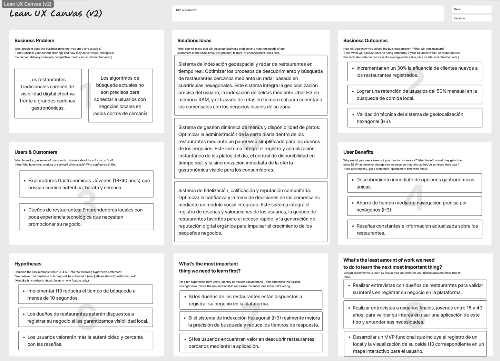

#### 1.3 Segmentos Objetivo

Esta sección detalla los segmentos relacionados con el ámbito del problema de Foodly, incorporando características demográficas y datos estadísticos que brindan respaldo a su análisis. Con el objetivo de crear un producto que responda adecuadamente a las necesidades de nuestros usuarios y potencie la economía local a nivel nacional (Perú), FoodNode centrará su atención en los siguientes segmentos de la población peruana:

1. Comensales exploradores que buscan experiencias gastronómicas auténticas y locales

    Personas que residen o transitan por zonas urbanas en diversas regiones del Perú y desean descubrir opciones de comida de alta calidad, buen precio y sazón única que no figuran en las aplicaciones comerciales masivas.

    - Edad: 18 a 35 años.
    - Ocupación: Estudiantes universitarios, jóvenes profesionales, trabajadores dependientes e independientes.

    - País: Perú.

    - Dominio: Usuarios con nivel intermedio-avanzado en el uso de smartphones y aplicaciones de mapas.
    - Beneficios buscados:
      - Localización instantánea de huariques en su entorno geográfico actual mediante radar geoespacial.

      - Acceso a información visual real y precios actualizados para reducir la incertidumbre.

      - Filtrado de opciones para descubrir negocios con identidad regional sobre franquicias.

2. Dueños de huariques o pequeños negocios gastronómicos con baja visibilidad digital

    A Emprendedores y familias dueñas de establecimientos con recetas tradicionales y excelente calidad que, por falta de herramientas técnicas o presupuesto de marketing, no logran captar al público que transita cerca de su ubicación.

    - Edad: 25 a 60 años.

    - Ocupación: Emprendedores gastronómicos, propietarios de micro y pequeñas empresas (MYPE).

    - País: Perú.

    - Dominio: Nivel básico o intermedio en tecnología; familiarizados con herramientas de mensajería (WhatsApp) y redes sociales básicas (Facebook), pero sin experiencia en gestión de plataformas especializadas.

    - Beneficios buscados:

      - Visibilidad automática ante usuarios que se encuentran físicamente cerca mediante el sistema de celdas H3.

      - Herramienta práctica para gestionar su vitrina digital (menú y fotos vía S3) de forma autónoma.

      - Atracción de nuevos clientes locales sin depender de altos costos publicitarios.

### Capítulo II: Requirements & Analysis

#### 2.1 Competidores
### 2.1.1. Análisis competitivo

En el mercado actual existen varias aplicaciones y plataformas de comida que permiten a los usuarios buscar restaurantes y lugares para comer, como Rappi, PedidosYa y Google Maps. Sin embargo, estas apps utilizan algoritmos de logística basados en radios circulares tradicionales que generan ineficiencias en ciudades complejas como Lima, dando prioridad a grandes cadenas y dejando poco espacio para huariques o negocios locales que no pueden costear sus altas comisiones.

<table style="width: 100%; border-collapse: collapse; font-family: Arial, sans-serif; font-size: 14px; border: 1px solid #ddd;">
  <thead>
    <tr style="background-color: #f2f2f2;">
      <th colspan="2" style="padding: 12px; border: 1px solid #ddd; text-align: left; background-color: #e8e8e8;">¿Por qué llevar a cabo este análisis?</th>
      <th colspan="4" style="padding: 12px; border: 1px solid #ddd; text-align: left;">El objetivo es identificar las brechas tecnológicas en el mercado de FoodTech en Lima y validar cómo la indexación hexagonal (H3) de Foodly ofrece una ventaja competitiva frente a los algoritmos de radio circular de las grandes plataformas.</th>
    </tr>
    <tr style="background-color: #4CAF50; color: white; text-align: center;">
      <th style="padding: 12px; border: 1px solid #ddd; width: 10%;">Categoría</th>
      <th style="padding: 12px; border: 1px solid #ddd; width: 15%;">Criterio</th>
      <th style="padding: 12px; border: 1px solid #ddd; width: 18.75%;">
        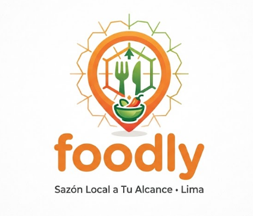 Nuestra Startup (Foodly)
      </th>
      <th style="padding: 12px; border: 1px solid #ddd; width: 18.75%;">
        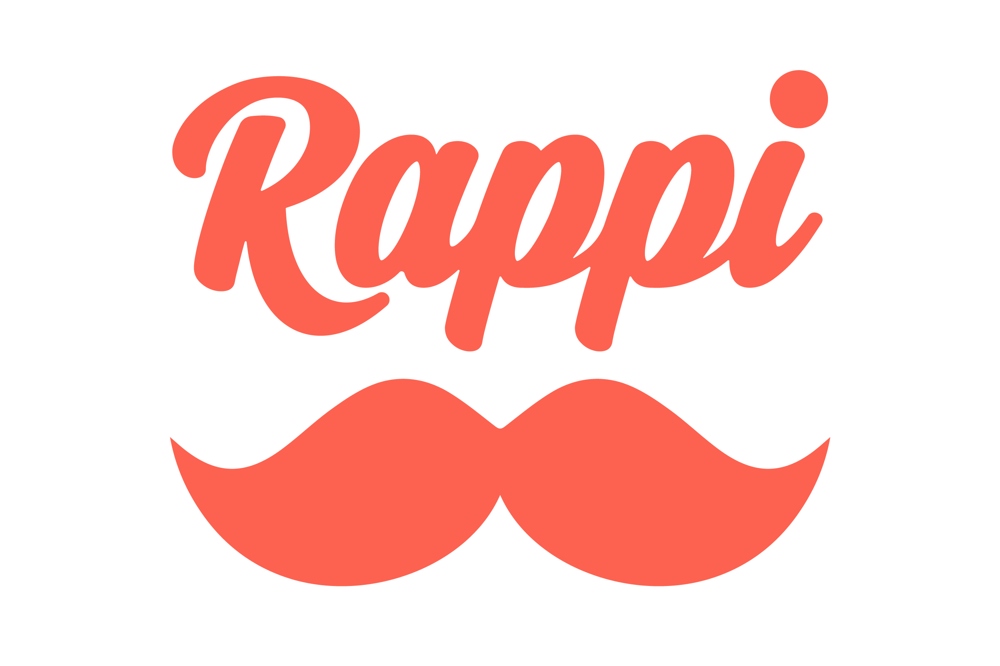 Competidor 1 (Rappi)
      </th>
      <th style="padding: 12px; border: 1px solid #ddd; width: 18.75%;">
         Competidor 2 (PedidosYa)
      </th>
      <th style="padding: 12px; border: 1px solid #ddd; width: 18.75%;">
        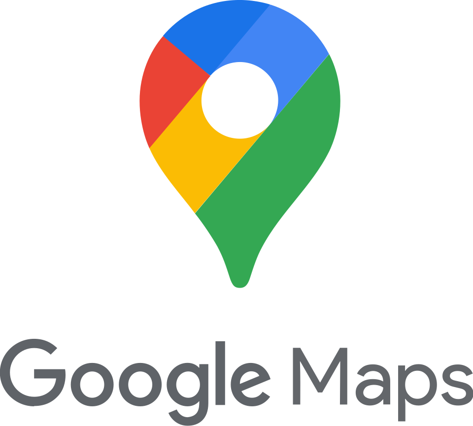 Competidor 3 (Google Maps)
      </th>
    </tr>
  </thead>
  <tbody>
    <tr>
      <td rowspan="2" style="padding: 10px; border: 1px solid #ddd; font-weight: bold; background-color: #fafafa; text-align: center;">Perfil</td>
      <td style="padding: 10px; border: 1px solid #ddd; background-color: #fafafa; font-weight: bold;">Overview</td>
      <td style="padding: 10px; border: 1px solid #ddd;">Solución logística especializada en huariques con optimización H3.</td>
      <td style="padding: 10px; border: 1px solid #ddd;">Super-app latinoamericana con gran cuota de mercado.</td>
      <td style="padding: 10px; border: 1px solid #ddd;">Plataforma de delivery masiva con fuerte presencia distrital.</td>
      <td style="padding: 10px; border: 1px solid #ddd;">Buscador global con reseñas y geolocalización básica.</td>
    </tr>
    <tr>
      <td style="padding: 10px; border: 1px solid #ddd; background-color: #fafafa; font-weight: bold;">Ventaja Competitiva</td>
      <td style="padding: 10px; border: 1px solid #ddd;">Eficiencia geoespacial extrema, acceso a joyas culinarias ocultas y baja latencia.</td>
      <td style="padding: 10px; border: 1px solid #ddd;">Ecosistema financiero integrado y amplia red de repartidores.</td>
      <td style="padding: 10px; border: 1px solid #ddd;">Logística establecida y promociones agresivas constantes.</td>
      <td style="padding: 10px; border: 1px solid #ddd;">Inmediatez de datos y base de datos de negocios infinita.</td>
    </tr>
    <tr>
      <td rowspan="2" style="padding: 10px; border: 1px solid #ddd; font-weight: bold; background-color: #fafafa; text-align: center;">Perfil de Marketing</td>
      <td style="padding: 10px; border: 1px solid #ddd; background-color: #fafafa; font-weight: bold;">Mercado Objetivo</td>
      <td style="padding: 10px; border: 1px solid #ddd;">Comensales que buscan autenticidad y dueños de pequeños huariques.</td>
      <td style="padding: 10px; border: 1px solid #ddd;">Usuarios urbanos masivos y grandes franquicias.</td>
      <td style="padding: 10px; border: 1px solid #ddd;">Consumidores de conveniencia de diversos estratos.</td>
      <td style="padding: 10px; border: 1px solid #ddd;">Público general que requiere información de ubicación.</td>
    </tr>
    <tr>
      <td style="padding: 10px; border: 1px solid #ddd; background-color: #fafafa; font-weight: bold;">Estrategias</td>
      <td style="padding: 10px; border: 1px solid #ddd;">Marketing de nicho basado en "curaduría" y autenticidad local.</td>
      <td style="padding: 10px; border: 1px solid #ddd;">Campañas masivas digitales y fidelización mediante RappiCard.</td>
      <td style="padding: 10px; border: 1px solid #ddd;">Descuentos agresivos por volumen y pautas en redes sociales.</td>
      <td style="padding: 10px; border: 1px solid #ddd;">Posicionamiento orgánico mediante SEO y Google Ads.</td>
    </tr>
    <tr>
      <td rowspan="3" style="padding: 10px; border: 1px solid #ddd; font-weight: bold; background-color: #fafafa; text-align: center;">Perfil de Producto</td>
      <td style="padding: 10px; border: 1px solid #ddd; background-color: #fafafa; font-weight: bold;">Productos & Servicios</td>
      <td style="padding: 10px; border: 1px solid #ddd;">Software de alta disponibilidad y radar de proximidad geoespacial.</td>
      <td style="padding: 10px; border: 1px solid #ddd;">Delivery de comida, súper, farmacia y servicios financieros.</td>
      <td style="padding: 10px; border: 1px solid #ddd;">Delivery de comida, farmacias y servicios de courier.</td>
      <td style="padding: 10px; border: 1px solid #ddd;">Mapas, perfiles de negocio, reseñas y navegación GPS.</td>
    </tr>
    <tr>
      <td style="padding: 10px; border: 1px solid #ddd; background-color: #fafafa; font-weight: bold;">Precios & Costos</td>
      <td style="padding: 10px; border: 1px solid #ddd;">Comisiones reducidas mediante optimización de costos operativos.</td>
      <td style="padding: 10px; border: 1px solid #ddd;">Comisiones altas (25-30%) más cargos por servicio.</td>
      <td style="padding: 10px; border: 1px solid #ddd;">Comisiones variables según demanda y costos de envío.</td>
      <td style="padding: 10px; border: 1px solid #ddd;">Gratuito para usuarios; monetización vía publicidad.</td>
    </tr>
    <tr>
      <td style="padding: 10px; border: 1px solid #ddd; background-color: #fafafa; font-weight: bold;">Canales (Web/Móvil)</td>
      <td style="padding: 10px; border: 1px solid #ddd;">Aplicación móvil (Android/iOS) centrada en el radar H3.</td>
      <td style="padding: 10px; border: 1px solid #ddd;">Aplicación móvil y plataforma web de escritorio.</td>
      <td style="padding: 10px; border: 1px solid #ddd;">Aplicación móvil y sitio web de pedidos online.</td>
      <td style="padding: 10px; border: 1px solid #ddd;">App móvil, sitio web e integración nativa.</td>
    </tr>
    <tr>
      <td rowspan="4" style="padding: 10px; border: 1px solid #ddd; font-weight: bold; background-color: #fafafa; text-align: center;">Análisis SWOT</td>
      <td style="padding: 10px; border: 1px solid #ddd; background-color: #e8f5e9; font-weight: bold;">Fortalezas</td>
      <td style="padding: 10px; border: 1px solid #ddd;">Precisión H3, nicho especializado y baja latencia.</td>
      <td style="padding: 10px; border: 1px solid #ddd;">Marca consolidada y flota masiva.</td>
      <td style="padding: 10px; border: 1px solid #ddd;">Logística robusta en distritos clave.</td>
      <td style="padding: 10px; border: 1px solid #ddd;">Base de datos global e integración con Google.</td>
    </tr>
    <tr>
      <td style="padding: 10px; border: 1px solid #ddd; background-color: #ffebee; font-weight: bold;">Debilidades</td>
      <td style="padding: 10px; border: 1px solid #ddd;">Marca nueva y red de soporte inicial pequeña.</td>
      <td style="padding: 10px; border: 1px solid #ddd;">Algoritmos de radio circular ineficientes.</td>
      <td style="padding: 10px; border: 1px solid #ddd;">Dependencia de descuentos para retención.</td>
      <td style="padding: 10px; border: 1px solid #ddd;">Sin gestión de logística ni última milla.</td>
    </tr>
    <tr>
      <td style="padding: 10px; border: 1px solid #ddd; background-color: #e3f2fd; font-weight: bold;">Oportunidades</td>
      <td style="padding: 10px; border: 1px solid #ddd;">Captar huariques que huyen de comisiones altas.</td>
      <td style="padding: 10px; border: 1px solid #ddd;">Expansión a dark kitchens y servicios B2B.</td>
      <td style="padding: 10px; border: 1px solid #ddd;">Crecimiento en conveniencia inmediata.</td>
      <td style="padding: 10px; border: 1px solid #ddd;">Pedidos directos desde la búsqueda.</td>
    </tr>
    <tr>
      <td style="padding: 10px; border: 1px solid #ddd; background-color: #fff3e0; font-weight: bold;">Amenazas</td>
      <td style="padding: 10px; border: 1px solid #ddd;">Guerra de precios de grandes competidores.</td>
      <td style="padding: 10px; border: 1px solid #ddd;">Regulaciones laborales de plataformas.</td>
      <td style="padding: 10px; border: 1px solid #ddd;">Entrada de nuevos competidores de nicho.</td>
      <td style="padding: 10px; border: 1px solid #ddd;">Nuevos buscadores con IA geoespacial.</td>
    </tr>
  </tbody>
</table>

**Foodly** se diferencia al implementar una arquitectura de alta disponibilidad basada en **indexación hexagonal (H3)**, lo que permite optimizar la logística de última milla con una precisión superior. Mientras la competencia satura sus servidores con cálculos de distancia punto a punto en tiempo real, Foodly reduce la latencia de emparejamiento a menos de 1 segundo mediante celdas uniformes. Esto nos permite reducir los tiempos de entrega en un 20% y ofrecer costos de envío menores, democratizando el acceso a tecnología de vanguardia para los pequeños negocios gastronómicos de Lima.

### 2.1.2. Estrategias y tácticas frente a competidores.  

Para diferenciar a Foodly de las grandes plataformas generales y posicionarse con éxito en el nicho de huariques, se plantean las siguientes estrategias y tácticas:

**Estrategias:**
- **Superioridad Técnica Geoespacial:** Utilizar el sistema de rejilla H3 para garantizar rutas óptimas y una asignación de repartidores más eficiente que los radios convencionales de la competencia.
- **Enfoque en Autenticidad Local:** Especializar la plataforma exclusivamente en "joyas ocultas" o huariques, ofreciendo una experiencia de curaduría que los competidores masivos no pueden replicar.
- **Sostenibilidad para el Negocio Local:** Implementar un modelo de costos operativos reducidos gracias a la eficiencia algorítmica, permitiendo comisiones más bajas y justas para los pequeños empresarios.

**Tácticas:**
- **Despliegue por Clústeres Hexagonales:** Focalizar la captación de comercios en zonas urbanas específicas de alta densidad gastronómica (nodos), asegurando la eficiencia del sistema antes de expandir el radio de acción.
- **Dashboard de Influencia Real:** Proveer a los dueños de huariques herramientas visuales basadas en mapas de calor hexagonales para que entiendan su área de cobertura y demanda real.
- **Agrupación Inteligente de Pedidos (Batching):** Implementar algoritmos que permitan a un solo repartidor cubrir múltiples pedidos dentro de una misma celda H3 o adyacentes, reduciendo el costo final para el usuario.
- **Optimización de UX para el Descubrimiento:** Crear una interfaz de alta velocidad que permita encontrar el "huarique ideal" en menos de 30 segundos mediante filtros basados en cercanía real y no solo en distancia lineal.
  
#### 2.2 Entrevistas

- *Diseño de entrevistas*:

Segmento 1: Exploradores Gastronómicos (Usuarios de la app web)

Objetivo: Entender sus motivaciones, comportamientos y expectativas al usar una app web para descubrir comida local auténtica.

  Preguntas Segmento 1:
  - ¿Con qué frecuencia usas aplicaciones web para buscar lugares para comer fuera de lo común?
  - ¿Cómo sueles descubrir huariques o lugares de comida poco conocidos en la web?
  - ¿Qué aspectos valoras más al elegir un lugar para comer usando una app web (precio, ubicación, reseñas, fotos, etc.)?
  - ¿Qué dificultades has tenido al usar apps web para buscar lugares de comida local?
  - ¿Qué te motivaría a usar una app web dedicada exclusivamente a huariques?
  - ¿Qué funcionalidades en la app web considerarías imprescindibles para usarla con regularidad?
  - ¿Qué preocupaciones o barreras tendrías al usar una app web para descubrir huariques?

Segmento 2: Dueños y Administradores de Huariques (Usuarios que usan la app web para gestionar su huarique).

Objetivo: Comprender sus necesidades y expectativas al usar la app web para administrar y promocionar sus huariques.

  Preguntas Segmento 2:
  - ¿Actualmente usas alguna plataforma web o digital para promocionar tu huarique? ¿Cuál?
  - ¿Qué retos has enfrentado al tratar de gestionar tu negocio a través de plataformas digitales?
  - ¿Qué tan cómodo te sientes usando aplicaciones web para actualizar la información de tu negocio?
  - ¿Qué características te harían decidirte a usar una app web especializada para huariques?
  - ¿Qué tipo de soporte o facilidades esperarías al usar esta app web para gestionar tu perfil o negocio?
  - ¿Qué modelo de tarifas o membresías considerarías justo para usar esta plataforma?
  - ¿Qué resultados te gustaría ver después de usar esta aplicación web para promocionar tu huarique?
  
### Segmento #1: Exploradores Gastronómicos (Usuarios de la app web)

<table border="1" cellspacing="0" cellpadding="8">
  <thead>
    <tr>
      <th>Número de entrevista</th>
      <th>Datos del entrevistado</th>
      <th>Evidencia de entrevista</th>
    </tr>
  </thead>
  <tbody>
    <tr>
      <td>1</td>
      <td>
        <strong>Nombre:</strong> Vitaly Baca  
        <strong>Edad:</strong> 20  
        <strong>Distrito:</strong> Lurín   
        <strong>Resumen:</strong> Vitaly Baca, estudiante de 20 años de Ingeniería de Software en la UPC, utiliza este tipo de aplicaciones casi todos los fines de semana, pues disfruta salir con su pareja o amigos a probar lugares nuevos. Descubre la mayoría de huariques en TikTok e Instagram siguiendo a foodies, y también explora en Google Maps. Lo primero que valora es el precio, ya que como estudiante tiene un presupuesto ajustado, seguido de fotos y comentarios confiables para no caer en un mal sitio. Entre las dificultades que ha enfrentado menciona que a veces llega a lugares que aparecen como abiertos pero están cerrados, además de que muchos huariques pequeños ni siquiera figuran en las apps. Se sentiría motivado a usar una app exclusiva de huariques siempre que tenga reseñas sinceras de usuarios similares a él. Considera imprescindibles los filtros por precio y tipo de comida, un mapa rápido e intuitivo y recomendaciones personalizadas. Sus principales preocupaciones serían que la app se llene de publicidad, tenga información poco confiable o incluya muy pocos lugares en su ciudad, perdiendo su valor.
      </td>
      <td>
         
        <a href="https://drive.google.com/file/d/1NSQkOkLNAq3A-IIhc4_lm2q3UwWDaylk/view?usp=sharing">Ver entrevista</a> 
        00:00 - 05:37
      </td>
    </tr>
    <tr>
      <td>2</td>
      <td>
        <strong>Nombre:</strong> Sebastian del Rio  
        <strong>Edad:</strong> 20  
        <strong>Distrito:</strong> Chorrillos   
        <strong>Resumen:</strong> Sebastián del Río, estudiante de 20 años de Ingeniería de Software en la UTP, no suele usar aplicaciones web con mucha frecuencia para buscar huariques, apenas una o dos veces al mes cuando quiere salir con amigos o probar algo distinto. Descubre la mayoría de lugares por recomendaciones en TikTok e Instagram, y ocasionalmente en Google Maps. Para él, lo más importante al elegir un lugar son las fotos y reseñas reales de otros usuarios, además del precio y la cercanía. Señala como principal dificultad que los huariques casi no aparecen en las aplicaciones, predominando los restaurantes conocidos, además de que muchas veces la información está incompleta o sin buenas fotos. Lo motivaría a usar una app que realmente muestre sitios auténticos y confiables, siempre que sea sencilla. Considera imprescindibles fotos reales, reseñas honestas, mapa con ubicación, filtros de precio y la opción de guardar favoritos. Su mayor preocupación sería que la información no sea confiable, que la app lo mande a lugares cerrados o de baja calidad, o que sea complicada y lenta.
      </td>
      <td>
         
        <a href="https://drive.google.com/file/d/1NSQkOkLNAq3A-IIhc4_lm2q3UwWDaylk/view?usp=sharing">Ver entrevista</a> 
        05:37 - 09:56
      </td>
    </tr>
    <tr>
      <td>3</td>
      <td>
        <strong>Nombre:</strong> Luis Fernandez  
        <strong>Edad:</strong> 20  
        <strong>Distrito:</strong> Pueblo Libre   
        <strong>Resumen:</strong> Luis Fernández, estudiante de 20 años de Ingeniería de Sistemas en la UTP, busca lugares nuevos casi todas las semanas, sobre todo los fines de semana cuando sale con su pareja. Se guía por cuentas de foodies en Instagram y TikTok, guarda videos para después y también consulta reseñas en Google Maps o en grupos de Facebook. Para él, el precio es fundamental, pero también valora la experiencia completa: reseñas sobre la atención y la calidad de la comida, junto con fotos de los platos. Ha tenido problemas con horarios desactualizados en apps, llegando a lugares cerrados, y con la falta de visibilidad de huariques menos conocidos. Lo motivaría una app confiable que se enfoque en huariques y cuente con reseñas de personas locales. Considera imprescindibles los filtros por tipo de comida, precio y ubicación, un mapa interactivo y recomendaciones personalizadas. Sus preocupaciones son que la aplicación tenga publicidad excesiva, información falsa o que no incluya suficientes opciones locales.
        </td>
      <td>
         
        <a href="https://drive.google.com/file/d/1P5WpXLAtHH9lsgnF7tXXyMJiK7xsN05h/view?usp=sharing">Ver entrevista</a> 
        09:56 - 13:01
      </td>
    </tr>
  </tbody>
</table>

### Segmento #2: Dueños y Administradores de Huariques (Usuarios que usan la app web para gestionar su huarique)
<table border="1" cellspacing="0" cellpadding="8">
  <thead>
    <tr>
      <th>Número de entrevista</th>
      <th>Datos del entrevistado</th>
      <th>Evidencia de entrevista</th>
    </tr>
  </thead>
  <tbody>
    <tr>
      <td>1</td>
      <td>
        <strong>Nombre:</strong> Wildor Villalobos  
        <strong>Edad:</strong> 28  
        <strong>Distrito:</strong> Santiago de Surco   
        <strong>Resumen:</strong> Propietario de un huarique de pan con chicharrón. Usa Instagram y TikTok (más IG Reels); las publicaciones sirven para promociones, pero los reels “mueven” más. Dificultades: competencia y algoritmo, requiere pagar para alcanzar más gente. Quiere que la app le permita resaltar su negocio y ver métricas claras (cuánta gente lo encuentra, eficacia para traer clientes), con panel simple y gráficos directos. Estaría dispuesto a pagar S/ 20–50/mes si rinde igual o mejor que IG/TikTok. Objetivo: aumentar ventas.
      </td>
      <td>
         
        <a href="https://drive.google.com/file/d/1P5WpXLAtHH9lsgnF7tXXyMJiK7xsN05h/view?usp=sharing">Ver entrevista</a> 
        00:00 - 03:15
      </td>
    </tr>
    <tr>
      <td>2</td>
      <td>
        <strong>Nombre:</strong> Piero Tapia  
        <strong>Edad:</strong> 26  
        <strong>Distrito:</strong> Jesús María   
        <strong>Resumen:</strong> Dueño de una sandwichería. Hoy depende de la afluencia local por falta de presupuesto y poca experiencia en redes/pagos en línea; la afiliación a apps no le resulta intuitiva. Valora que la app sea fácil de aprender y usar, con bajas comisiones (que no encarezcan sus productos). Además de visibilidad, pide guía/soporte para aprender a usar la herramienta y mejorar el negocio. Propone planes por etapas (principiante/intermedio/avanzado). Éxito esperado: más personas consumiendo en el local (no solo vistas).
      </td>
      <td>
         
        <a href="https://drive.google.com/file/d/1P5WpXLAtHH9lsgnF7tXXyMJiK7xsN05h/view?usp=sharing">Ver entrevista</a> 
        03:15 - 08:14
      </td>
    </tr>
    <tr>
      <td>3</td>
      <td>
        <strong>Nombre:</strong> Gabriela Vasquez  
        <strong>Edad:</strong> 23  
        <strong>Distrito:</strong> Pueblo Libre   
        <strong>Resumen:</strong> Propietaria de una juguería artesanal. Por ahora depende principalmente de los clientes que pasan por la zona, ya que su presupuesto es limitado y no tiene mucha experiencia en el uso de redes sociales ni plataformas digitales de venta. Comenta que afiliarse a apps de delivery o pago le resulta algo confuso. Busca una aplicación que sea intuitiva, con bajos costos de comisión y que le permita promocionar sus productos sin complicaciones. Además, le gustaría contar con asesoría o tutoriales que la ayuden a aprender a usar la herramienta y a impulsar su negocio. Propone contar con niveles de uso progresivos para avanzar poco a poco. Espera como resultado aumentar el flujo de clientes en su juguería, más que solo generar presencia en internet.
      </td>
      <td>
         
        <a href="https://drive.google.com/file/d/15Qma_86tWBnnfWBWlx28-MLKOQJRCrI2/view?usp=drive_link">Ver entrevista</a>
      </td>
    </tr>
  </tbody>
</table>

#### 2.3 Needfinding
##### 2.3.1 User Personas

Para comprender mejor las necesidades y comportamientos de los usuarios de Foodly, se han desarrollado dos perfiles representativos. Estos perfiles sintetizan los objetivos y retos de nuestros segmentos, permitiendo que las decisiones de arquitectura (como la indexación hexagonal H3) respondan a problemas reales de búsqueda y visibilidad en Lima.

* Persona 1: El Comensal Explorador
  
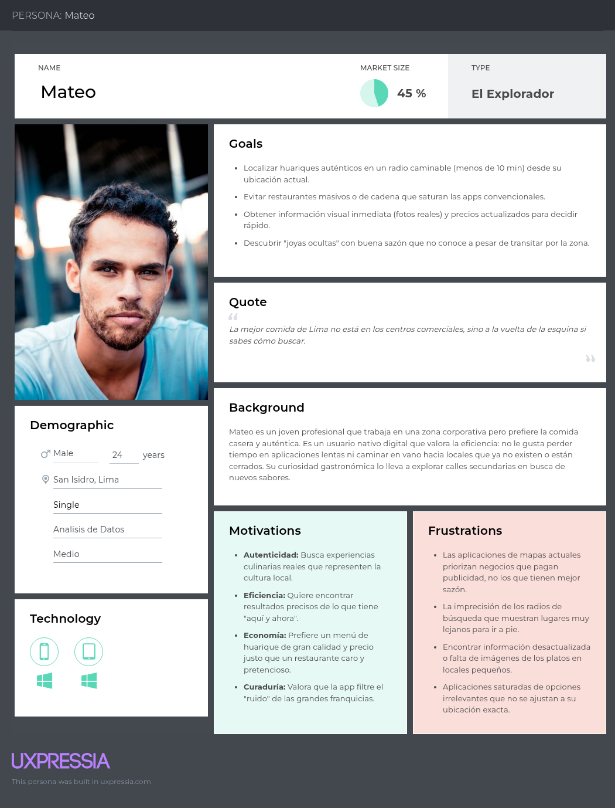

* Persona 2: El Dueño de Huarique
  

##### 2.3.2 User Task Matrix

<table border="1" style="width:100%; border-collapse: collapse; font-family: Arial, sans-serif; font-size: 14px;">
    <thead>
        <tr style="background-color: #f2f2f2; text-align: center;">
            <th style="padding: 10px; width: 30%;" rowspan="2">Tareas</th>
            <th style="padding: 10px; width: 35%;" colspan="2">Mateo (Explorador)</th>
            <th style="padding: 10px; width: 35%;" colspan="2">Doña Rosa (Dueña)</th>
        </tr>
        <tr style="background-color: #f2f2f2; text-align: center;">
            <th style="padding: 10px;">Frecuencia</th>
            <th style="padding: 10px;">Importancia</th>
            <th style="padding: 10px;">Frecuencia</th>
            <th style="padding: 10px;">Importancia</th>
        </tr>
    </thead>
    <tbody>
        <tr>
            <td style="padding: 8px; font-weight: bold;">Escanear entorno con radar hexagonal (H3)</td>
            <td style="padding: 8px; text-align: center;">Siempre</td>
            <td style="padding: 8px; text-align: center;">Muy alta</td>
            <td style="padding: 8px; text-align: center;">Raramente</td>
            <td style="padding: 8px; text-align: center;">Baja</td>
        </tr>
        <tr style="background-color: #fafafa;">
            <td style="padding: 8px; font-weight: bold;">Consultar detalles y precios del huarique</td>
            <td style="padding: 8px; text-align: center;">Siempre</td>
            <td style="padding: 8px; text-align: center;">Muy alta</td>
            <td style="padding: 8px; text-align: center;">Aveces</td>
            <td style="padding: 8px; text-align: center;">Media</td>
        </tr>
        <tr>
            <td style="padding: 8px; font-weight: bold;">Visualizar mapa de proximidad en tiempo real</td>
            <td style="padding: 8px; text-align: center;">Siempre</td>
            <td style="padding: 8px; text-align: center;">Alta</td>
            <td style="padding: 8px; text-align: center;">Raramente</td>
            <td style="padding: 8px; text-align: center;">Baja</td>
        </tr>
        <tr style="background-color: #fafafa;">
            <td style="padding: 8px; font-weight: bold;">Registrar y actualizar datos del local</td>
            <td style="padding: 8px; text-align: center;">Nunca</td>
            <td style="padding: 8px; text-align: center;">Nunca</td>
            <td style="padding: 8px; text-align: center;">Casi siempre</td>
            <td style="padding: 8px; text-align: center;">Alta</td>
        </tr>
        <tr>
            <td style="padding: 8px; font-weight: bold;">Gestionar galería de fotos (vía S3)</td>
            <td style="padding: 8px; text-align: center;">Aveces</td>
            <td style="padding: 8px; text-align: center;">Media</td>
            <td style="padding: 8px; text-align: center;">Casi siempre</td>
            <td style="padding: 8px; text-align: center;">Muy alta</td>
        </tr>
        <tr style="background-color: #fafafa;">
            <td style="padding: 8px; font-weight: bold;">Guardar huariques favoritos</td>
            <td style="padding: 8px; text-align: center;">Casi siempre</td>
            <td style="padding: 8px; text-align: center;">Alta</td>
            <td style="padding: 8px; text-align: center;">Nunca</td>
            <td style="padding: 8px; text-align: center;">Nunca</td>
        </tr>
    </tbody>
</table>

Las tareas identificadas en la matriz para **Foodly** reflejan la naturaleza bidireccional de la plataforma. **Mateo**, como explorador urbano, mantiene una interacción intensiva con las funciones de visualización y búsqueda geoespacial (H3), las cuales considera críticas para decidir dónde comer en el momento. Por otro lado, **Doña Rosa** centra su actividad en la gestión de su presencia digital, priorizando la actualización de datos y la carga de imágenes en la galería para atraer clientes, tareas que realiza con regularidad y considera de vital importancia para su visibilidad.

#### Coincidencias:
* Ambos perfiles consideran que la calidad visual de la información (fotos de los platos) es un factor relevante, aunque interactúan con esta función desde perspectivas distintas (consumo vs. creación).
* Existe una coincidencia en la baja frecuencia de uso de las funciones opuestas a su rol principal: Mateo nunca gestiona datos de locales y Doña Rosa casi nunca busca otros locales en el mapa.
* La importancia de la precisión en la ubicación es un punto en común, ya que de esto depende tanto el éxito del descubrimiento para uno como la llegada de clientes para la otra.

#### Diferencias:
* Mateo es un usuario de alta frecuencia en el radar de proximidad y mapas, mientras que para Doña Rosa esta función es secundaria debido a que su ubicación es estática.
* La actualización de información es la tarea principal de Doña Rosa, actividad que el segmento de comensales no realiza en absoluto.
* El uso del sistema de persistencia (S3) para la galería multimedia tiene una importancia "Muy alta" para Doña Rosa como herramienta de venta, mientras que para Mateo es un apoyo visual de importancia "Media" para la validación rápida.
  
##### 2.3.3 Empathy Maps
A continuación se presentan los mapas de empatía para los dos perfiles principales de usuarios de Foodly: Mateo, el comensal explorador, y Doña Rosa, la especialista y dueña de un huarique tradicional. Estos mapas permiten comprender en profundidad sus necesidades, pensamientos, sentimientos y comportamientos, facilitando un diseño arquitectónico y de interfaz centrado en el usuario.

* Segmento 1: Mateo (El Explorador)
  
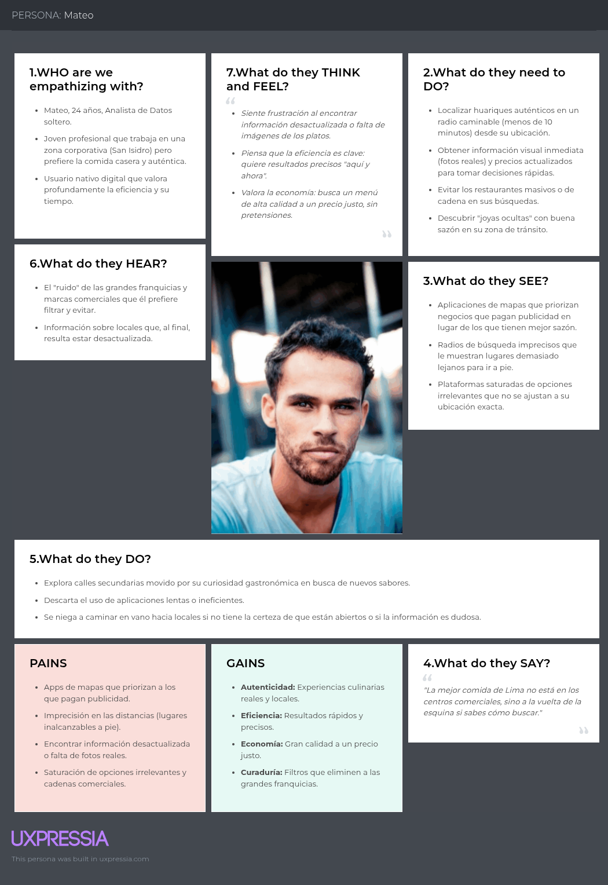

* Segmento 2: Doña Rosa (La Especialista)
  
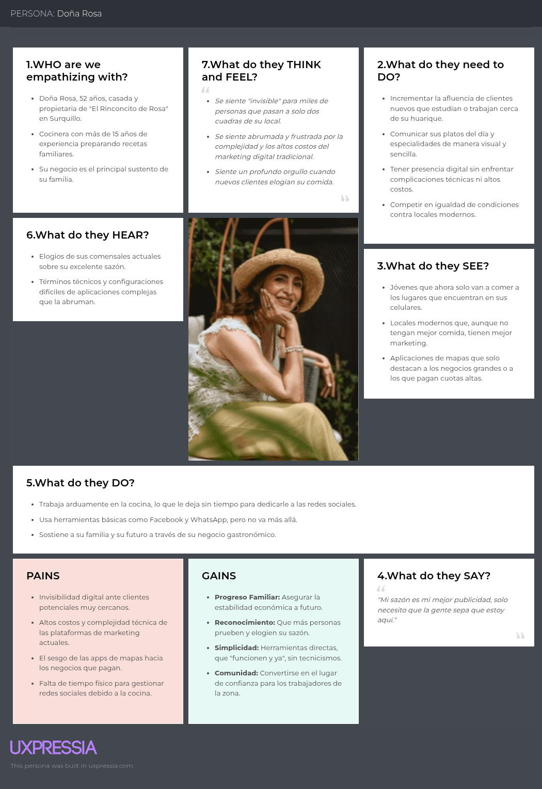

##### 2.3.4 As-is Scenario Mapping
* Segmento 1: Mateo (El Comensal Explorador)
  
Mediante este artefacto, se ha llevado a cabo la elaboración del As-Is Scenario Mapping para el primer segmento. Este escenario refleja cómo los usuarios jóvenes y profesionales, interesados en descubrir huariques, realizan actualmente sus actividades durante su rutina diaria. Además, evidencia las dificultades que enfrentan al buscar opciones auténticas y cercanas, lidiando con aplicaciones saturadas de franquicias, radios de búsqueda imprecisos y falta de información visual, así como las percepciones de desconfianza y frustración que experimentan en cada etapa de su recorrido.

* Segmento 2: Doña Rosa (La Especialista)
  
De igual manera, se ha elaborado el As-Is Scenario Mapping para el segundo segmento, enfocado en los propietarios de huariques tradicionales. Este escenario ilustra cómo estos emprendedores gestionan actualmente la promoción de sus locales comerciales. Detalla las fuertes barreras tecnológicas y de tiempo que enfrentan al intentar ganar visibilidad digital frente a negocios más modernos, resaltando la frustración, la sensación de invisibilidad y las emociones que experimentan al intentar atraer a nuevos clientes que transitan a escasas cuadras de su negocio.

### Capítulo III: Requirements Specification

#### 3.1 To-Be Scenario Mapping
* Segmento 1: Mateo (El Comensal Explorador)
  
Mediante este artefacto, se ha llevado a cabo la elaboración del To-Be Scenario Mapping para el primer segmento. Este escenario proyecta la experiencia ideal de los usuarios al utilizar Foodly durante su rutina diaria para descubrir huariques. Refleja cómo la aplicación resuelve sus dificultades actuales al permitirles filtrar cadenas comerciales, encontrar opciones auténticas en radios de caminata precisos y visualizar fotos reales de los platos, transformando la incertidumbre previa en un proceso de decisión rápido, confiable y altamente satisfactorio.

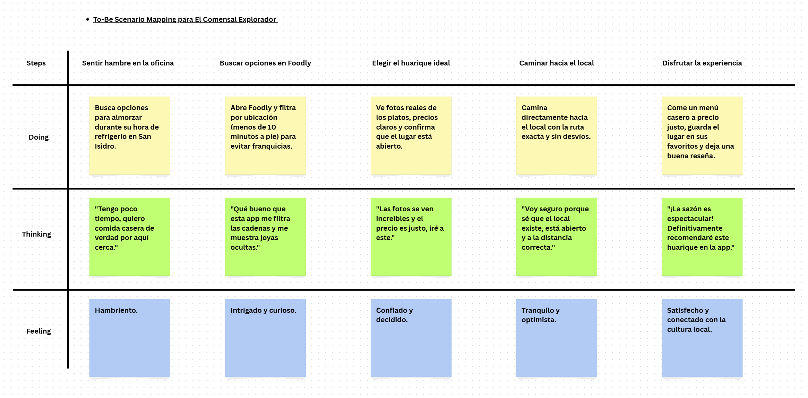

* Segmento 2: Doña Rosa (La Especialista)
  
De igual manera, se ha elaborado el To-Be Scenario Mapping para el segundo segmento, enfocado en los propietarios de huariques tradicionales. Este escenario ilustra el proceso optimizado mediante el cual estos emprendedores podrán promocionar sus locales comerciales usando Foodly. Detalla cómo la plataforma elimina las actuales barreras tecnológicas y económicas, permitiéndoles actualizar su menú diario de forma intuitiva para conectar directamente con nuevos clientes cercanos, transformando su previa sensación de invisibilidad en empoderamiento, reconocimiento y seguridad económica.

#### 3.2 User Stories

En esta sección, el equipo detalla el conjunto de User Stories y Epics desarrollados para Foodly. Cada una de ellas define un requerimiento funcional desde la perspectiva del usuario e incluye sus respectivos Criterios de Aceptación detallados en el formato Given / When / Then. Esta estructura nos permite establecer escenarios claros y verificables, tanto positivos como negativos, que guiarán el desarrollo del software para asegurar la precisión geoespacial y la alta disponibilidad propuestas para la plataforma. 

| Epic ID | Título | Descripción |
| :--- | :--- | :--- |
| **EP01** | Visualización Geográfica Interactiva | Implementación del núcleo visual basado en el sistema de indexación H3 de Uber para representación hexagonal[cite: 1]. |
| **EP02** | Gestión de Identidad y Negocio Digital | Herramientas para que los dueños de locales digitalicen su oferta y gestionen su presencia en el mapa[cite: 1]. |
| **EP03** | Motor de Descubrimiento Inteligente | Algoritmos de filtrado y búsqueda optimizados para la toma de decisiones rápida del usuario[cite: 1]. |
| **EP04** | Engagement y Experiencia Social | Funcionalidades para fomentar la fidelidad, reseñas verificadas y navegación en tiempo real[cite: 1]. |
| **EP05** | Infraestructura y Escalabilidad | Atributos de administración, soporte offline y resiliencia del sistema bajo carga[cite: 1]. |

---

| Epic / User Story ID | Título | Descripción | Criterios de Aceptación (Escenarios) | Relacionado con (Epic ID) |
| :--- | :--- | :--- | :--- | :--- |
| **US01** | Visualización de Radar H3 | Como explorador, quiero ver huariques en un mapa hexagonal para identificar zonas con comida cerca. | **Escenario 1 – Radar con datos** **Given** el usuario se encuentra en una zona con locales registrados **When** abre el mapa principal **Then** el sistema renderiza celdas H3 iluminadas con iconos de comida.  **Escenario 2 – Radar vacío** **Given** el usuario está en una zona remota sin registros **When** abre el mapa **Then** muestra un mensaje: "No hay huariques aquí aún, ¡recomienda uno!". | EP01 |
| **US02** | Registro de Huarique | Como dueño, quiero registrar mi local con pin en el mapa para ser visible en el radar. | **Escenario 1 – Registro exitoso** **Given** el dueño ingresa coordenadas válidas en Lima **When** guarda la ubicación del local **Then** el sistema asigna el local a una celda H3 única.  **Escenario 2 – Ubicación fuera de rango** **Given** el dueño marca un punto fuera de la ciudad de Lima **When** intenta guardar **Then** el sistema muestra error: "Ubicación fuera del área de servicio". | EP02 |
| **US03** | Filtrado por Sazón | Como explorador, quiero filtrar locales por calificación para asegurar una buena experiencia. | **Escenario 1 – Aplicación de filtro** **Given** locales con diversas puntuaciones en la celda **When** selecciono el filtro "4+ estrellas" **Then** el mapa oculta los locales con baja calificación.  **Escenario 2 – Sin resultados por filtro** **Given** solo locales con 3 estrellas en el radar **When** aplico el filtro "5 estrellas" **Then** el sistema muestra: "No hay locales tan top en esta celda, intenta ampliar el radio". | EP03 |
| **US04** | Galería de Platos | Como dueño, quiero subir fotos de mis platos para convencer visualmente a los clientes. | **Escenario 1 – Carga correcta** **Given** un archivo JPG de 2MB **When** el dueño lo sube a la galería **Then** la imagen se optimiza y se publica en el perfil.  **Escenario 2 – Formato inválido** **Given** un archivo de formato PDF **When** el dueño intenta subirlo **Then** muestra mensaje: "Solo se permiten imágenes (PNG/JPG)". | EP02 |
| **US05** | Navegación a Pie | Como explorador, quiero ver la ruta hacia el local para llegar rápidamente caminando. | **Escenario 1 – Cálculo de ruta** **Given** el usuario selecciona un local a 300m **When** pulsa el botón "Ir" **Then** se traza una línea guía en el mapa con el tiempo estimado.  **Escenario 2 – GPS desactivado** **Given** el permiso de ubicación denegado **When** pulsa "Ir" **Then** el sistema solicita activar el GPS para mostrar la ruta. | EP04 |
| **US06** | Estado Abierto/Cerrado | Como dueño, quiero cambiar mi estado de servicio para no recibir gente si ya cerré. | **Escenario 1 – Cierre de local** **Given** el local está como "Abierto" **When** el dueño pulsa "Cerrar" **Then** el hexágono cambia de color a gris en el mapa de los usuarios.  **Escenario 2 – Apertura programada** **Given** el local está "Cerrado" **When** llega la hora de apertura **Then** el sistema envía un recordatorio al dueño para activar el radar. | EP02 |
| **US07** | Búsqueda por Antojo | Como explorador, quiero buscar por tipo de comida para encontrar un antojo específico. | **Escenario 1 – Búsqueda directa** **Given** el usuario escribe "Ceviche" **When** presiona buscar **Then** el sistema resalta los hexágonos con cevicherías.  **Escenario 2 – Sin coincidencias** **Given** el usuario busca "Pizza con piña" **When** no hay locales con ese tag **Then** el sistema sugiere: "No encontramos pizza, ¿qué tal estos Lomo Saltados?". | EP03 |
| **US08** | Favoritos | Como explorador, quiero guardar locales para volver después fácilmente. | **Escenario 1 – Guardado exitoso** **Given** el perfil de un local abierto **When** presiono el icono de corazón **Then** el local se agrega a mi lista de "Joyas Guardadas".  **Escenario 2 – Local eliminado** **Given** un local en mis favoritos que fue dado de baja **When** abro mi lista **Then** el sistema indica que el local ya no está disponible. | EP04 |
| **US09** | Notificación Proximity | Como explorador, quiero recibir alertas de locales "Top" cercanos para no perdérmelos. | **Escenario 1 – Alerta en movimiento** **Given** el usuario entra en una celda con un local de 5 estrellas **When** la app está en segundo plano **Then** envía notificación: "¡Hay un huarique increíble a 50 metros!".  **Escenario 2 – Fuera de horario** **Given** el usuario pasa cerca a las 2 AM **When** el local está cerrado **Then** el sistema no envía ninguna notificación molesta. | EP04 |
| **US10** | Filtro de Presupuesto | Como explorador, quiero filtrar por precio para comer según lo que tenga en el bolsillo. | **Escenario 1 – Filtro económico** **Given** locales con rangos $, $$y$$$ **When** selecciono "$" **Then** solo muestra locales con platos de menos de S/15.  **Escenario 2 – Cambio de rango** **Given** el filtro "$" activo **When** cambio a "$$" **Then** la lista se actualiza instantáneamente con las nuevas opciones. | EP03 |
| **US11** | Dashboard de Vistas | Como dueño, quiero ver estadísticas de mi local para saber cuánta gente me encuentra. | **Escenario 1 – Consulta de métricas** **Given** actividad de usuarios en el día **When** abro el dashboard **Then** muestra el número total de clics en mi perfil.  **Escenario 2 – Perfil nuevo** **Given** un local recién registrado hoy **When** abro métricas **Then** muestra: "Aún no tienes visitas, ¡completa tu perfil para destacar!". | EP05 |
| **US12** | Reseña Verificada | Como explorador, quiero calificar locales para ayudar a la comunidad de Foodly. | **Escenario 1 – Reseña válida** **Given** el usuario está físicamente en el local **When** envía su calificación y comentario **Then** la reseña se publica con el sello "Visitante Real".  **Escenario 2 – Reseña remota** **Given** el usuario está a 5km del local **When** intenta calificar **Then** el sistema indica: "Debes estar en el local para dejar una reseña". | EP04 |
| **US13** | Contacto WhatsApp | Como explorador, quiero contactar al dueño para hacer preguntas o pedidos rápidos. | **Escenario 1 – Abrir chat** **Given** el botón de WhatsApp en el perfil **When** el usuario lo pulsa **Then** se abre la app de WhatsApp con un mensaje predeterminado.  **Escenario 2 – Sin número** **Given** un dueño que no registró teléfono **When** el usuario busca contacto **Then** el botón aparece deshabilitado. | EP02 |
| **US14** | Modo Oscuro Map | Como explorador, quiero un modo nocturno para buscar comida de noche cómodamente. | **Escenario 1 – Cambio de tema** **Given** es después de las 7 PM **When** abro la app **Then** el mapa cambia automáticamente a colores oscuros de alta visibilidad.  **Escenario 2 – Switch manual** **Given** el tema claro activo **When** cambio en ajustes a "Oscuro" **Then** toda la interfaz cambia sin necesidad de reiniciar la app. | EP04 |
| **US15** | Compartir Joyita | Como explorador, quiero enviar un huarique a un amigo para ir juntos. | **Escenario 1 – Link enviado** **Given** el usuario pulsa "Compartir" **When** selecciona un contacto **Then** envía un deep-link que abre el local directamente en el mapa.  **Escenario 2 – Receptor sin app** **Given** un contacto que no tiene Foodly **When** abre el link compartido **Then** se le redirige a una versión web con la info del local. | EP04 |
| **US16** | Validación de Higiene | Como dueño, quiero mostrar mis credenciales de sanidad para generar confianza. | **Escenario 1 – Sello verificado** **Given** el dueño sube su carnet sanitario **When** el admin lo aprueba **Then** aparece un check verde de "Local Seguro" en el radar.  **Escenario 2 – Documento vencido** **Given** un certificado con fecha pasada **When** el sistema lo detecta **Then** notifica al dueño para actualizarlo o perderá el sello. | EP05 |
| **US17** | Carga Offline | Como explorador, quiero ver locales guardados sin internet para no perderme en zonas sin señal. | **Escenario 1 – Consulta en caché** **Given** el usuario pierde conexión 4G **When** abre sus favoritos **Then** el sistema muestra la información básica almacenada localmente.  **Escenario 2 – Datos no cargados** **Given** un local que nunca visitó ni guardó **When** intenta abrirlo sin red **Then** muestra: "Se requiere conexión para ver este local". | EP05 |
| **US18** | Reporte de Local Cerrado | Como explorador, quiero reportar si un local ya no existe para mantener el mapa actualizado. | **Escenario 1 – Reporte enviado** **Given** el usuario llega al local y está vacío **When** pulsa "Informar cierre" **Then** el sistema envía una alerta al administrador para verificar.  **Escenario 2 – Reporte falso** **Given** un usuario que reporta muchos locales abiertos **When** el sistema detecta el patrón **Then** ignora sus reportes temporalmente por fiabilidad. | EP05 |
| **US19** | Gestión de Empleados | Como dueño, quiero registrar a mis ayudantes para que actualicen el menú por mí. | **Escenario 1 – Agregar staff** **Given** el panel de administración del dueño **When** ingresa el correo del empleado **Then** el empleado recibe acceso limitado para editar el plato del día.  **Escenario 2 – Revocar acceso** **Given** un empleado que ya no trabaja ahí **When** el dueño lo elimina de la lista **Then** el empleado pierde el acceso a la gestión del local inmediatamente. | EP02 |
| **US20** | Escalabilidad de Búsqueda | Como administrador, quiero que el motor H3 soporte miles de consultas para evitar caídas. | **Escenario 1 – Carga pesada** **Given** 1,000 usuarios buscando en la misma celda **When** se ejecutan las queries geoespaciales **Then** el tiempo de respuesta se mantiene por debajo de los 200ms.  **Escenario 2 – Fallo de servidor** **Given** una caída en un nodo de base de datos **When** un usuario intenta buscar **Then** el sistema conmuta a un nodo de respaldo sin interrumpir el servicio. | EP05 |
| **TS01** | Integración del Core H3 | Como arquitecto, deseo integrar la librería H3 de Uber para que el backend gestione correctamente los índices hexagonales[cite: 1]. | **Escenario 1 – Conversión de coordenadas:** Given una coordenada Lat/Long válida. When el servicio de indexación procesa el punto. Then genera un índice H3 válido. **Escenario 2 – Resolución inválida:** Given una solicitud de resolución no soportada. When el sistema intenta procesar. Then retorna un error de configuración. | EP01 |
| **TS02** | Persistencia Geoespacial | Como desarrollador, deseo configurar una base de datos optimizada para índices H3 para reducir latencia[cite: 1]. | **Escenario 1 – Indexación de local:** Given un nuevo registro de huarique. When se persiste en la DB geoespacial. Then el índice H3 se almacena como clave de búsqueda primaria. **Escenario 2 – Consulta por celda:** Given consulta por ID de celda H3. When el motor busca registros. Then retorna todos los locales en < 100ms. | EP05 |
| **TS03** | Microservicio de Media | Como arquitecto, deseo implementar almacenamiento en S3 para que la gestión de fotos sea asíncrona[cite: 1]. | **Escenario 1 – Subida asíncrona:** Given imagen enviada por el dueño. When el API recibe el archivo. Then delega la carga al bucket S3 sin bloquear el hilo principal. **Escenario 2 – Fallo de almacenamiento:** Given caída del servicio S3. When el sistema detecta el error. Then encola la tarea para reintento automático. | EP02 |
| **TS04** | Caché de Proximidad | Como desarrollador, deseo implementar Redis para que los resultados de celdas H3 se sirvan sin consultar la base de datos[cite: 1]. | **Escenario 1 – Hit de caché:** Given celda H3 altamente consultada. When un usuario abre el radar. Then los datos se recuperan desde Redis en < 50ms. **Escenario 2 – Invalidación:** Given actualización de datos en un local. When el dueño guarda cambios. Then se purga la entrada correspondiente en el caché. | EP03 |
| **TS05** | Service Workers Offline | Como desarrollador, deseo implementar Service Workers para que los favoritos persistan sin red[cite: 1]. | **Escenario 1 – Registro de worker:** Given app abierta. When el worker se activa. Then intercepta peticiones a la API de favoritos para guardarlas localmente. **Escenario 2 – Modo avión:** Given dispositivo sin internet. When usuario abre favoritos. Then el worker sirve los datos desde el storage local. | EP05 |

---

| ID | Título del Requerimiento | Especificación Técnica (Métrica/Restricción) | Relación con US/TS |
| :--- | :--- | :--- | :--- |
| **NFR-01** | **Disponibilidad de Servicio** | El sistema debe operar con un uptime del **99.9%** anual, implementando redundancia de nodos para failover automático. | **US20, TS02** |
| **NFR-02** | **Latencia de Búsqueda** | El radar H3 debe procesar y retornar los resultados de una celda hexagonal en un tiempo **$T < 200ms$** bajo condiciones normales de red. | **US01, TS04** |
| **NFR-03** | **Precisión de Geolocalización** | El sistema debe rechazar cualquier intento de reseña si la diferencia entre las coordenadas del usuario y el local es mayor a **50 metros**[cite: 1]. | **US12, TS03** |
| **NFR-04** | **Escalabilidad de Consultas** | El motor de indexación debe ser capaz de manejar hasta **1,000 peticiones concurrentes** por segundo sin incrementar la latencia por encima de los 500ms[cite: 1]. | **US20, TS02** |
| **NFR-05** | **Optimización de Carga Visual** | Las imágenes de la galería deben pasar por un proceso de compresión asíncrono que reduzca su peso a un máximo de **500KB** por archivo[cite: 1]. | **US04, TS03** |
| **NFR-06** | **Persistencia en Memoria** | El uso de Redis para el caché de proximidad debe garantizar un hit-rate mayor al **70%** para las celdas H3 de alta densidad[cite: 1]. | **TS04** |
| **NFR-07** | **Sincronización Offline** | El Service Worker debe ser capaz de sincronizar y almacenar localmente hasta **50 huariques favoritos** para su consulta sin conexión[cite: 1]. | **US17, TS05** |

#### 3.3 Impact Map

En esta sección, se presenta el Impact Mapping diseñado para articular la estrategia de negocio con el desarrollo tecnológico de Foodly. Esta herramienta visual conecta de manera lógica y SMART los Business Goals (Objetivos de Negocio) con los Deliverables (Entregables) y las User Stories, partiendo de los perfiles definidos en las fichas de User Persona. El mapa responde secuencialmente a las preguntas: ¿Por qué queremos lograrlo?, ¿Quiénes nos ayudarán?, ¿Cómo queremos que cambie su comportamiento? y, finalmente, ¿Qué características de software necesitamos construir para provocar ese impacto? 

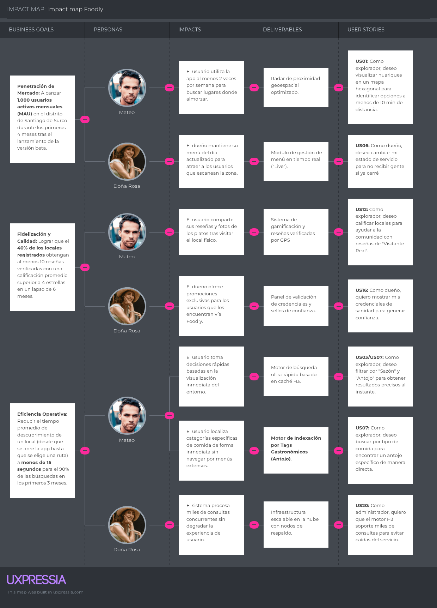

### 3.4. Product Backlog

A continuación se detalla el Product Backlog del proyecto **Foodly**. En esta sección se muestra una lista ordenada de nuestras historias de usuario, priorizadas de acuerdo con el consenso del equipo, el valor de negocio y la validación de los atributos de calidad de la arquitectura propuesta. Para estimar la complejidad de cada tarea, empleamos la secuencia de Fibonacci (1, 2, 3, 5, 8) como referencia para los Story Points.

| # Orden | User Story ID | Título | Descripción | Story Points (1 / 2 / 3 / 5 / 8) |
| :--- | :--- | :--- | :--- | :---: |
| 1 | US01 | Visualización de Radar H3 | Como explorador, quiero ver huariques en un mapa hexagonal para identificar zonas con comida cerca. | 8 |
| 2 | US02 | Registro de Huarique | Como dueño, quiero registrar mi local con pin en el mapa para ser visible en el radar. | 5 |
| 3 | US20 | Escalabilidad de Búsqueda | Como administrador, quiero que el motor H3 soporte miles de consultas para evitar caídas. | 8 |
| 4 | US04 | Galería de Platos | Como dueño, quiero subir fotos de mis platos para convencer visualmente a los clientes. | 5 |
| 5 | US03 | Filtrado por Sazón | Como explorador, quiero filtrar locales por calificación para asegurar una buena experiencia. | 3 |
| 6 | US07 | Búsqueda por Antojo | Como explorador, quiero buscar por tipo de comida para encontrar un antojo específico. | 5 |
| 7 | US06 | Estado Abierto/Cerrado | Como dueño, quiero cambiar mi estado de servicio para no recibir gente si ya cerré. | 3 |
| 8 | US05 | Navegación a Pie | Como explorador, quiero ver la ruta hacia el local para llegar rápidamente caminando. | 5 |
| 9 | US12 | Reseña Verificada | Como explorador, quiero calificar locales para ayudar a la comunidad de Foodly. | 5 |
| 10 | US09 | Notificación Proximity | Como explorador, quiero recibir alertas de locales "Top" cercanos para no perdérmelos. | 5 |
| 11 | US10 | Filtro de Presupuesto | Como explorador, quiero filtrar por precio para comer según lo que tenga en el bolsillo. | 3 |
| 12 | US08 | Favoritos | Como explorador, quiero guardar locales para volver después fácilmente. | 2 |
| 13 | US13 | Contacto WhatsApp | Como explorador, quiero contactar al dueño para hacer preguntas o pedidos rápidos. | 2 |
| 14 | US11 | Dashboard de Vistas | Como dueño, quiero ver estadísticas de mi local para saber cuánta gente me encuentra. | 5 |
| 15 | US17 | Carga Offline | Como explorador, quiero ver locales guardados sin internet para no perderme en zonas sin señal. | 5 |
| 16 | US16 | Validación de Higiene | Como dueño, quiero mostrar mis credenciales de sanidad para generar confianza. | 3 |
| 17 | US19 | Gestión de Empleados | Como dueño, quiero registrar a mis ayudantes para que actualicen el menú por mí. | 5 |
| 18 | US15 | Compartir Joyita | Como explorador, quiero enviar un huarique a un amigo para ir juntos. | 2 |
| 19 | US18 | Reporte de Local Cerrado | Como explorador, quiero reportar si un local ya no existe para mantener el mapa actualizado. | 2 |
| 20 | US14 | Modo Oscuro Map | Como explorador, quiero un modo nocturno para buscar comida de noche cómodamente. | 1 |

Igualmente podrá visuarlo mediante el link proporcionado, en la cual se implementó Trello: 

Además se esta compartiendo una captura del product backlog de Foodly:
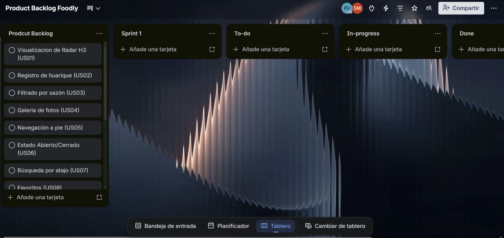

### Capítulo IV: Product Architecture Design

#### 4.1 Design Concepts, ViewPoints & ER Diagrams
##### 4.1.1 Principles Statements

Se han definido pautas generales basadas en la visión de negocio de **FoodNode** para guiar las decisiones técnicas a largo plazo:

* **Geolocalización centrada en Celdas (H3):** Toda lógica de proximidad debe basarse en el índice de celdas hexagonales en lugar de distancias euclidianas para garantizar tiempos de respuesta sub-segundo.
    * Optimiza la precisión en la localización y búsqueda por proximidad en aplicaciones basadas en mapas.
    * Permite que un usuario encuentre un huarique relevante en menos de 10 segundos y con precisión de celda actual.

* **Comunicación Asíncrona sobre Sincrónica:** Se priorizará el uso de un Broker de mensajería para desacoplar procesos pesados, como la actualización de métricas del local o la carga de imágenes.
    * Evita cuellos de botella en el procesamiento de información geoespacial al no bloquear el hilo principal.
    * Mejora la escalabilidad al procesar tareas de fondo (como carga a S3) sin afectar el rendimiento del radar.

* **Agnosticismo de la Interfaz:** La lógica del radar geoespacial debe ser independiente del cliente (App móvil o Web), permitiendo una experiencia consistente en ambos canales.
    * Garantiza que la curaduría culinaria y la precisión de búsqueda sean idénticas en cualquier plataforma.
    * Facilita el mantenimiento centralizado del algoritmo de búsqueda H3 y las reglas de negocio.

* **Persistencia Políglota:** Cada microservicio debe utilizar el motor de base de datos que mejor se adapte a su dominio (ej. NoSQL para el radar, Relacional para gestión de usuarios).
    * Permite manejar de forma eficiente la alta disponibilidad y la indexación espacial requerida para Foodly.
    * Asegura la integridad de los datos de gestión de negocios y usuarios mediante esquemas relacionales donde sea necesario.

##### 4.1.2 Approaches Statements, Architectural Styles & Patterns
* **Domain-Driven Design (DDD):** El sistema se divide en contextos delimitados (*Bounded Contexts*) para separar el motor de búsqueda (Geo-Radar) de la gestión administrativa de los huariques.
    * Alinea la arquitectura técnica con los segmentos objetivo: exploradores y dueños de locales.
    * Reduce la complejidad al aislar las reglas de negocio de geolocalización de las de gestión de perfiles e inventarios.

* **Estilo Arquitectónico de Microservicios:** Se implementará una arquitectura descentralizada para permitir el crecimiento exponencial y el escalamiento independiente de los módulos críticos.
    * Permite que la plataforma escale a otros distritos de Lima sin degradar el tiempo de respuesta.
    * Asegura una arquitectura de alta disponibilidad fundamental para el sector gastronómico de Lima.

* **Patrón API Gateway:** Actuará como punto de entrada único, encargándose de la agregación de datos y la seguridad, optimizando las peticiones desde dispositivos móviles.
    * Simplifica la interacción cliente-servidor ocultando la complejidad interna de los microservicios.
    * Proporciona una interfaz móvil-first eficiente para los exploradores gastronómicos.

* **Event-Driven Architecture:** Se utilizarán eventos para notificar cambios de estado en tiempo real, como cuando un dueño de local cambia su estado a "Abierto" o "Cerrado".
    * Actualiza instantáneamente el hexágono en el mapa de los usuarios según el estado real del local.
    * Permite enviar notificaciones de proximidad (*Proximity Alerts*) de forma reactiva al movimiento del usuario.
##### 4.1.3 Context Diagram

A continuación, se presenta el diagrama de contexto (Nivel 1 del modelo C4), el cual proporciona una vista macro de Foodly, mostrando al sistema central y sus interacciones directas con los usuarios finales y los sistemas de software externos.

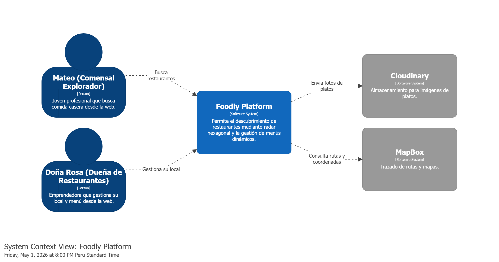

**Descripción de los elementos del diagrama:**

* **Sistema Central (Software System):**
  * **Foodly Platform:** El sistema core que gestiona el descubrimiento de huariques y la publicación de menús.
* **Personas (Actores):**
  * **Comensal Explorador:** Usuario que utiliza la aplicación para escanear zonas con el radar H3, buscar comida auténtica y dejar reseñas.
  * **Dueño de Huarique:** Usuario administrador que gestiona su local, sube fotos de sus platos y actualiza su estado (Abierto/Cerrado).
* **Sistemas Externos (External Systems):**
  * **H3 Geospatial Engine / Map API:** Proveedor externo que permite renderizar las celdas hexagonales y calcular la proximidad.
  * **Cloud Storage System (ej. AWS S3):** Almacenamiento externo para guardar y servir optimizadamente la galería de imágenes de los huariques y platos.

##### 4.1.4 Approach driven ViewPoints Diagrams
Para la representación y documentación de la arquitectura de Foodly Platform, se adopta el Modelo C4 como el enfoque principal de puntos de vista (Viewpoints). Este enfoque permite comunicar el diseño del software tanto a los stakeholders técnicos como a los no técnicos a través de múltiples niveles de abstracción. Asimismo se presenta los diagrama de actividades:

* **Container Viewpoint**
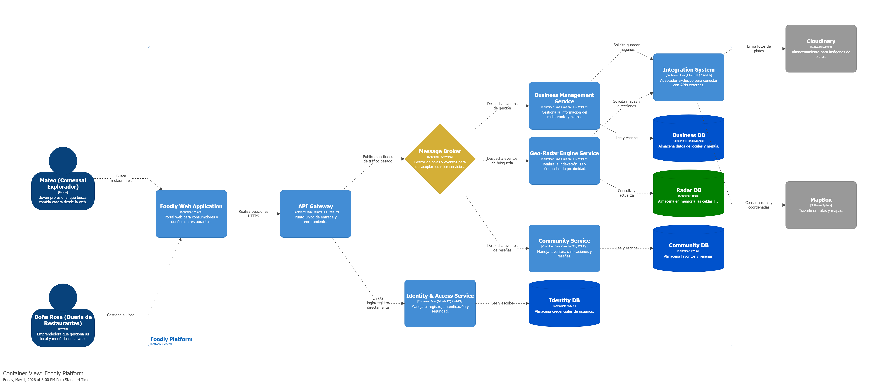

**Descripción:** Este punto de vista detalla las responsabilidades de la aplicación web en Vue.js, el API Gateway y el Message Broker (ActiveMQ) en WildFly, los microservicios core desarrollados en Java nativo (Jakarta EE) y las bases de datos individuales e independientes (MySQL, MongoDB Atlas y Redis) bajo el patrón Database-per-Service. Es el punto de vista principal utilizado para guiar a los desarrolladores y arquitectos en las decisiones de despliegue, lenguajes de programación y protocolos de comunicación.

* **Component Viewpoint**

  a. Geo Radar Microservice

  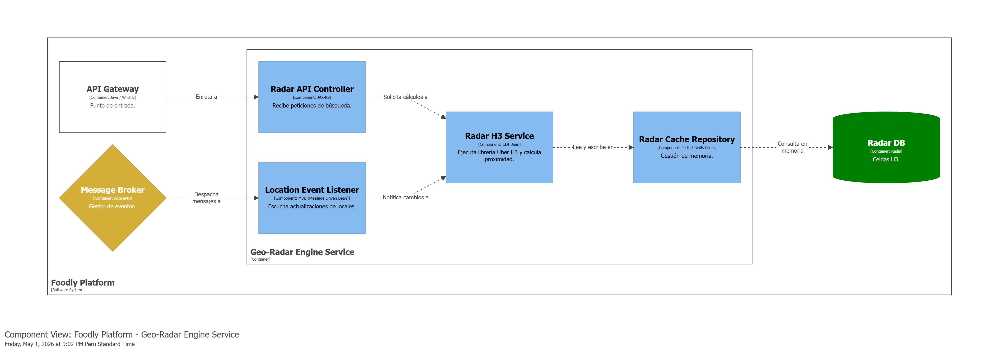

  Este microservicio es responsable de la conversión de coordenadas geográficas en índices hexagonales mediante la librería Uber H3 y de calcular la proximidad de los restaurantes en tiempo real.

  - Radar API Controller (JAX-RS): Actúa como el punto de entrada síncrono del microservicio. Expone los endpoints RESTful para recibir las coordenadas (latitud y longitud) del comensal Mateo desde el frontend en Vue.js.

  - Radar H3 Service: Contiene el núcleo de la lógica matemática del radar. Utiliza los bindings nativos de la librería Uber H3 en Java para transformar las coordenadas en un índice hexadecimal y calcular el anillo de celdas vecinas.

  - Radar Cache Repository: Gestiona la conexión directa con la base de datos en memoria Redis (Radar DB). Permite leer y escribir los datos geoespaciales a velocidad de memoria RAM.

  - Location Event Listener: Es un componente asíncrono que escucha la cola del Message Broker (ActiveMQ). Se activa de forma automática cuando se registra o actualiza un nuevo restaurante, notificando al Radar H3 Service para que refresque la caché en Redis.

  b. Identity & User Management Microservice

  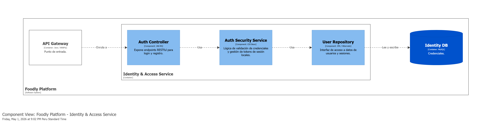

  Este microservicio centraliza la seguridad de la plataforma, el registro de usuarios y el control de accesos mediante la gestión de tokens de sesión locales almacenados en base de datos.

  - Auth Controller: Expone los endpoints RESTful necesarios para los flujos de registro de usuarios, inicio de sesión (login) y cierre de sesión (logout).

  - Auth Security Service: Implementa las reglas de seguridad del negocio. Valida las contraseñas enviadas por los usuarios y se encarga de generar los tokens de sesión únicos en formato UUID de Java nativo.

  - User Repository: Gestiona el acceso a la base de datos Identity DB (MySQL). Ejecuta las consultas para verificar las credenciales del usuario y persiste los tokens de sesión locales junto con su fecha de expiración para su posterior validación.

  c. Integration System

  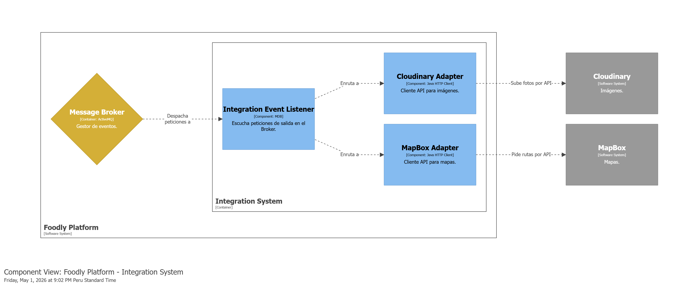

  Este componente actúa como una Capa de Anti-Corrupción (ACL). Aísla por completo el núcleo del sistema de los cambios o fallas en los contratos de APIs externas de terceros.
  
  - Integration Event Listener: Escucha las solicitudes de salida enviadas por los microservicios core a través del Message Broker (ActiveMQ). Al recibir un mensaje, lo procesa de forma asíncrona sin bloquear la experiencia del usuario en la web.
  
  - Cloudinary Adapter: Es el adaptador exclusivo para la gestión de imágenes. Transforma las solicitudes internas de Foodly al formato requerido por la API de Cloudinary para subir las fotos de los platos de Doña Rosa.

  - MapBox Adapter: Es el adaptador geoespacial exclusivo. Se comunica por HTTP con la API de Mapbox para solicitar las direcciones exactas, distancias y tiempos de llegada entre el comensal y el huarique.

  d. Business Management Microservice

  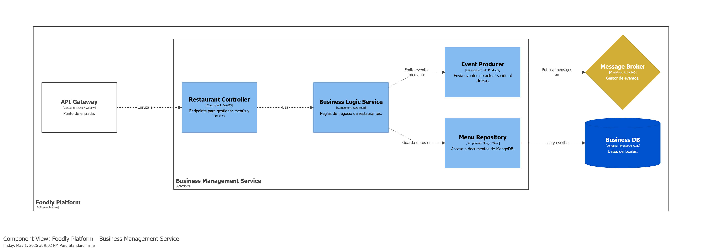

  Este microservicio administra la información comercial de los restaurantes, la geolocalización de los locales y la actualización de los platos del menú.

  - Restaurant Controller: Expone los endpoints RESTful para que Doña Rosa pueda gestionar los datos de su restaurante y crear nuevos platos para el día.
  
  - Business Logic Service: Ejecuta las reglas de negocio transaccionales del restaurante, como validar horarios de atención, precios de platos y disponibilidad.

  - Menu Repository: Es el componente de acceso a datos para Business DB (MongoDB Atlas). Almacena y recupera los menús del restaurante en formato de documentos JSON flexibles.

  - Event Producer: Se encarga de publicar eventos en el Message Broker (ActiveMQ). Por ejemplo, cuando se crea un nuevo plato con foto, emite un mensaje asíncrono para que el Integration System procese la imagen en Cloudinary sin retrasar la respuesta del frontend.

* **Activities Viewpoint**
  a. Flujo de Autenticación (Síncrono - Driver de Performance Inicial)

  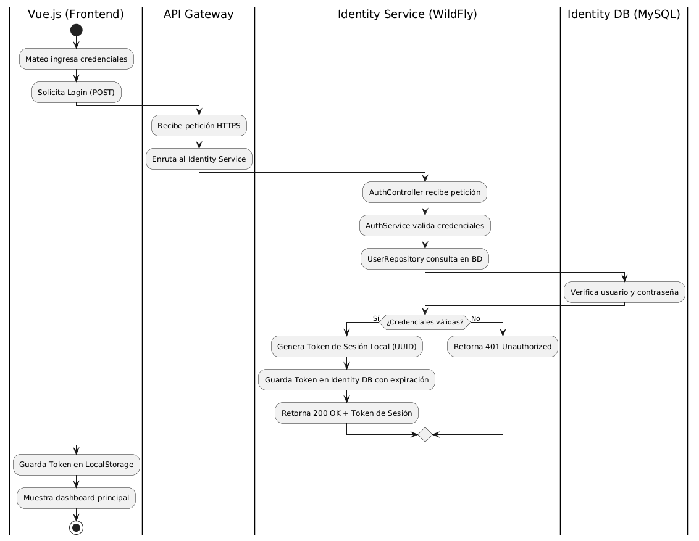

  - Descripción: Este diagrama de actividad modela el proceso por el cual el comensal Mateo o la dueña Doña Rosa acceden a la plataforma de forma segura. El flujo es estrictamente síncrono para garantizar una respuesta inmediata al usuario.

  - Sustento Técnico: La petición HTTPS es canalizada por el API Gateway hacia el microservicio de identidad. Al validar las credenciales contra la base de datos MySQL (Identity DB), el sistema genera un Token de Sesión Local (UUID) que se persiste temporalmente con una fecha de caducidad. Este enfoque elimina la necesidad de procesar firmas complejas o depender de proveedores externos, optimizando la velocidad del inicio de sesión.

  b. Flujo de Búsqueda por Radar (Caché - Driver de Performance)

  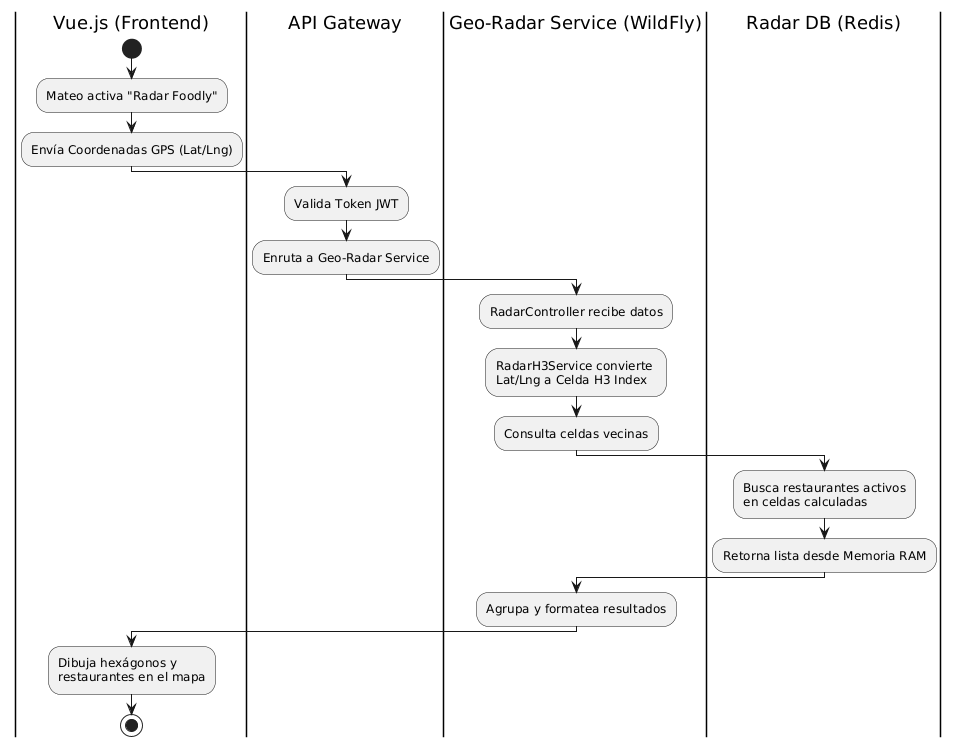

  - Descripción: Representa el flujo que se activa cuando Mateo busca huariques cercanos utilizando el radar hexagonal desde la aplicación web en Vue.js.

  - Sustento Técnico: Al recibir las coordenadas geográficas, el Geo-Radar Engine Service utiliza los bindings nativos de la librería Uber H3 en Java para calcular la celda del usuario en milisegundos. Para satisfacer el driver de Performance, la consulta de los restaurantes activos no se hace en las bases de datos transaccionales en disco duro, sino que se recupera directamente de la memoria RAM en Redis (Radar DB). Esto permite que la web pinte el mapa con el radar en menos de 2 segundos.

  c. Flujo de Creación de Menú y Subida de Imagen (Asíncrono - Alta Disponibilidad)

  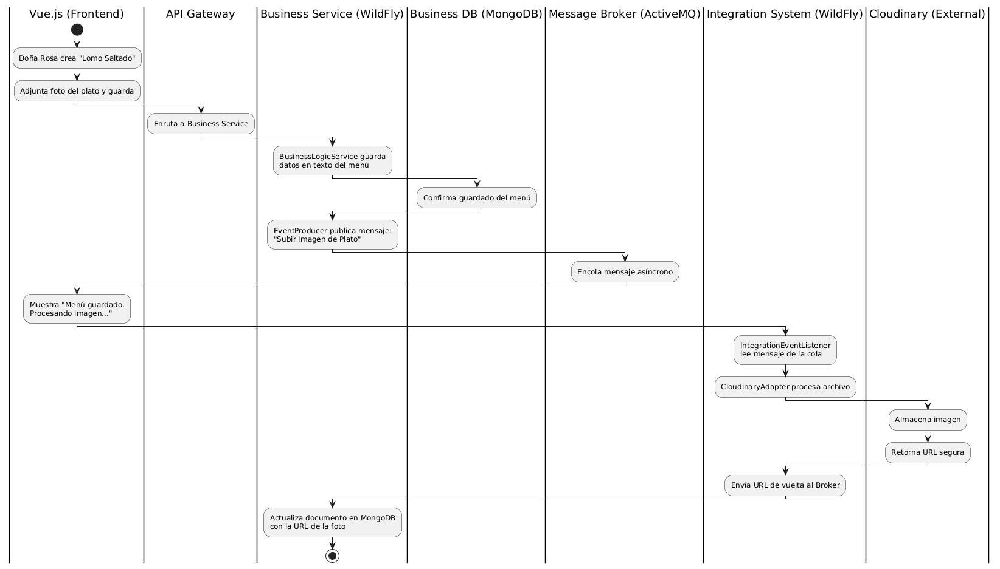

    - Descripción: Detalla el proceso que ocurre cuando Doña Rosa registra un nuevo plato en su carta y sube una fotografía desde el portal web.
  
    - Sustento Técnico: Para no congelar la pantalla de Doña Rosa mientras se procesa la imagen, el flujo se divide mediante una táctica asíncrona. Los datos en texto del plato se guardan de inmediato en MongoDB Atlas, mientras que la tarea pesada de la foto se publica en el Message Broker (ActiveMQ). El Integration System lee el mensaje en segundo plano, sube el archivo a la API de Cloudinary y actualiza el registro con la URL final. Esto garantiza que el sistema no colapse ante picos de tráfico en horas punta de gestión.

##### 4.1.5 Relational/Non Relational Database Diagram

Para soportar los atributos de calidad de alta disponibilidad y baja latencia exigidos por Foodly, el sistema implementa un enfoque de persistencia políglota, utilizando el modelo de base de datos más eficiente para cada tipo de información.

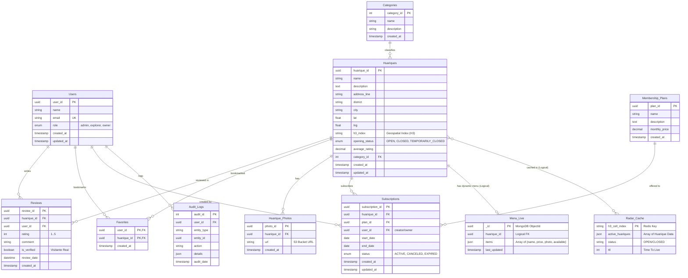
```mermaid
erDiagram
  Users            ||--o{ Reviews         : "writes"
  Users            ||--o{ Favorites       : "bookmarks"
  Huariques        ||--o{ Reviews         : "reviewed in"
  Huariques        ||--o{ Favorites       : "bookmarked"
  Categories       ||--o{ Huariques       : "classifies"
  Huariques        ||--o{ Huarique_Photos : "has"
  Membership_Plans ||--o{ Subscriptions   : "offered to"
  Huariques        ||--o{ Subscriptions   : "subscribes"
  Users            ||--o{ Subscriptions   : "created by"
  Users            ||--o{ Audit_Logs      : "logs"

  Users {
      uuid user_id PK
      string name
      string email UK
      enum role "admin, explorer, owner"
      timestamp created_at
      timestamp updated_at
  }

  Huariques {
      uuid huarique_id PK
      string name
      text description
      string address_line
      string district
      string city
      float lat
      float lng
      string h3_index "Geospatial Index (H3)"
      enum opening_status "OPEN, CLOSED, TEMPORARILY_CLOSED"
      decimal average_rating
      int category_id FK
      timestamp created_at
      timestamp updated_at
  }

  Categories {
      int category_id PK
      string name
      string description
      timestamp created_at
  }

  Reviews {
      uuid review_id PK
      uuid huarique_id FK
      uuid user_id FK
      int rating "1..5"
      string comment
      boolean is_verified "Visitante Real"
      datetime review_date
      timestamp created_at
  }

  Favorites {
      uuid user_id PK,FK
      uuid huarique_id PK,FK
      timestamp created_at
  }

  Membership_Plans {
      uuid plan_id PK
      string name
      text description
      decimal monthly_price
      timestamp created_at
  }

  Subscriptions {
      uuid subscription_id PK
      uuid huarique_id FK
      uuid plan_id FK
      uuid user_id FK "creator/owner"
      date start_date
      date end_date
      enum status "ACTIVE, CANCELED, EXPIRED"
      timestamp created_at
      timestamp updated_at
  }

  Huarique_Photos {
      uuid photo_id PK
      uuid huarique_id FK
      string url "S3 Bucket URL"
      timestamp created_at
  }

  Audit_Logs {
      int audit_id PK
      uuid user_id FK
      string entity_type
      uuid entity_id
      string action
      json details
      timestamp audit_date
  }
  Huariques ||--o| Menu_Live : "has dynamic menu (Logical)"

  Menu_Live {
      uuid _id PK "MongoDB ObjectId"
      uuid huarique_id "Logical FK"
      json items "Array of {name, price, photo, available}"
      timestamp last_updated
  }
  Huariques }o--o{ Radar_Cache : "cached in (Logical)"

  Radar_Cache {
      string h3_cell_index PK "Redis Key"
      json active_huariques "Array of Huarique Data"
      string status "OPEN/CLOSED"
      int ttl "Time To Live"
  }

```

**1. Base de Datos Relacional (PostgreSQL / MySQL)**
Maneja la información transaccional y la integridad referencial estricta del sistema.
* **Tabla `Usuarios`:** Almacena los datos de autenticación (ID, Nombre, Email, Contraseña, Rol: Explorador/Dueño).
* **Tabla `Huariques`:** Contiene los datos maestros del negocio (ID, Dueño_ID, Nombre, Descripción, Latitud, Longitud, H3_Index_Celda).
* **Tabla `Resenas`:** Registra el feedback verificado (ID, Huarique_ID, Usuario_ID, Calificación, Comentario, Fecha).

**2. Base de Datos No Relacional (MongoDB & Redis)**
Maneja datos dinámicos, documentos flexibles y garantiza respuestas de baja latencia para búsquedas.
* **Colección `Menu_Diario` (MongoDB):** Utilizado para la carta dinámica. Almacena documentos con el Huarique_ID y un array de objetos de platos (Nombre, Precio, Foto_URL, Disponibilidad).
* **Caché en Memoria (Redis):** Almacena el radar temporal. Guarda pares clave-valor que mapean el ID de la celda H3 con la lista de huariques activos, garantizando búsquedas geoespaciales en milisegundos.

##### 4.1.6 Design Patterns
* **Factory Method:** Útil para la creación de entidades críticas como locales, registros de sensores o reseñas de usuarios.
    * Centraliza la lógica de creación y validación inicial de los locales geolocalizados.
    * Asegura que todos los locales se inicialicen con campos obligatorios para su indexación en el mapa.

* **Circuit Breaker:** Patrón crítico que protege al sistema cuando un microservicio de búsqueda (H3) presenta fallos o alta latencia.
    * Evita que los fallos se propaguen en cascada a todo el ecosistema de Foodly.
    * Mejora la disponibilidad, permitiendo que funciones vitales sigan operativas si un módulo auxiliar falla temporalmente.

* **Retry Pattern:** Aplicado a las llamadas salientes entre servicios para manejar fallos transitorios, como picos de latencia en la red.
    * Aumenta la tolerancia a fallos transitorios mediante reintentos con una estrategia de *backoff* exponencial.
    * Se implementa para asegurar que la comunicación entre microservicios sea robusta frente a inestabilidades temporales.

* **Builder Configuration:** Se empleará para construir objetos complejos como el perfil del huarique, que contiene múltiples atributos opcionales.
    * Facilita la creación legible de perfiles que incluyen fotos (vía S3), menús, horarios y coordenadas.
##### 4.1.7 Tactics
Estrategias específicas para asegurar que Foodly cumpla con sus Atributos de Calidad:

* **Facade (API Gateway):**
    * El API Gateway funcionará como fachada del ecosistema de microservicios para los clientes finales.
    * Simplifica la interacción ocultando la complejidad de la arquitectura y el enrutamiento interno.
    * Implementación de *rate limiting* y *throttling* para proteger los servicios de ráfagas inesperadas de búsqueda.

* **Repository Implementation:**
    * Facilita el testing y la posible migración de la tecnología de base de datos sin afectar el código de negocio.
    * Control de concurrencia para entornos multihilo al acceder a recursos compartidos del mapa geoespacial.
    * Monitoreo de uso para prevenir fugas de memoria en la capa de conectividad del motor H3.
#### 4.2 Architectural Drivers

##### 4.2.1 Design Purpose

El propósito principal del diseño arquitectónico es crear una plataforma confiable y de alta disponibilidad, que responda eficazmente a los desafíos de visibilidad y localización del sector gastronómico local tradicional. La arquitectura debe soportar la búsqueda geoespacial ultrarrápida mediante indexación hexagonal (H3), facilitar una gestión ágil del menú diario en tiempo real y proporcionar información visual y precisa tanto para los comensales exploradores como para los dueños de los negocios. Esto permitirá a los usuarios minimizar el tiempo perdido en búsquedas ineficientes, descubrir experiencias culinarias auténticas a precios justos y mejorar drásticamente la competitividad digital y captación de clientes para los microempresarios.

##### 4.2.2 Primary Functionality (Primary User Stories)

Las funcionalidades primarias de Foodly son aquellas que definen su propuesta de valor única y sobre las cuales recae la mayor exigencia técnica. A partir del Product Backlog, se han identificado las siguientes historias de usuario como críticas (Primary User Stories) para el diseño arquitectónico inicial:

<table>
  <thead>
    <tr>
      <th>ID US</th>
      <th>Descripción</th>
    </tr>
  </thead>
  <tbody>
    <tr>
      <td><strong>US01 - Visualización de Radar H3</strong></td>
      <td>Como explorador, quiero ver huariques en un mapa hexagonal para identificar zonas con comida cerca.</td>
    </tr>
    <tr>
      <td><strong>US07 - Búsqueda por Antojo</strong></td>
      <td>Como explorador, quiero buscar por tipo de comida para encontrar un antojo específico.</td>
    </tr>
    <tr>
      <td><strong>US02 - Registro de Huarique</strong></td>
      <td>Como dueño, quiero registrar mi local con pin en el mapa para ser visible en el radar.</td>
    </tr>
    <tr>
      <td><strong>US04 - Galería de Platos</strong></td>
      <td>Como dueño, quiero subir fotos de mis platos para convencer visualmente a los clientes.</td>
    </tr>
  </tbody>
</table>

##### 4.2.3 Quality Attribute Scenarios

Para garantizar que la arquitectura soporte los requerimientos del negocio, se han formalizado escenarios de atributos de calidad utilizando el estándar ADD. Estos guiarán las iteraciones de diseño:

 <table>
  <thead>
    <tr>
      <th>ID</th>
      <th>Atributo de calidad</th>
      <th>Escenario</th>
      <th>US's asociada</th>
    </tr>
  </thead>
  <tbody>
    <tr>
      <td><strong>QA-01</strong></td>
      <td><strong>Alta Disponibilidad</strong></td>
      <td>Ante ingresos masivos durante las horas pico de almuerzo (estímulo) o la caída abrupta de un nodo del servidor, el sistema de infraestructura en la nube balancea la carga automáticamente hacia instancias de respaldo (táctica). Esto garantiza que la plataforma siga operando con un <em>uptime</em> del 99.9%, permitiendo a los usuarios buscar y a los dueños mantener su estado sin interrupciones.</td>
      <td>US06, US17, US20</td>
    </tr>
    <tr>
      <td><strong>QA-02</strong></td>
      <td><strong>Performance (Rendimiento)</strong></td>
      <td>Cuando un "Comensal Explorador" realiza búsquedas geoespaciales 24/7, carga imágenes o traza rutas a pie (estímulo), el <em>Geo-Radar Engine</em> apoyado por el caché en memoria (Redis) procesa los datos (táctica). El sistema devuelve y renderiza los resultados precisos en la pantalla en menos de 200 milisegundos, evitando pantallas de carga prolongadas.</td>
      <td>US01, US03, US04, US05, US07, US10</td>
    </tr>
    <tr>
      <td><strong>QA-03</strong></td>
      <td><strong>Modificabilidad</strong></td>
      <td>Cuando el equipo de desarrollo necesita agregar, actualizar o escalar nuevas funcionalidades periféricas al sistema (estímulo), el uso del estilo arquitectónico de microservicios y el desacoplamiento lógico (táctica) permite compilar y desplegar estos cambios de forma aislada. Esto asegura que módulos como notificaciones, reseñas o gestión de empleados se modifiquen sin afectar el código central del radar H3.</td>
      <td>US02, US08, US09, US11, US12, US13, US14, US15, US16, US18, US19</td>
    </tr>
  </tbody>
</table>

##### 4.2.4 Constraints

El diseño de la arquitectura de Foodly debe ceñirse a las siguientes restricciones impuestas por el entorno tecnológico y los lineamientos del proyecto:

<table>
  <thead>
    <tr>
      <th>ID</th>
      <th>Constraints</th>
    </tr>
  </thead>
  <tbody>
    <tr>
      <td><strong>CON-01</strong></td>
      <td>La solución debe contemplar una propuesta de aplicación móvil enfocada en la plataforma Android y vistas web administrativas, respaldadas por un backend con APIs RESTful.</td>
    </tr>
    <tr>
      <td><strong>CON-02</strong></td>
      <td>El sistema debe ser implementado obligatoriamente bajo una arquitectura empresarial de microservicios, descartando enfoques monolíticos desde su concepción.</td>
    </tr>
    <tr>
      <td><strong>CON-03</strong></td>
      <td>Uso obligatorio de persistencia políglota, empleando Azure SQL para registros relacionales centrales y MongoDB Atlas como motor NoSQL independiente para cada microservicio.</td>
    </tr>
    <tr>
      <td><strong>CON-04</strong></td>
      <td>Preferencia estricta por servicios externos con capas gratuitas (Free Tiers) o licencias Open Source, incluyendo la librería H3 de Uber, Cloudinary para imágenes y Mapbox/OpenRouteService para enrutamiento.</td>
    </tr>
    <tr>
      <td><strong>CON-05</strong></td>
      <td>Los microservicios deben ser contenerizados y desplegados en una plataforma de nube pública (AWS, Azure o Google Cloud) para asegurar su correcta evaluación.</td>
    </tr>
    <tr>
      <td><strong>CON-06</strong></td>
      <td>El control de versiones, la gestión de la configuración y la colaboración del equipo se realizarán exclusivamente mediante repositorios en la plataforma GitHub.</td>
    </tr>
  </tbody>
</table>

##### 4.2.5 Architectural Concerns

Se han identificado riesgos y preocupaciones técnicas que deben monitorearse durante las iteraciones de diseño y desarrollo:

<table>
  <thead>
    <tr>
      <th>ID</th>
      <th>Architectural Concerns</th>
    </tr>
  </thead>
  <tbody>
    <tr>
      <td><strong>ARC-01</strong></td>
      <td>Adaptación del equipo a la integración de la librería geoespacial H3 y a la arquitectura de microservicios para evitar cuellos de botella en el desarrollo temprano.</td>
    </tr>
    <tr>
      <td><strong>ARC-02</strong></td>
      <td>Garantizar la consistencia de los datos distribuidos al manejar una persistencia políglota (Azure SQL central y MongoDB Atlas por servicio) sin afectar la confiabilidad del sistema.</td>
    </tr>
    <tr>
      <td><strong>ARC-03</strong></td>
      <td>Gestionar eficientemente las cuotas y límites de uso (Rate Limiting) de los servicios externos gratuitos (Cloudinary, Mapbox) para evitar bloqueos durante pruebas o sustentaciones.</td>
    </tr>
    <tr>
      <td><strong>ARC-04</strong></td>
      <td>Mantener una coherencia estricta en los contratos de comunicación (APIs RESTful) entre los desarrolladores del Frontend (Web Reponsive) y el Backend.</td>
    </tr>
    <tr>
      <td><strong>ARC-05</strong></td>
      <td>Prevenir errores de integración entre los diferentes microservicios mediante la aplicación temprana de pruebas unitarias y de comportamiento (BDD).</td>
    </tr>
  </tbody>
</table>

#### 4.3 ADD Iterations

El proceso de diseño arquitectónico del sistema se desarrolló utilizando el método ADD (Attribute-Driven Design), el cual permite definir y refinar la arquitectura en base a drivers arquitectónicos como atributos de calidad, funcionalidades principales y restricciones.

En este proyecto, ADD se aplicó de manera iterativa para garantizar el cumplimiento de atributos clave como:

- Alta disponibilidad ante picos de demanda.
- Alto rendimiento en el cálculo de rutas y distancias en tiempo real.
- Modificabilidad mediante el uso de una arquitectura basada en microservicios.

Cada iteración se centró en refinar componentes críticos del sistema, integrando servicios externos como H3, Mapbox/OpenRouteService/GraphHopper, Cloudinary y bases de datos en Azure SQL y MongoDB Atlas.

##### 4.3.1 Iteration 1: Alta Disponibilidad
###### 4.3.1.1 Architectural Design Backlog N° 1
En esta sección se identifican y priorizan los drivers arquitectónicos que impulsan la primera iteración de diseño. Se destacan los atributos de calidad de Alta Disponibilidad (QA-01) y Modificabilidad (QA-02), junto con el caso de uso crítico de búsqueda por radar (UC-01), estableciendo las bases técnicas para soportar picos de tráfico en horas punta y permitir el despliegue independiente de los módulos sin generar puntos únicos de fallo.

<table>
<tr>
<th>ID</th>
<th>Descripción</th>
<th>Driver</th>
<th>Prioridad</th>
</tr>
<tr>
<td>AD1-01</td>
<td>Implementar API Gateway como punto único de entrada</td>
<td>Alta Disponibilidad</td>
<td>Alta</td>
</tr>
<tr>
<td>AD1-02</td>
<td>Incorporar Message Broker para comunicación asíncrona</td>
<td>Alta Disponibilidad</td>
<td>Alta</td>
</tr>
<tr>
<td>AD1-03</td>
<td>Desacoplar servicios mediante arquitectura event-driven</td>
<td>Modificabilidad</td>
<td>Alta</td>
</tr>
<tr>
<td>AD1-04</td>
<td>Implementar Integration System (ACL)</td>
<td>Disponibilidad</td>
<td>Media</td>
</tr>
</table>

###### 4.3.1.2 Establish Iteration Goal by Selecting Drivers
La meta de esta iteración es diseñar la infraestructura lógica inicial de Foodly Platform para mitigar caídas del sistema y desacoplar componentes. Se seleccionaron los drivers QA-01 (Alta Disponibilidad) y QA-02 (Modificabilidad) con el fin de definir cómo se comunicarán los servicios y cómo se procesarán las peticiones de los usuarios mediante una topología de red distribuida que evite la pérdida de datos ante saturaciones del servidor.

**Drivers seleccionados:**
<table>
<tr><th>Driver</th><th>Descripción</th><th>Impacto</th></tr>
<tr><td>QA-01</td><td>Alta disponibilidad ante picos</td><td>Evita caídas del sistema</td></tr>
<tr><td>QA-02</td><td>Desacoplamiento de servicios</td><td>Facilita cambios sin impacto global</td></tr>
</table>

###### 4.3.1.3 Choose One or More Elements of the System to Refine
Se selecciona para su refinamiento el sistema de software principal (Foodly Platform) en su capa de contenedores. Específicamente, se descomponen y refinan el punto único de entrada de solicitudes (API Gateway), el canal de eventos asíncronos (Message Broker) y los microservicios core de negocio desarrollados sobre Java nativo en el servidor de aplicaciones WildFly.

**Elementos refinados:**
- API Gateway → control de tráfico y seguridad  
- Message Broker → asincronía  
- Microservicios → lógica distribuida  

###### 4.3.1.4 Choose One or More Design Concepts That Satisfy the Selected Drivers
Se adoptan los patrones arquitectónicos API Gateway y Event-Driven Architecture para canalizar de forma síncrona la autenticación de usuarios y gestionar de manera asíncrona mediante ActiveMQ las operaciones pesadas de negocio. Asimismo, se implementa el patrón Anti-Corruption Layer (ACL) mediante el Integration System para aislar por completo la comunicación con APIs de terceros (Cloudinary y Mapbox) de las reglas de negocio del core.

**Conceptos aplicados:**
<table>
<tr><th>Patrón</th><th>Propósito</th></tr>
<tr><td>API Gateway</td><td>Centralizar acceso y seguridad</td></tr>
<tr><td>Event-Driven</td><td>Evitar bloqueos del sistema</td></tr>
<tr><td>ACL</td><td>Aislar dependencias externas</td></tr>
</table>

###### 4.3.1.5 Instantiate Architectural Elements, Allocate Responsibilities, and Define Interfaces
Se instancian los componentes de software asignando responsabilidades específicas: la aplicación web en Vue.js gestiona la interfaz de usuario; el API Gateway en WildFly enruta el tráfico HTTPS y valida la seguridad; el Message Broker (ActiveMQ interno) encola y distribuye eventos; los microservicios core ejecutan la lógica del sistema; y el Integration System actúa como adaptador exclusivo de APIs externas. Las interfaces de comunicación combinan protocolos HTTP/REST para procesos síncronos y colas JMS para flujos asíncronos.

<table>
<tr><th>Elemento</th><th>Responsabilidad</th><th>Interfaz</th></tr>
<tr><td>Frontend (Vue)</td><td>Interfaz de usuario</td><td>HTTP</td></tr>
<tr><td>API Gateway</td><td>Entrada y seguridad</td><td>REST</td></tr>
<tr><td>Message Broker</td><td>Eventos asincrónicos</td><td>JMS</td></tr>
<tr><td>Microservicios</td><td>Lógica de negocio</td><td>REST + eventos</td></tr>
<tr><td>Integration System</td><td>Conexión externa</td><td>HTTP APIs</td></tr>
</table>

###### 4.3.1.6 Sketch Views (C4 & UML) and Record Design Decisions

**1. Objetivo y Tácticas Arquitectónicas**  
El objetivo es asegurar que la plataforma de Foodly siga operativa ante picos masivos de tráfico (por ejemplo, en horas punta de almuerzo) y evitar caídas si un servicio externo falla.

    - **Táctica principal:** Asincronía mediante Message Broker y Anti-Corruption Layer (ACL).
    - **Componentes clave:** Message Broker (ActiveMQ integrado en WildFly) e Integration System.

**2. Descripción del Flujo y Sustento Técnico**  
Para proteger los microservicios core, el API Gateway envía las peticiones de alto consumo o de segundo plano hacia el Message Broker. ActiveMQ encola estos eventos y los despacha a los microservicios de manera controlada para evitar que colapsen.

Por otro lado, para evitar que el sistema falle si las APIs de Mapbox o Cloudinary experimentan lentitud o caídas, se introduce el contenedor Integration System en Java/WildFly. Este adaptador es el único componente que habla con el exterior. Si Mapbox cambia su contrato o sufre una interrupción, el núcleo de Foodly sigue funcionando con total normalidad.

**3. Diagrama C4 de Contenedores**

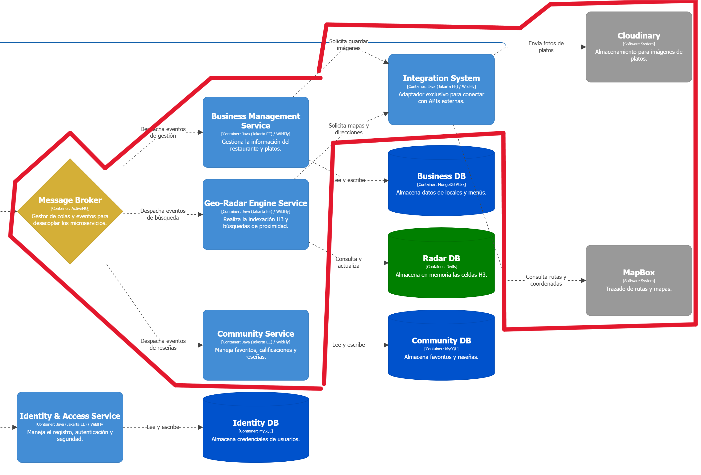

###### 4.3.1.7 Analysis of Current Design and Review Iteration Goal (Kanban Board)
Se evalúa el diseño obtenido y se concluye que la meta de la Iteración 1 ha sido satisfecha exitosamente. Como se observa en el tablero, las tareas de diseño para los microservicios, el API Gateway y el soporte de alta concurrencia (AC-01) han pasado a la columna "Done". El uso de un Message Broker para la comunicación asíncrona y la inclusión del Integration System garantizan la resiliencia ante la caída de servicios externos. La arquitectura queda lista para abordar el almacenamiento de datos de alto rendimiento en la siguiente iteración.

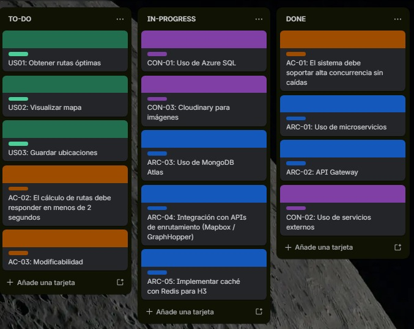

**Leyenda:**

- 🟢 User Stories  
- 🟠 Atributos de Calidad  
- 🔵 Decisiones Arquitectónicas  
- 🟣 Restricciones

**Link del tablero:**
https://trello.com/invite/b/69f501c05c2af93e4ff4893c/ATTIfcb179e7128dc5ba98dbc4b53ed07c7e7F9CD517/kanban-board

##### 4.3.2 Iteration 2: Performance
###### 4.3.2.1 Architectural Design Backlog N° 2
Se registran los drivers pendientes para optimizar el tiempo de respuesta del sistema. Se prioriza el atributo de calidad de Performance (QA-03), centrándose en el caso de uso crítico de la búsqueda geoespacial por celdas H3 (UC-01), donde se requiere que la visualización del radar de restaurantes cercanos cargue en la plataforma web en menos de 2 segundos.

<table>
<tr>
<th>ID</th>
<th>Descripción</th>
<th>Driver</th>
<th>Prioridad</th>
</tr>
<tr>
<td>AD2-01</td>
<td>Implementar Redis como cache en memoria</td>
<td>Performance</td>
<td>Alta</td>
</tr>
<tr>
<td>AD2-02</td>
<td>Optimizar consultas geoespaciales con H3</td>
<td>Performance</td>
<td>Alta</td>
</tr>
<tr>
<td>AD2-03</td>
<td>Reducir acceso a base de datos principal</td>
<td>Performance</td>
<td>Alta</td>
</tr>
<tr>
<td>AD2-04</td>
<td>Mejorar tiempo de respuesta del radar &lt; 2s</td>
<td>Performance</td>
<td>Alta</td>
</tr>
</table>

###### 4.3.2.2 Establish Iteration Goal by Selecting Drivers
La meta de esta iteración es diseñar el patrón de persistencia del sistema de manera que se maximice la velocidad de lectura de datos. El driver seleccionado es QA-03 (Performance), y la meta de diseño se enfoca en resolver los cuellos de botella que generaría la lectura constante del disco duro para consultas de proximidad geográfica en tiempo real.

**Driver seleccionado:**
<table>
<tr><th>Driver</th><th>Descripción</th><th>Objetivo</th></tr>
<tr><td>QA-03</td><td>Performance</td><td>Respuesta &lt; 2s</td></tr>
</table>

###### 4.3.2.3 Choose One or More Elements of the System to Refine
Se refina específicamente la capa de datos de los contenedores del backend, concentrando los esfuerzos en el Geo-Radar Engine Service y su interacción con el sistema de almacenamiento. Se analiza cómo este microservicio en Java/WildFly procesará la indexación de celdas mediante la librería Uber H3 sin sobrecargar las bases de datos transaccionales del sistema.

**Elementos clave:**
- Geo-Radar Engine Service  
- Sistema de almacenamiento  
- Indexación H3  

###### 4.3.2.4 Choose One or More Design Concepts That Satisfy the Selected Drivers
Se selecciona la táctica de Caching a través del uso de una base de datos NoSQL en memoria RAM (Redis) y el patrón de persistencia políglota. Esto permite que el Geo-Radar Service recupere las coordenadas y las celdas H3 activas de manera inmediata desde la memoria del servidor, reduciendo sustancialmente el uso de CPU y eliminando las consultas lentas a las bases de datos tradicionales en disco.

**Conceptos aplicados:**
<table>
<tr><th>Concepto</th><th>Beneficio</th></tr>
<tr><td>Caching (Redis)</td><td>Acceso en milisegundos</td></tr>
<tr><td>Persistencia Políglota</td><td>Optimización por tipo de dato</td></tr>
</table>

###### 4.3.2.5 Instantiate Architectural Elements, Allocate Responsibilities, and Define Interfaces
Se instancia el contenedor Radar DB utilizando Redis como caché en memoria RAM. El Geo-Radar Engine Service asume la responsabilidad de calcular las celdas H3 mediante la librería nativa de Uber y actualizar el índice en Redis; asimismo, se define una interfaz de conexión rápida TCP/IP nativa entre el microservicio y el contenedor de caché para recuperar datos en milisegundos.

<table>
<tr><th>Elemento</th><th>Responsabilidad</th><th>Interfaz</th></tr>
<tr><td>Geo-Radar Service</td><td>Cálculo H3</td><td>REST</td></tr>
<tr><td>Redis</td><td>Cache en memoria</td><td>TCP</td></tr>
</table>

###### 4.3.2.6 Sketch Views (C4 & UML) and Record Design Decisions

**1. Objetivo y Tácticas Arquitectónicas**  
El objetivo es garantizar que cuando el comensal active el radar hexagonal, los tiempos de respuesta sean menores a 2 segundos para descubrir restaurantes cercanos.
    - **Táctica principal:** Caching mediante almacenamiento en memoria RAM.
    - **Persistencia:** Radar DB (Redis).

**2. Descripción del Flujo y Sustento Técnico**  
Para evitar la latencia que produce la consulta constante al disco duro de la base de datos de los restaurantes, el sistema utiliza Redis como una base de datos en memoria intermedia.

Cuando el Geo-Radar Engine Service calcula las celdas H3 mediante la librería nativa de Uber, no consulta la base de datos principal; en su lugar, recupera los datos directamente de la memoria RAM en Radar DB (Redis). Esto reduce el tráfico de red, disminuye el uso de CPU y garantiza una respuesta inmediata en el frontend desarrollado en Vue.js.

**3. Diagrama C4 de Contenedores**

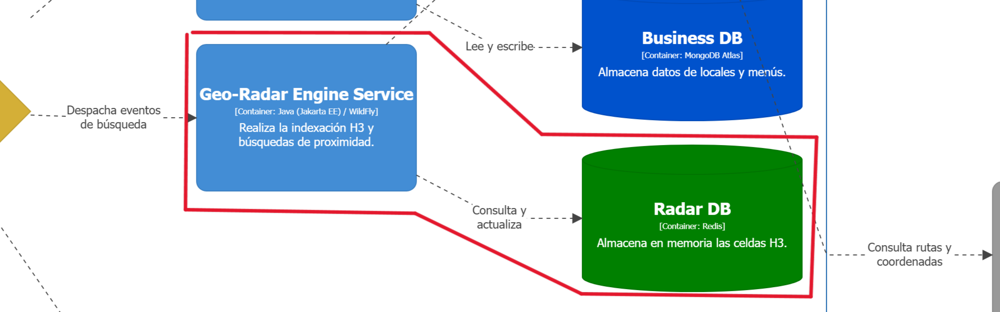

###### 4.3.2.7 Analysis of Current Design and Review Iteration Goal (Kanban Board)
Se valida el diseño de la Iteración 2 y se confirma el cumplimiento del driver de Performance. El tablero refleja el avance, pasando a estado "Done" la restricción de tiempo de respuesta (AC-02) y la integración de Redis en memoria. La inclusión de esta caché garantiza que las consultas del radar no dependan del disco duro transaccional, alcanzando tiempos de respuesta inferiores a los 2 segundos. La tarea de diseño de almacenamiento para alta velocidad finaliza, habilitando la fase orientada a la modificabilidad.

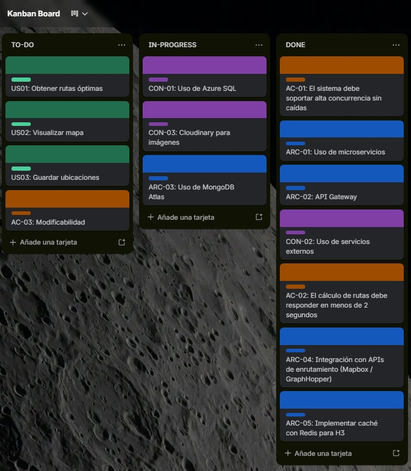

**Leyenda:**

- 🟢 User Stories  
- 🟠 Atributos de Calidad  
- 🔵 Decisiones Arquitectónicas  
- 🟣 Restricciones

**Link del tablero:**
https://trello.com/invite/b/69f501c05c2af93e4ff4893c/ATTIfcb179e7128dc5ba98dbc4b53ed07c7e7F9CD517/kanban-board

##### 4.3.3 Iteration 3: Modificabilidad
###### 4.3.3.1 Architectural Design Backlog N° 3
Se revisan los drivers enfocados en el bajo acoplamiento físico del sistema. Se prioriza el driver de Modificabilidad (QA-04), el cual exige que cada microservicio mantenga su autonomía funcional en la capa de datos, evitando que cambios en la estructura de un módulo rompan o alteren las operaciones de otros servicios independientes.

<table>
<tr>
<th>ID</th>
<th>Descripción</th>
<th>Driver</th>
<th>Prioridad</th>
</tr>
<tr>
<td>AD3-01</td>
<td>Implementar Database-per-Service</td>
<td>Modificabilidad</td>
<td>Alta</td>
</tr>
<tr>
<td>AD3-02</td>
<td>Separar bases de datos por microservicio</td>
<td>Modificabilidad</td>
<td>Alta</td>
</tr>
<tr>
<td>AD3-03</td>
<td>Evitar acceso cruzado entre servicios</td>
<td>Modificabilidad</td>
<td>Alta</td>
</tr>
<tr>
<td>AD3-04</td>
<td>Aplicar persistencia poliglota</td>
<td>Modificabilidad</td>
<td>Media</td>
</tr>
</table>

###### 4.3.3.2 Establish Iteration Goal by Selecting Drivers
La meta de esta iteración es diseñar la separación física absoluta de las bases de datos del sistema para eliminar dependencias cruzadas. El driver seleccionado es QA-04 (Modificabilidad), aplicando estrictamente el principio de diseño de aislamiento de datos requerido para microservicios empresariales independientes.

**Driver seleccionado:**
<table>
<tr><th>Driver</th><th>Descripción</th><th>Objetivo</th></tr>
<tr><td>QA-04</td><td>Modificabilidad</td><td>Bajo acoplamiento</td></tr>
</table>

###### 4.3.3.3 Choose One or More Elements of the System to Refine
Se refinan los microservicios Identity & Access Service, Business Management Service y Community Service junto con sus respectivas tecnologías de almacenamiento. El objetivo es desacoplar las conexiones compartidas a nivel de base de datos para garantizar la modificabilidad individual de cada componente.

**Elementos refinados:**
- Identity Service  
- Business Service  
- Community Service  

###### 4.3.3.4 Choose One or More Design Concepts That Satisfy the Selected Drivers
Se selecciona el patrón arquitectónico Database-per-Service. Se asignan motores de bases de datos independientes según el dominio de negocio: MySQL para la gestión de usuarios y reseñas (datos relacionales estructurados), y MongoDB Atlas para los menús dinámicos de los restaurantes (documentos flexibles no relacionales), logrando persistencia políglota aislada.

**Conceptos aplicados:**
<table>
<tr><th>Concepto</th><th>Beneficio</th></tr>
<tr><td>Database-per-Service</td><td>Independencia total</td></tr>
<tr><td>Persistencia Políglota</td><td>Flexibilidad de datos</td></tr>
</table>

###### 4.3.3.5 Instantiate Architectural Elements, Allocate Responsibilities, and Define Interfaces
Se instancian las bases de datos independientes: Identity DB (MySQL) exclusiva para credenciales de usuario; Business DB (MongoDB Atlas) para los locales y menús; y Community DB (MySQL) para las reseñas y favoritos. Ningún microservicio tiene acceso directo a la base de datos de otro, y cualquier intercambio de datos necesario entre módulos se realiza exclusivamente a través de mensajes asíncronos o peticiones HTTP internas mediante el API Gateway.

<table>
<tr><th>Base de Datos</th><th>Tipo</th><th>Uso</th></tr>
<tr><td>Identity DB</td><td>SQL</td><td>Usuarios</td></tr>
<tr><td>Business DB</td><td>MongoDB</td><td>Menús</td></tr>
<tr><td>Community DB</td><td>SQL</td><td>Reseñas</td></tr>
</table>

###### 4.3.3.6 Sketch Views (C4 & UML) and Record Design Decisions

**1. Objetivo y Tácticas Arquitectónicas**  
El objetivo de esta iteración es garantizar que el sistema sea altamente mantenible y que los cambios en las reglas de negocio de un módulo no afecten la estabilidad de los demás. Se aplica la regla obligatoria de diseño del curso.

    - **Táctica principal:** Database-per-Service (Aislamiento físico y lógico de datos).
    - **Persistencia:** Uso de MySQL para datos relacionales y estructurados, y MongoDB Atlas para documentos dinámicos.

**2. Descripción del Flujo y Sustento Técnico**  
Para cumplir con este driver, cada microservicio core maneja de forma exclusiva su propia base de datos:

    - **El Identity & Access Service** se conecta únicamente a Identity DB (MySQL).
    - **El Business Management Service** gestiona Business DB (MongoDB Atlas), permitiendo que los menús de los restaurantes sean dinámicos sin alterar esquemas fijos de usuarios.
    - **El Community Service** tiene su propia instancia aislada en Community DB (MySQL) para guardar las reseñas y favoritos de los comensales.

Esta táctica elimina por completo el acoplamiento en la capa de datos. Si el 
esquema de platos del restaurante cambia, el microservicio de comunidad o el de identidad no sufrirán ningún impacto ni tiempo de inactividad.

**3. Diagrama C4 de Contenedores**

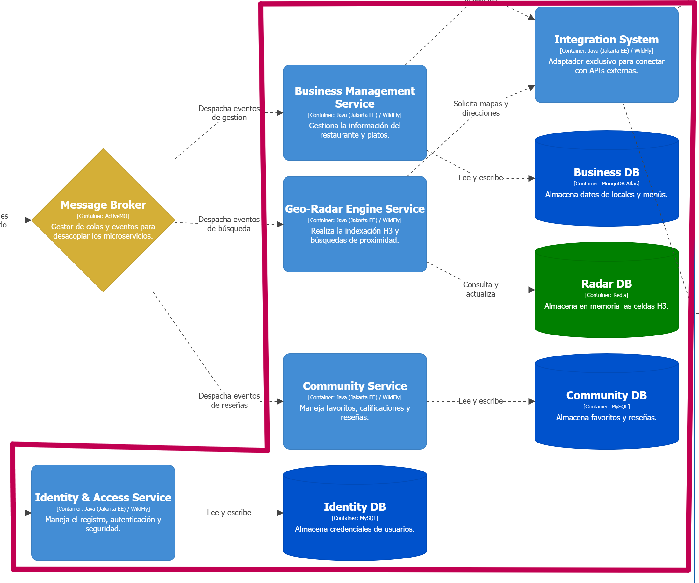

###### 4.3.3.7 Analysis of Current Design and Review Iteration Goal (Kanban Board)
Se concluye la última iteración confirmando que la meta de Modificabilidad se ha alcanzado con éxito. El tablero Kanban muestra todas las decisiones arquitectónicas en estado "Done", incluyendo la separación de la persistencia políglota con Azure SQL y MongoDB Atlas (AC-03). Se ha eliminado por completo el riesgo de un monolito de datos al aislar físicamente los almacenes. El diseño arquitectónico completo de Foodly Platform es ahora altamente disponible, veloz y fácil de modificar, quedando listo para la fase de construcción.

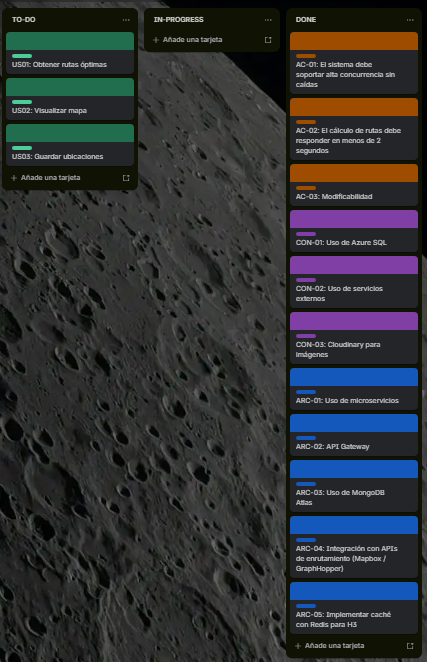

**Leyenda:**

- 🟢 User Stories  
- 🟠 Atributos de Calidad  
- 🔵 Decisiones Arquitectónicas  
- 🟣 Restricciones

**Link del tablero:**
https://trello.com/invite/b/69f501c05c2af93e4ff4893c/ATTIfcb179e7128dc5ba98dbc4b53ed07c7e7F9CD517/kanban-board

### Conclusiones
### Conclusiones y recomendaciones
* **AV1:**
Foodly atiende una necesidad concreta en el entorno gastronómico y urbano, ofreciendo una solución que permite a los comensales descubrir comida auténtica y a buen precio mientras optimizan su tiempo de búsqueda en un entorno real. A la vez, brinda a los dueños de huariques tradicionales acceso a una clientela joven, cercana y activa, que puede consumir sus menús diarios sin los altos costos de publicidad de las aplicaciones convencionales o agencias de marketing. La propuesta de valor de Foodly va más allá de conectar usuarios con restaurantes, ya que incorpora funcionalidades clave como filtros precisos de distancia, visibilidad mediante fotos reales, exclusión de cadenas comerciales y un sistema sencillo para publicar el menú del día. Esto no solo aumenta la visibilidad de los pequeños negocios, sino que también democratiza la experiencia gastronómica digital desde etapas tempranas, promoviendo relaciones de consumo local más justas, eficientes y centradas en la comunidad.

* **AV2:**
El diseño arquitectónico de Foodly se ha desarrollado con un enfoque claro en la alta disponibilidad, el rendimiento y la modificabilidad, utilizando patrones y tácticas que garantizan una plataforma robusta y escalable. La adopción de una arquitectura de microservicios desacoplada, junto con la implementación de un sistema de caché en memoria para optimizar las consultas geoespaciales, asegura que los usuarios puedan acceder a la información de manera rápida y confiable incluso durante picos de tráfico. Además, el uso de una persistencia políglota permite que cada microservicio maneje su propia base de datos, facilitando futuras modificaciones sin afectar la estabilidad del sistema. En conjunto, estas decisiones arquitectónicas posicionan a Foodly como una solución tecnológica sólida para abordar los desafíos específicos del sector gastronómico local.

### Video About-The-Team

### Referencias Bibliográficas

- Banco Interamericano de Desarrollo (BID). (2022). *Transformación digital de las micro y pequeñas empresas en América Latina*. https://www.iadb.org/es/blog/ciencia-tecnologia-e-innovacion/el-poder-de-los-datos-impulsando-la-transformacion-digital-de-las-pymes-de-america-latina

- Cámara de Comercio de Lima (CCL). (2024). *Reporte del sector gastronómico en Lima Metropolitana*. https://www.producempresarial.pe/wp-content/uploads/2025/02/234-Sector-restaurantes-y-afines-2024.pdf

- Instituto Nacional de Estadística e Informática (INEI). (2024). *Estadísticas de las micro y pequeñas empresas en el Perú*. https://www.gob.pe/institucion/inei/noticias/1334404-lima-metropolitana-concentra-el-42-2-de-las-empresas-que-existen-en-el-pais

- Ipsos Perú. (2024). *Hábitos y actitudes hacia el consumo gastronómico en el Perú*. https://www.ipsos.com/es-pe

- Organización para la Cooperación y el Desarrollo Económicos (OCDE). (2023). *Digitalisation of SMEs in Latin America*. https://www.ipsos.com/es-pe/alimentacion-y-vida-saludable-en-lima

- PRODUCE – Ministerio de la Producción del Perú. (2024). *Situación de las MYPE en el Perú*. https://www.producempresarial.pe/wp-content/uploads/2025/11/La-Mipyme-en-Cifras-2024_.pdf

- Uber Technologies Inc. (2020). *H3: Hexagonal Hierarchical Geospatial Indexing System*. https://h3geo.org/docs/

### Anexos

### Links
Link Organizacion GitHub: https://github.com/1ASI0657-FoodNode
Link Repository-Report: https://github.com/1ASI0657-FoodNode/Foodly-report
