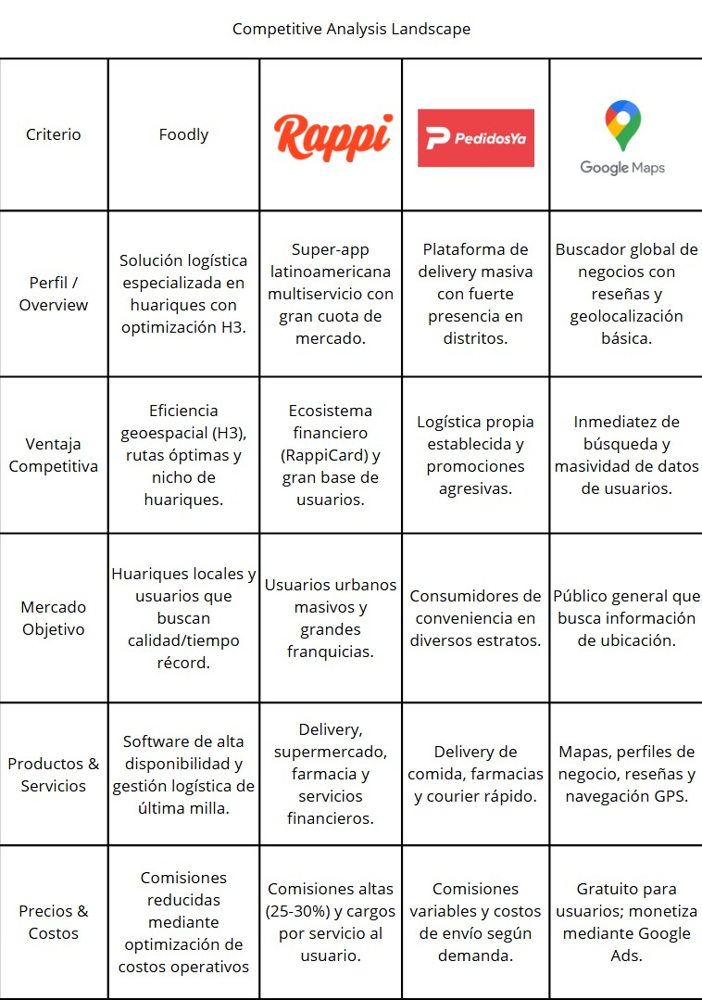
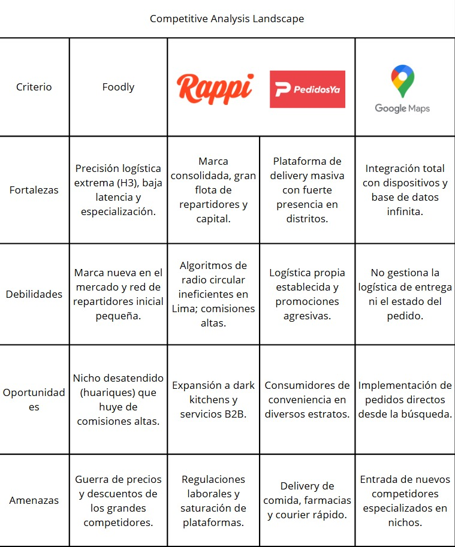

  

    <h2 style="text-align: center;">Universidad Peruana de Ciencias Aplicadas</h2>
    <h4 style="text-align: center;">Ingeniería de Software</h2> 
    <h4 style="text-align: center"> Periodo: 202610 </h4>
    <h4 style="text-align: center"> 1ASI0572 - Fundamentos de Arquitectura de Software </h4>
    <h4 style="text-align: center"> NRC: 17949  </h4>
    <h4 style="text-align: center"> Docente: Jorge Luis Delgado Vite </h4>

 

    <h3 style="text-align: center">Informe del Trabajo Final </h3>
    <h4 style="text-align: center;"> Startup: FoodNode </h3>
    <h4 style="text-align: center"> Producto: Foodly </h4>

 

    
U202223990 — Cacho Seminario, Diego Alonso

    
U202318274 — Julca Minaya, Sergio Gino 

    
U202310008 — Urrutia Pena, Jasmin Adriana

    
U202317000 — Vega Coronado Fabricio Samir

    
U20231c168 — Villanueva Andrade Ysaac Ligorio

    <h4 style="text-align: center">Lima – abril 2026</h4>

### Registro de Versiones del Informe

| Versión | Fecha | Autor | Descripción de modificación |
| :--- | :--- | :--- | :--- |
| |  |  |  |
| |  |  |  |
| |  |  |  |
| |  |  |  |

### Contenido

- [Contenido](#contenido)
- [Tabla de contenidos](#tabla-de-contenidos)
- [Student Outcome](#student-outcome)

- [Capítulo I: Introducción](#capítulo-i-introducción)
  - [1.1 Startup Profile](#11-startup-profile)
    - [1.1.1 Descripción de la Startup](#111-descripción-de-la-startup)
    - [1.1.2 Perfiles de integrantes del equipo](#112-perfiles-de-integrantes-del-equipo)
  - [1.2 Solution Profile](#12-solution-profile)
    - [1.2.1 Nombre del producto](#121-nombre-del-producto)
    - [1.2.2 Antecedentes y problemática](#122-antecedentes-y-problemática)
    - [1.2.3 Lean UX Process](#123-lean-ux-process)
      - [1.2.3.1 Lean UX Problem Statement](#1231-lean-ux-problem-statement)
      - [1.2.3.2 Lean UX Assumptions](#1232-lean-ux-assumptions)
      - [1.2.3.3 Lean UX Hypothesis](#1233-lean-ux-hypothesis)
      - [1.2.3.4 Lean UX Canvas](#1234-lean-ux-canvas)
  - [1.3 Segmentos objetivo](#13-segmentos-objetivo)

- [Capítulo II: Requirements & Analysis](#capítulo-ii-requirements--analysis)
  - [2.1 Competidores](#21-competidores)
  - [2.2 Entrevistas](#22-entrevistas)
  - [2.3 Needfinding](#23-needfinding)
    - [2.3.1 User Personas](#231-user-personas)
    - [2.3.2 User Task Matrix](#232-user-task-matrix)
    - [2.3.3 Empathy Maps](#233-empathy-maps)
    - [2.3.4 As-is Scenario Mapping](#234-as-is-scenario-mapping)

- [Capítulo III: Requirements Specification](#capítulo-iii-requirements-specification)
  - [3.1 To-Be Scenario Mapping](#31-to-be-scenario-mapping)
  - [3.2 User Stories](#32-user-stories)
  - [3.3 Impact Map](#33-impact-map)
  - [3.4 Product Backlog ](#34-product-backlog-avance-1)

- [Capítulo IV: Product Architecture Design](#capítulo-iv-product-architecture-design)
  - [4.1 Design Concepts, ViewPoints & ER Diagrams](#41-design-concepts-viewpoints--er-diagrams)
    - [4.1.1 Principles Statements](#411-principles-statements)
    - [4.1.2 Approaches Statements, Architectural Styles & Patterns](#412-approaches-statements-architectural-styles--patterns)
    - [4.1.3 Context Diagram](#413-context-diagram)
    - [4.1.4 Approach Driven ViewPoints Diagrams](#414-approach-driven-viewpoints-diagrams)
    - [4.1.5 Relational/Non Relational Database Diagram](#415-relationalnon-relational-database-diagram)
    - [4.1.6 Design Patterns](#416-design-patterns)
    - [4.1.7 Tactics](#417-tactics)
  - [4.2 Architectural Drivers](#42-architectural-drivers)
    - [4.2.1 Design Purpose](#421-design-purpose)
    - [4.2.2 Primary Functionality](#422-primary-functionality)
    - [4.2.3 Quality Attribute Scenarios](#423-quality-attribute-scenarios)
    - [4.2.4 Constraints](#424-constraints)
    - [4.2.5 Architectural Concerns](#425-architectural-concerns)
  - [4.3 ADD Iterations](#43-add-iterations)

- [Capítulo V: Product Implementation, Validation & Deployment](#capítulo-v-product-implementation-validation--deployment)
  - [5.1 Testing Suites & General Patterns](#51-testing-suites--general-patterns)
  - [5.2 Software Configuration Management](#52-software-configuration-management)
  - [5.3 Microservices Implementation](#53-microservices-implementation)
  - [5.4 Microservices Deployment](#54-microservices-deployment)

- [Conclusiones](#conclusiones)
- [Conclusiones y recomendaciones](#conclusiones-y-recomendaciones)
- [Video About-The-Team](#video-about-the-team)
- [Referencias Bibliográficas](#referencias-bibliográficas)
- [Anexos](#anexos)
- [Links](#links)

### Student Outcome

| Criterio específico | Acciones realizadas | Conclusiones |
| :--- | :--- | :--- |
| Actualiza conceptos y conocimientos necesarios para su desarrollo profesional y en especial para su proyecto en soluciones de software. | **Cacho Seminario, Diego Alonso** TB1: TP: TB2: TF:  **Julca Minaya, Sergio Gino** TB1: TP: TB2: TF:  **Urrutia Pena, Jasmin Adriana** TB1: TP: TB2: TF:  **Vega Coronado, Fabricio Samir** TB1: TP: TB2: TF:  **Villanueva Andrade, Ysaac Ligorio** TB1: TP: TB2: TF: |  |
| Reconoce la necesidad del aprendizaje permanente para el desempeño profesional y el desarrollo de proyectos en soluciones de software. | **Cacho Seminario, Diego Alonso** TB1: TP: TB2: TF:  **Julca Minaya, Sergio Gino** TB1: TP: TB2: TF:  **Urrutia Pena, Jasmin Adriana** TB1: TP: TB2: TF:  **Vega Coronado, Fabricio Samir** TB1: TP: TB2: TF:  **Villanueva Andrade, Ysaac Ligorio** TB1: TP: TB2: TF: |  |

### Capítulo I: Introducción

#### 1.1 Startup Profile
##### 1.1.1 Descripción de la Startup
Somos una startup de tecnología enfocada en soluciones FoodTech, dedicada a potenciar la visibilidad y el acceso al sector gastronómico local mediante software de alta disponibilidad. Nuestro objetivo con Foodly es cerrar la brecha entre los pequeños negocios gastronómicos ("huariques") y los comensales, utilizando una arquitectura escalable que permita el crecimiento exponencial de los emprendimientos locales en Lima.

A diferencia de los buscadores convencionales, Foodly optimiza la experiencia de descubrimiento mediante computación geoespacial. Utilizamos la indexación de mapas para conectar a los usuarios con las mejores propuestas culinarias en su entorno inmediato con una precisión superior, garantizando un sistema robusto, eficiente y centrado en la cercanía real.

* **Misión:** Optimizar la conexión entre la gastronomía local y los usuarios finales mediante soluciones de software de alta disponibilidad y precisión geoespacial que faciliten el descubrimiento de experiencias culinarias auténticas.
* **Visión:** Convertirnos en la plataforma líder de búsqueda y localización para negocios emergentes (huariques) en Lima, democratizando el acceso a tecnologías de vanguardia, como la indexación hexagonal (H3), para revolucionar la forma en que los usuarios interactúan con su entorno gastronómico local.

##### 1.1.2 Perfiles de integrantes del equipo

| Nombre: Cacho Seminario, Diego Alonso  |  |
| :---- | :---- |
| **Código:** U202223990 |  |
| **Carrera:** Ingeniería de Software |  |
| **Habilidades:** Soy estudiante de Ingeniería de Software cursando el 7mo ciclo de mi carrera en la UPC y tengo 21 años. Me considero una persona tranquila y diligente, intentó realizar mis tareas y trabajos lo antes posible para evitar contratiempos en un futuro, especialmente si son actividades que consumen mucho tiempo. Como miembro de equipo buscaré ayudar a mis compañeros cuando lo necesiten, realizando además mis entregas lo más temprano posible. Habilidades en C++, C\#, Python, Flutter, Unity 2D/3D, html/css/js. |  |

#### 1.2 Solution Profile
##### 1.2.1 Nombre del producto
##### 1.2.2 Antecedentes y problemática

##### 1.2.3 Lean UX Process
###### 1.2.3.1 Lean UX Problem Statement

Los comensales en Lima a menudo se limitan a cadenas comerciales debido a la dificultad de localizar "huariques" de alta calidad que no cuentan con presencia en grandes plataformas de búsqueda.

Los buscadores actuales usan radios circulares o listados por distritos, lo que genera resultados imprecisos y una carga de procesamiento innecesaria, ocultando negocios que están a pocas cuadras pero fuera del ranking comercial.

El usuario termina en lugares concurridos y costosos, mientras que los pequeños negocios con excelente sazón pierden la oportunidad de captar clientes que se encuentran físicamente cerca.

Implementar una arquitectura basada en indexación hexagonal (H3) que funcione como un radar de proximidad, conectando al usuario con el huarique más cercana.

Sabremos que hemos tenido éxito cuando logremos implementar un sistema de búsqueda e indexación basado en la librería H3

Lograr que un usuario encuentre un huarique relevante en menos de 10 segundos y con una precisión de búsqueda basada en su celda hexagonal actual.

###### 1.2.3.2 Lean UX Assumptions
#### Business Assumptions
- Creemos que los dueños de huariques se verán incentivados a registrar su información si les garantizamos visibilidad ante usuarios que se encuentran físicamente en su radio de influencia real.
- Asumimos que el uso de una arquitectura basada en microservicios y el sistema de indexación H3 permitirá que la plataforma escale a otros distritos de Lima sin degradar el tiempo de respuesta.
- Creemos que nuestra principal ventaja competitiva es la especialización en lugares de alta calidad y baja concurrencia (huariques) mediante un motor de búsqueda local ultra-preciso.
#### User Assumptions
- Los usuarios asumirán que la aplicación es una herramienta de curaduría confiable al mostrar resultados basados en cercanía física exacta y no en pautas publicitarias.
- Creemos que los comensales valoran más la autenticidad y el precio justo de un huarique cercano que las opciones de franquicias masivas que aparecen en buscadores convencionales.
- Asumimos que los usuarios prefieren una interfaz de búsqueda visualmente rápida que les permita escanear su entorno geoespacial para tomar decisiones inmediatas sobre dónde comer.
#### User Outcomes
- Que el usuario localice el huarique ideal en menos de 10 segundos gracias al filtrado por celdas hexagonales de cercanía real.
- Sentido de satisfacción y exclusividad al descubrir negocios locales con excelente sazón que son invisibles en las plataformas tradicionales.
- Optimización del tiempo de desplazamiento del usuario al recibir recomendaciones de locales que se encuentran a una distancia caminable o de corto trayecto.
- Incremento en el flujo de clientes nuevos para los dueños de huariques sin necesidad de invertir en marketing digital complejo.
#### Features
- Algoritmo de backend que indexa huariques en Lima usando la rejilla hexagonal H3 para proporcionar resultados de búsqueda instantáneos según la ubicación del usuario.
- Interfaz visual interactiva que permite a los usuarios explorar la densidad de huariques en su celda actual y celdas vecinas.
- Panel simplificado donde el dueño del negocio puede geolocalizar su establecimiento y gestionar la información que verán los usuarios.
- Galería de imágenes de alta velocidad que carga evidencias reales de los platos y el local sin latencia, facilitando la validación visual del usuario.
- Funcionalidad de búsqueda avanzada que prioriza locales con alta calificación de sazón y precios accesibles dentro del entorno geoespacial del usuario.
###### 1.2.3.3 Lean UX Hypothesis
###### 1.2.3.4 Lean UX Canvas

#### 1.3 Segmentos Objetivo

Para el desarrollo de Foodly, hemos identificado dos segmentos principales en Lima cuya interacción es el motor de la plataforma. El uso de la arquitectura H3 actúa como el puente de precisión entre ambos.

1. Dueños de Huariques: Proveedores de Información Gastronómica
* Perfil: Emprendedores y dueños de pequeños establecimientos gastronómicos en Lima que ofrecen comida de alta calidad y precios competitivos, pero que carecen de presencia en los algoritmos de búsqueda tradicionales.
* Necesidad: Una herramienta técnica sencilla que les permita aparecer en el mapa de manera relevante para las personas que transitan por su zona.
* Punto de Dolor: La invisibilidad digital frente a las grandes cadenas y la falta de plataformas que prioricen la cercanía física y la sazón sobre el presupuesto de marketing.
* Acción en la App: Registran su local, gestionan su menú visual y mantienen su ubicación actualizada para ser detectados por el radar hexagonal.

2. Exploradores Gastronomicos: Buscadores de Autenticidad Gastronómica
* Perfil: Estudiantes universitarios, trabajadores de oficina y jóvenes residentes en Lima que buscan lugares no convencionales para comer, priorizando la sazón, la rapidez de llegada y el precio justo.
* Necesidad: Un motor de búsqueda que les revele joyas ocultas en su entorno inmediato sin tener que desplazarse grandes distancias.
* Punto de Dolor: La saturación de opciones genéricas o muy concurridas en buscadores comunes y la dificultad de encontrar locales de calidad cuando se encuentran en zonas de Lima que no conocen bien.
* Acción en la App: Utilizan el radar geoespacial para escanear su ubicación actual y filtrar los huariques disponibles dentro de sus celdas hexagonales circundantes.

### Capítulo II: Requirements & Analysis

#### 2.1 Competidores
### 2.1.1. Análisis competitivo

En el mercado actual existen varias aplicaciones y plataformas de comida que permiten a los usuarios buscar restaurantes y lugares para comer, como Rappi, PedidosYa y Google Maps. Sin embargo, estas apps utilizan algoritmos de logística basados en radios circulares tradicionales que generan ineficiencias en ciudades complejas como Lima, dando prioridad a grandes cadenas y dejando poco espacio para huariques o negocios locales que no pueden costear sus altas comisiones.

**Foodly** se diferencia al implementar una arquitectura de alta disponibilidad basada en **indexación hexagonal (H3)**, lo que permite optimizar la logística de última milla con una precisión superior. Mientras la competencia satura sus servidores con cálculos de distancia punto a punto en tiempo real, Foodly reduce la latencia de emparejamiento a menos de 1 segundo mediante celdas uniformes. Esto nos permite reducir los tiempos de entrega en un 20% y ofrecer costos de envío menores, democratizando el acceso a tecnología de vanguardia para los pequeños negocios gastronómicos de Lima.

### 2.1.2. Estrategias y tácticas frente a competidores.  

Para diferenciar a Foodly de las grandes plataformas generales y posicionarse con éxito en el nicho de huariques, se plantean las siguientes estrategias y tácticas:

**Estrategias:**
- **Superioridad Técnica Geoespacial:** Utilizar el sistema de rejilla H3 para garantizar rutas óptimas y una asignación de repartidores más eficiente que los radios convencionales de la competencia.
- **Enfoque en Autenticidad Local:** Especializar la plataforma exclusivamente en "joyas ocultas" o huariques, ofreciendo una experiencia de curaduría que los competidores masivos no pueden replicar.
- **Sostenibilidad para el Negocio Local:** Implementar un modelo de costos operativos reducidos gracias a la eficiencia algorítmica, permitiendo comisiones más bajas y justas para los pequeños empresarios.

**Tácticas:**
- **Despliegue por Clústeres Hexagonales:** Focalizar la captación de comercios en zonas urbanas específicas de alta densidad gastronómica (nodos), asegurando la eficiencia del sistema antes de expandir el radio de acción.
- **Dashboard de Influencia Real:** Proveer a los dueños de huariques herramientas visuales basadas en mapas de calor hexagonales para que entiendan su área de cobertura y demanda real.
- **Agrupación Inteligente de Pedidos (Batching):** Implementar algoritmos que permitan a un solo repartidor cubrir múltiples pedidos dentro de una misma celda H3 o adyacentes, reduciendo el costo final para el usuario.
- **Optimización de UX para el Descubrimiento:** Crear una interfaz de alta velocidad que permita encontrar el "huarique ideal" en menos de 30 segundos mediante filtros basados en cercanía real y no solo en distancia lineal.
  
#### 2.2 Entrevistas

#### 2.3 Needfinding
##### 2.3.1 User Personas

Para comprender mejor las necesidades y comportamientos de los usuarios de Foodly, se han desarrollado dos perfiles representativos. Estos perfiles sintetizan los objetivos y retos de nuestros segmentos, permitiendo que las decisiones de arquitectura (como la indexación hexagonal H3) respondan a problemas reales de búsqueda y visibilidad en Lima.

* Persona 1: El Comensal Explorador
  

* Persona 2: El Dueño de Huarique
  

##### 2.3.2 User Task Matrix
##### 2.3.3 Empathy Maps
A continuación se presentan los mapas de empatía para los dos perfiles principales de usuarios de Foodly: Mateo, el comensal explorador, y Doña Rosa, la especialista y dueña de un huarique tradicional. Estos mapas permiten comprender en profundidad sus necesidades, pensamientos, sentimientos y comportamientos, facilitando un diseño arquitectónico y de interfaz centrado en el usuario.

* Segmento 1: Mateo (El Explorador)
  

* Segmento 2: Doña Rosa (La Especialista)
  

##### 2.3.4 As-is Scenario Mapping
* Segmento 1: Mateo (El Comensal Explorador)
  
Mediante este artefacto, se ha llevado a cabo la elaboración del As-Is Scenario Mapping para el primer segmento. Este escenario refleja cómo los usuarios jóvenes y profesionales, interesados en descubrir huariques, realizan actualmente sus actividades durante su rutina diaria. Además, evidencia las dificultades que enfrentan al buscar opciones auténticas y cercanas, lidiando con aplicaciones saturadas de franquicias, radios de búsqueda imprecisos y falta de información visual, así como las percepciones de desconfianza y frustración que experimentan en cada etapa de su recorrido.

* Segmento 2: Doña Rosa (La Especialista)
  
De igual manera, se ha elaborado el As-Is Scenario Mapping para el segundo segmento, enfocado en los propietarios de huariques tradicionales. Este escenario ilustra cómo estos emprendedores gestionan actualmente la promoción de sus locales comerciales. Detalla las fuertes barreras tecnológicas y de tiempo que enfrentan al intentar ganar visibilidad digital frente a negocios más modernos, resaltando la frustración, la sensación de invisibilidad y las emociones que experimentan al intentar atraer a nuevos clientes que transitan a escasas cuadras de su negocio.

### Capítulo III: Requirements Specification

#### 3.1 To-Be Scenario Mapping
* Segmento 1: Mateo (El Comensal Explorador)
  
Mediante este artefacto, se ha llevado a cabo la elaboración del To-Be Scenario Mapping para el primer segmento. Este escenario proyecta la experiencia ideal de los usuarios al utilizar Foodly durante su rutina diaria para descubrir huariques. Refleja cómo la aplicación resuelve sus dificultades actuales al permitirles filtrar cadenas comerciales, encontrar opciones auténticas en radios de caminata precisos y visualizar fotos reales de los platos, transformando la incertidumbre previa en un proceso de decisión rápido, confiable y altamente satisfactorio.

* Segmento 2: Doña Rosa (La Especialista)
  
De igual manera, se ha elaborado el To-Be Scenario Mapping para el segundo segmento, enfocado en los propietarios de huariques tradicionales. Este escenario ilustra el proceso optimizado mediante el cual estos emprendedores podrán promocionar sus locales comerciales usando Foodly. Detalla cómo la plataforma elimina las actuales barreras tecnológicas y económicas, permitiéndoles actualizar su menú diario de forma intuitiva para conectar directamente con nuevos clientes cercanos, transformando su previa sensación de invisibilidad en empoderamiento, reconocimiento y seguridad económica.

#### 3.2 User Stories
#### 3.3 Impact Map
#### 3.4 Product Backlog
### Capítulo IV: Product Architecture Design

#### 4.1 Design Concepts, ViewPoints & ER Diagrams
##### 4.1.1 Principles Statements
##### 4.1.2 Approaches Statements, Architectural Styles & Patterns
##### 4.1.3 Context Diagram
##### 4.1.4 Approach Driven ViewPoints Diagrams
##### 4.1.5 Relational/Non Relational Database Diagram
##### 4.1.6 Design Patterns
##### 4.1.7 Tactics

#### 4.2 Architectural Drivers
##### 4.2.1 Design Purpose
##### 4.2.2 Primary Functionality
##### 4.2.3 Quality Attribute Scenarios
##### 4.2.4 Constraints
##### 4.2.5 Architectural Concerns

#### 4.3 ADD Iterations
##### 4.3.X Iteration N
###### 4.3.X.1 Architectural Design Backlog N
###### 4.3.X.2 Establish Iteration Goal
###### 4.3.X.3 Refine System Elements
###### 4.3.X.4 Select Design Concepts
###### 4.3.X.5 Define Architectural Elements
###### 4.3.X.6 Sketch Views (C4 & UML)
###### 4.3.X.7 Analysis & Review (Avance 2)

### Capítulo V: Product Implementation, Validation & Deployment

#### 5.1 Testing Suites & General Patterns
##### 5.1.1 Backend Application Core Testing Suite
##### 5.1.2 Pattern Based Backend Application(s)
##### 5.1.3 Pattern Based Custom Software Library
##### 5.1.4 Framework Pattern Driven Refactoring Report

#### 5.2 Software Configuration Management
##### 5.2.1 Software Development Environment Configuration
##### 5.2.2 Source Code Management
##### 5.2.3 Source Code Style Guide & Conventions
##### 5.2.4 Software Deployment Configuration

#### 5.3 Microservices Implementation

##### 5.3.1 Sprint 1
###### 5.3.1.1 Sprint Backlog 1
###### 5.3.1.2 Development Evidence
###### 5.3.1.3 Testing Evidence
###### 5.3.1.4 Execution Evidence
###### 5.3.1.5 Documentation Evidence
###### 5.3.1.6 Deployment Evidence
###### 5.3.1.7 Team Collaboration Insights
###### 5.3.1.8 Kanban Board

##### 5.3.2 Sprint 2
##### 5.3.3 Sprint 3
##### 5.3.4 Sprint 4

#### 5.4 Microservices Deployment
##### 5.4.1 Cloud Architecture Diagram
##### 5.4.2 Cloud Deployment

### Conclusiones

### Conclusiones y recomendaciones

### Video About-The-Team

### Referencias Bibliográficas

### Anexos

### Links
